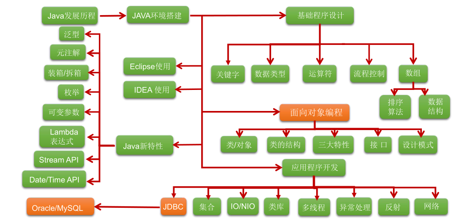
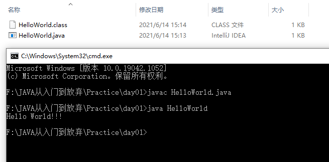

# 第一章 Java概述

## 1.1 JavaSE体系介绍

JavaSE知识图解：



JavaSE知识模块介绍：

* **第一部分：计算机编程语言核心结构：**`数据类型`、`运算符`、`流程控制`、`数组`、`家庭收支记账系统`、…

* **第二部分：Java面向对象核心逻辑：**`类和对象`、`封装`、`继承`、`多态`、`抽象`、`接口`、`客户信息管理系统`、…

* **第三部分：JavaSE核心高级应用：**`集合`、`I/O`、`多线程`、`网络编程`、`反射机制`、`开发团队人员调度系统`、…

* **第四部分：Java新特性：**`Lambda表达式`、`函数式编程`、`新Date/Time API`、`接口的默认、静态和私有方法`、…

* **第五部分：MySQL/JDBC核心技术：**`SQL语句`、`数据库连接池`、`DBUtils`、`事务管理`、`批处理`、…

  

## 1.2 计算机语言介绍

​		计算机编程语言，就是人们可以使用编程语言对计算机下达命令，让计算机完成人们需要的功能。

计算机语言的发展：

* 第一代：机器语言
* 第二代：汇编语言
* 第三代：高级语言

## 1.3  常用DOS命令

​		DOS是一个早期的操作系统，现在已经被Windows系统取代，对于我们开发人员，目前需要在DOS中完成一些事情，因此就需要掌握一些必要的命令。

* **进入DOS操作窗口：**
  * 按下`Windows+R`键，打开运行窗口，输入`cmd`回车，进入到DOS的操作窗口。

  * 打开DOS命令行后，看到一个路径 `C:\Users\...`  就表示我们现在操作的磁盘是C盘。

* **DOS常用命令:**

  | 命令             | 操作符号      |
  | ---------------- | ------------- |
  | 切换至D盘        | `d:`          |
  | 查看当前目录文件 | ` dir`        |
  | 进入文件夹命令   | `cd 文件夹名` |
  | 退出文件夹命令   | `cd ..`       |
  | 退出到磁盘根目录 | `cd /`        |
  | 清屏             | `cls`         |
  | 退出             | `exit`        |

## 1.4 Java语言概述

​		Java诞生于SUN（Stanford University Network），09年SUN被Oracle（甲骨文）收购。

​		Java之父是詹姆斯.高斯林(James Gosling)。

​		1996年发布JDK1.0版。

​		目前最新的版本是Java12。我们学习的Java8。

### Java语言发展历史

|   发行版本   |  发行时间  |                             备注                             |
| :----------: | :--------: | :----------------------------------------------------------: |
|     Java     | 1995.05.23 |     Sun公司在Sun world会议上正式发布Java和HotJava浏览器      |
|   Java 1.0   | 1996.01.23 |             Sun公司发布了Java的第一个开发工具包              |
|   Java 1.1   | 1997.02.19 |                                                              |
|   Java 1.2   | 1998.12.08 |    拆分成：J2SE（标准版）、J2EE（企业版）、J2ME（小型版）    |
|   Java 1.3   | 2000.05.08 |                                                              |
|   Java1.4    | 2004.02.06 |                                                              |
| **Java 5.0** | 2004.09.30 | ①版本号从1.4直接更新至5.0；②平台更名为JavaSE、JavaEE、JavaME |
|   Java 6.0   | 2006.12.11 |               2009.04.20 Oracle宣布收购SUN公司               |
|   Java 7.0   | 2011.07.02 |                                                              |
| **Java 8.0** | 2014.03.18 |                                                              |
|   Java 9.0   | 2017.09.22 |    ①每半年更新一次；②Java 9.0开始不再支持windows 32位系统    |
|  Java 10.0   | 2018.03.21 |                                                              |
|  Java 11.0   | 2018.09.25 |                  JDK安装包取消独立JRE安装包                  |
|  Java 12.0   | 2019.03.19 |                                                              |

Java技术体系平台：

* JavaSE（标准版）：是为开发普通桌面应用程序和商务应用程序提供的解决方案，包含基础语法、面向对象、高级应用、等。

* JavaME（小型版）：是为开发电子消费产品和嵌入式设备提供的解决方案，但$\textcolor{red}{已被Android所取代}$。

* JavaEE（企业版）：是为开发企业环境下的应用程序提供的一套解决方案，主要针对于Web应用程序开发。

  

## 1.5 Java语言跨平台原理

### Java语言的五大特点

* **完全面向对象：**Java语言支持封装、继承、多态，面对对象编程，让程序更好达到`高内聚`，`低耦合`的标准。
* **支持分布式：**Java语言支持Internet应用的开发，在基本的Java应用编程接口中有一个网络应用编程接口（java net），它提供了用于网络应用编程的类库，包括URL、URLConnection、Socket、ServerSocket等。Java的RMI（远程方法激活）机制也是开发分布式应用的重要手段。
* **健壮型：**Java的强类型机制、异常处理、垃圾的自动收集等是Java程序健壮性的重要保证。对指针的丢弃是Java的明智选择。
* **安全：**Java通常被用在网络环境中，为此，Java提供了一个安全机制以防恶意代码的攻击。如：安全防范机制（类ClassLoader），如分配不同的名字空间以防替代本地的同名类、字节代码检查。
* **跨平台性：**Java程序（后缀为java的文件）在Java平台上被编译为体系结构中立的字节码格式（后缀为class的文件），然后可以在实现这个Java平台的任何系统中运行。

### Java语言的跨平台原理

- **跨平台**：任何软件的运行，都必须要运行在操作系统之上，而我们用Java编写的软件可以运行在任何的操作系统上，这个特性称为**Java语言的跨平台特性**。该特性是由JVM实现的，我们编写的程序运行在JVM上，而JVM运行在操作系统上。
- **JVM**（Java Virtual Machine ）：**Java虚拟机**，简称JVM，是运行所有Java程序的假想计算机，是Java程序的运行环境之一，也是Java 最具吸引力的特性之一。我们编写的Java代码，都运行在**JVM** 之上。

$\textcolor{red}{注：就是因为JVM的存在，才使得JAVA处处可运行！}$

- **JRE ** (Java Runtime Environment) ：是Java程序的运行时环境，包含`JVM` 和运行时所需要的`核心类库`。（包含JVM）

- **JDK**  (Java Development Kit)：是Java程序开发工具包，包含`JRE` 和开发人员使用的工具。（包含JRE、JVM）

  我们想要运行一个已有的Java程序，那么只需安装`JRE` 即可。

  我们想要开发一个全新的Java程序，那么必须安装`JDK` ，其内部包含`JRE`。

  $\textcolor{red}{三者关系：JVM<JRE<JDK}$
  
  

## 1.6 JDK的下载、安装、环境变量

**JDK的下载：**

* 下载网址：www.oracle.com 

* 下载步骤：

  * 登录Oracle公司官网，www.oracle.com

  * 在**Developer Downloads**处，选择`Java`。

  * 下拉页面，找到**Java**，在此选择`Java (JDK) for Developers`。

  * 下拉页面，找到**Java SE 8u201 / Java SE 8u202**，在此处选择`JDK DOWNLOAD`。

    * 下拉页面，找到 **Java SE Development Kit 8u202**，选择**Accept License Agreement**。

    * 如果电脑系统版本是32位的，请选择`jdk-8u202-windows-i586.exe`下载；如果电脑系统版本是64位的，请选择`jdk-8u202-windows-x64.exe`下载。

**JDK的安装：**

* 安装步骤：

  * 双击`jdk-8u202-windows-x64.exe`文件，并单击`下一步`。

  * 取消独立JRE的安装，单击`公共JRE前的下拉列表`，选择`此功能将不可用`。

  * 修改安装路径，开始安装。


**配置环境变量：**

* 步骤：

  * 打开桌面上的计算机，进入后在左侧找到`计算机`，单击鼠标`右键`，选择`属性`。

  * 选择`高级系统设置`。

  * 在`高级`选项卡，单击`环境变量`。

  * 在`系统变量`中，单击`新建` ，创建新的环境变量。

  * 变量名输入`JAVA_HOME`，变量值输入 `D:\develop\Java\jdk1.8.0_202` （你自己安装的jdk地址），并单击`确定`。

  * 选中`Path` 环境变量，`双击`或者`点击编辑` 。

  * 在变量值的最前面，键入`%JAVA_HOME%\bin;`  分号必须要写，而且还要是**英文符号**。

  * 环境变量配置完成，**开启**DOS命令行，在任意目录下输入`javac` 命令，运行成功。

    


## 1.7 入门程序HelloWorld

### HelloWorld案例

​		Java程序开发三步走：**编写**、**编译**、**运行**。

**编写：**

1. 新建文本文件，文件名修改为`HelloWorld.java`，其中文件名为`HelloWorld`，后缀名必须为`.java` 。
2. 用记事本或notepad++等文本编辑器打开。

3. 在文件中键入文本并保存，代码如下：

```java
public class HelloWorld {
  	public static void main(String[] args) {
    	System.out.println("HelloWorld");
  	}
}
```

**编译：**

​		在DOS命令行中，进入你的HelloWorld.java所在的目录，使用`javac` 命令进行编译。

命令：

```
javac HelloWorld.java
```

​		编译成功后，命令行没有任何提示。打开文件所在目录，发现产生了一个新的文件 `HelloWorld.class`，该文件就是编译后的文件，是Java的可运行文件，称为**字节码文件**，有了字节码文件，就可以运行程序了。 

**运行：**

​		在DOS命令行中，**进入Java源文件的目录**，使用`java` 命令进行运行。

```
java HelloWorld
```

$\textcolor{red}{注：运行时不要加文件后缀名.class}$

运行结果：



### Java程序的结构与格式

```java
public class HelloWorld {		//HelloWorld为类名，自定义。
  	public static void main(String[] args) {		//main为主方法，也是程序入口。
    	System.out.println("HelloWorld");		//输出语句。
  	}
}
```

编码问题：

​		GBK(ANSI)  是简体中文，也是cmd中默认的编码格式。

​		UTF-8  是万国码。

更改编码格式进行编译：

```
javac -encoding utf-8 HelloWorld.java
```

