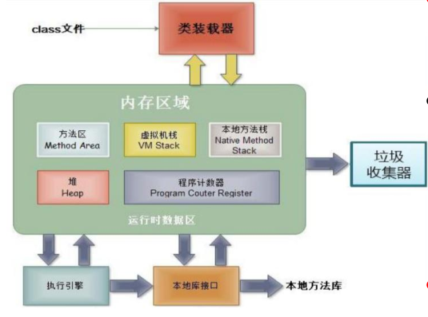
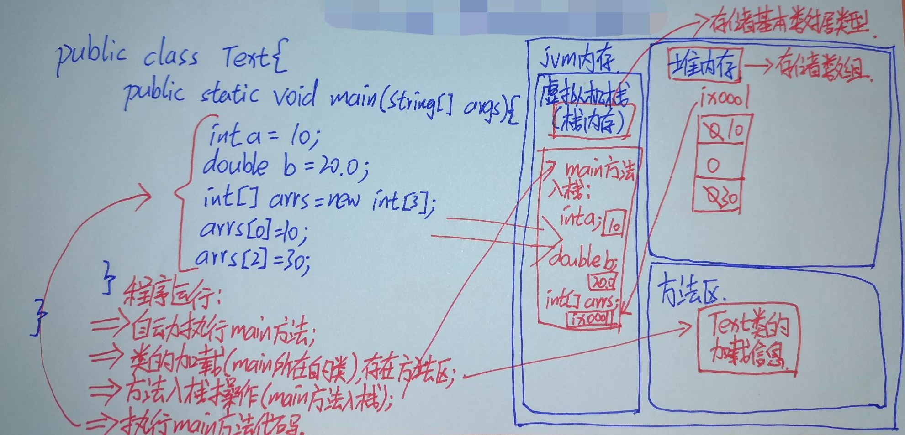
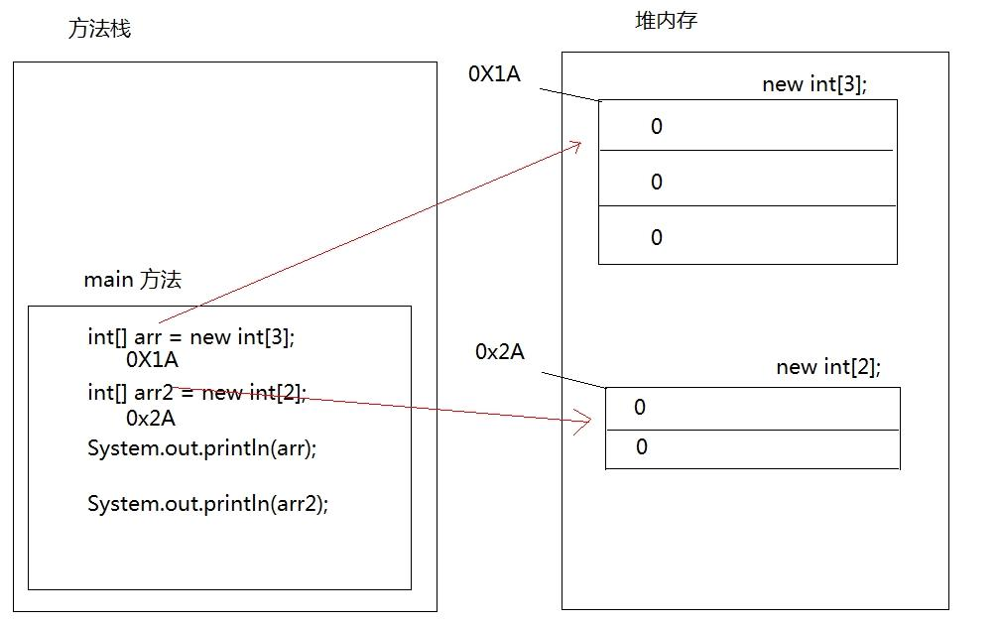
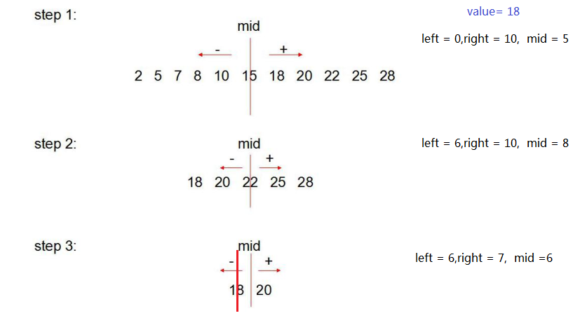

# 第四章 数组

## 4.1 容器概述

**容器概念：**

- **容器：**是将多个数据存储到一起，每个数据称为该容器的元素。
- **生活中的容器：**水杯，衣柜，教室。。。

## 4.2 数组的概念

- **数组概念：** 数组就是用于存储数据的长度固定的容器，保证多个数据的数据类型要一致。

​		所谓**数组**(array)，就是相同数据类型的元素按一定顺序排列的集合，就是把有限个类型相同的变量用一个名字命名，以便统一管理他们，然后用编号区分他们，这个名字称为**数组名**，编号称为**下标或索引**(index)。组成数组的各个变量称为数组的**元素**(element)。数组中元素的个数称为**数组的长度**(length)。


数组的特点：

1、数组的长度一旦确定就不能修改

2、创建数组时会在内存中开辟一整块连续的空间。

3、存取元素的速度快，因为可以通过[下标]，直接定位到任意一个元素。

$\textcolor{red}{注意：数组下标从0开始。}$

## 4.3 数组的定义

### 方式一：静态初始化

* **格式：**

```java
数据类型[] 数组名 = {元素1,元素2,元素3...};//必须在一个语句中完成，不能分开两个语句写
```

* 举例：

定义存储1，2，3，4，5整数的数组容器

```java
int[] arr = {1,2,3,4,5};//正确

int[] arr;
arr = {1,2,3,4,5};//错误
```

### 方式二：静态初始化

* **格式：**

```java
数据类型[] 数组名 = new 数据类型[]{元素1,元素2,元素3...};
或
数据类型[] 数组名;
数组名 = new 数据类型[]{元素1,元素2,元素3...};
```

* 举例：

定义存储1，2，3，4，5整数的数组容器。

```java
int[] arr = new int[]{1,2,3,4,5};//正确

int[] arr;
arr = new int[]{1,2,3,4,5};//正确

int[] arr = new int[5]{1,2,3,4,5};//错误的，后面有{}指定元素列表，就不需要在[长度]指定长度。
```

### 方式三：动态初始化

- **格式：**

```java
 数组存储的元素的数据类型[] 数组名字 = new 数组存储的元素的数据类型[长度];
 
  或

 数组存储的数据类型[] 数组名字;
 数组名字 = new 数组存储的数据类型[长度];
```

- 数组定义格式详解：
  - 数组存储的元素的数据类型： 创建的数组容器可以存储什么数据类型的数据。
  - 元素的类型可以是任意的Java的数据类型。例如：int, String, Student等
  - [] : 表示数组。
  - 数组名字：为定义的数组起个变量名，满足标识符规范，可以使用名字操作数组。
  - new：关键字，创建数组使用的关键字。因为数组本身是引用数据类型，所以要用new创建数组对象。
  - [长度]：数组的长度，表示数组容器中可以存储多少个元素。
  - **注意：数组有定长特性，长度一旦指定，不可更改。**
    - 和水杯道理相同，买了一个2升的水杯，总容量就是2升，不能多也不能少。
- 举例：

定义可以存储5个整数的数组容器，代码如下：

```java
int[] arr = new int[5];

int[] arr;
arr = new int[5];
```

> 思考：用这种方式初始化的数组，元素有值吗？

数组只要开辟了空间就存在初始值。对应如下：

| 数组类型               | 初始值                             |
| ---------------------- | ---------------------------------- |
| byte、short、int、long | 0                                  |
| float、double          | 0.0                                |
| char                   | ''      （是个空白符，非空值null） |
| boolean                | false                              |
| String                 | null                               |


## 4.4 数组元素的访问

- **索引：** 每一个存储到数组的元素，都会自动的拥有一个编号，从0开始，这个自动编号称为**数组索引(index)**，可以通过数组的索引访问到数组中的元素。
- **索引范围：**[0, 数组的长度-1]
- **格式：**

```java
数组名[索引]
```

- **索引访问数组中的元素：**
  - 数组名[索引]=数值，为数组中的元素赋值
  - 变量=数组名[索引]，获取出数组中的元素

```java
public static void main(String[] args) {
    //定义存储int类型数组，赋值元素1，2，3，4，5
    int[] arr = {1,2,3,4,5};
    //为0索引元素赋值为6
    arr[0] = 6;
    //获取数组0索引上的元素
    int i = arr[0];
    System.out.println(i);		//6
    //直接输出数组0索引元素
    System.out.println(arr[0]);		//6
}
```

## 4.5 数组的遍历

* **数组的长度属性：** 每个数组都具有长度，而且是固定的，Java中赋予了数组的一个属性，可以获取到数组的长度，语句为：`数组名.length` ，属性length的执行结果是数组的长度，int类型结果。由次可以推断出，$\textcolor{red}{数组的最大索引值为:数组名.length-1}$。
* **数组遍历：** 就是将数组中的每个元素分别获取出来，就是遍历。遍历也是数组操作中的基石。

```java
public static void main(String[] args) {
  	int[] arr = new int[]{1,2,3,4,5};
  	//打印数组的属性，输出结果是5
  	System.out.println("数组的长度：" + arr.length);
    
    //遍历输出数组中的元素
    System.out.println("数组的元素有：");
    for(int i=0; i<arr.length; i++){
        System.out.println(arr[i]);
    }
}
```

## 4.6 数组内存图

### 4.6.1 内存概述

内存是计算机中重要的部件之一，它是与CPU进行沟通的桥梁。其作用是用于暂时存放CPU中的运算数据，以及与硬盘等外部存储器交换的数据。只要计算机在运行中，CPU就会把需要运算的数据调到内存中进行运算，当运算完成后CPU再将结果传送出来。我们编写的程序是存放在硬盘中的，在硬盘中的程序是不会运行的，必须放进内存中才能运行，运行完毕后会清空内存。

Java虚拟机要运行程序，必须要对内存进行空间的分配和管理。

### 4.6.2 Java虚拟机的内存划分

为了提高运算效率，就对空间进行了不同区域的划分，因为每一片区域都有特定的处理数据方式和内存管理方式。



| 区域名称   | 作用                                                         |
| ---------- | ------------------------------------------------------------ |
| 程序计数器 | 程序计数器是CPU中的寄存器，它包含每一个线程下一条要执行的指令的地址 |
| 本地方法栈 | 当程序中调用了native的本地方法时，本地方法执行期间的内存区域 |
| 方法区     | 存储已被虚拟机加载的类信息、常量、静态变量、即时编译器编译后的代码等数据。 |
| 堆内存     | 存储对象（包括数组对象），new来创建的，都存储在堆内存。      |
| 虚拟机栈   | 用于存储正在执行的每个Java方法的局部变量表等。局部变量表存放了编译期可知长度的各种基本数据类型、对象引用，方法执行完，自动释放。 |

### 4.6.3 数组在内存中的存储

#### 1、一个数组内存图



```java
public static void main(String[] args) {
  	int[] arr = new int[3];
  	System.out.println(arr);		//[I@5f150435
}

```

> 思考：打印arr为什么是[I@5f150435，它是数组的地址吗？
>
> 答：它不是数组的地址。
>
> 问？不是说arr中存储的是数组对象的首地址吗？
>
> 答：arr中存储的是数组的首地址，但是因为数组是引用数据类型，打印arr时，会自动调用arr数组对象的toString()方法，默认该方法实现的是对象类型名@该对象的hashCode()值的十六进制值。
>
> 问？对象的hashCode值是否就是对象内存地址？
>
> 答：不一定，因为这个和不同品牌的JVM产品的具体实现有关。例如：Oracle的OpenJDK中给出了5种实现，其中有一种是直接返回对象的内存地址，但是OpenJDK默认没有选择这种方式。

#### 2、数组下标为什么是0开始

因为第一个元素距离数组首地址间隔0个单元。

#### 3、两个数组内存图

```java
public static void main(String[] args) {
    int[] arr = new int[3];
    int[] arr2 = new int[2];
    System.out.println(arr);
    System.out.println(arr2);
}

```



#### 4、两个变量指向一个数组

```java
public static void main(String[] args) {
    // 定义数组，存储3个元素
    int[] arr = new int[3];
    //数组索引进行赋值
    arr[0] = 5;
    arr[1] = 6;
    arr[2] = 7;
    //输出3个索引上的元素值
    System.out.println(arr[0]);
    System.out.println(arr[1]);
    System.out.println(arr[2]);
    //定义数组变量arr2，将arr的地址赋值给arr2
    int[] arr2 = arr;
    arr2[1] = 9;
    System.out.println(arr[1]);		//9   拿到的只是arr的地址值，内存中指向同一个数组。
}
```

 

## 4.7 数组使用过程中常见异常

### 数组越界异常

观察一下代码，运行后会出现什么结果。

```java
public static void main(String[] args) {
    int[] arr = {1,2,3};
    System.out.println(arr[3]);
}

```

创建数组，赋值3个元素，数组的索引就是0，1，2，没有3索引，因此我们不能访问数组中不存在的索引，程序运行后，将会抛出 `ArrayIndexOutOfBoundsException`  数组越界异常。在开发中，数组的越界异常是**不能出现**的，一旦出现了，就必须要修改我们编写的代码。

### 数组空指针异常

观察一下代码，运行后会出现什么结果。

```java
public static void main(String[] args) {
    int[] arr = {1,2,3};
    arr = null;
    System.out.println(arr[0]);
｝
```

`arr = null`这行代码，意味着变量arr将不会在保存数组的内存地址，也就不允许再操作数组了，因此运行的时候会抛出`NullPointerException` 空指针异常。在开发中，数组的越界异常是**不能出现**的，一旦出现了，就必须要修改我们编写的代码。

观察如下代码，运行后会出现什么结果：

```java
	public static void main(String[] args){
		//声明一个String[]类型的数组，用来存储三个学生的姓名
		String[] names = new String[3];
		int count = names[0].length();
		System.out.println("第一个学生姓名的字数：" + count);
	}		//names[0]中目前是默认值null，再用它调用方法，来求字符串的长度，会报空指针异常。
```


## 4.8 数组的常见操作

### 4.8.1 数组找最值

思路：

（1）先假设第一个元素最大/最小

（2）然后用max/min与后面的元素一一比较

* **实现思路：**
  * 定义变量，保存数组0索引上的元素
  * 遍历数组，获取出数组中的每个元素
  * 将遍历到的元素和保存数组0索引上值的变量进行比较
  * 如果数组元素的值大于了变量的值，变量记录住新的值
  * 数组循环遍历结束，变量保存的就是数组中的最大值

示例代码：

```java
int[] arr = {4,5,6,1,9};
//找最大值
int max = arr[0];
for(int i=1; i<arr.length; i++){
    if(arr[i] > max){
        max = arr[i];
    }
}
```

### 4.8.2 数组中找最值及其下标

情况一：找最值及其第一次出现的下标

思路：

（1）先假设第一个元素最大/最小

（2）用max/min变量表示最大/小值，用max/min与后面的元素一一比较

（3）用index时刻记录目前比对的最大/小的下标

示例代码：

```java
int[] arr = {4,5,6,1,9};
//找最大值
int max = arr[0];
int index = 0;
for(int i=1; i<arr.length; i++){
    if(arr[i] > max){
        max = arr[i];
        index = i;
    }
}
```

或

思路：

（1）先假设第一个元素最大/最小

（2）用maxIndex时刻记录目前比对的最大/小的下标，那么arr[maxIndex]就是目前的最大值

```java
int[] arr = {4,5,6,1,9};
//找最大值
int maxIndex = 0;
for(int i=1; i<arr.length; i++){
    if(arr[i] > arr[maxIndex]){
        maxIndex = i;
    }
}
System.out.println("最大值：" + arr[maxIndex]);
```

情况二：找最值及其所有最值的下标（即可能最大值重复）

思路：

（1）先找最大值

①假设第一个元素最大

②用max与后面的元素一一比较

（2）遍历数组，看哪些元素和最大值是一样的

示例代码：

```java
int[] arr = {4,5,6,1,9};
//找最大值
int max = arr[0];
for(int i=1; i<arr.length; i++){
    if(arr[i] > max){
        max = arr[i];
    }
}

//遍历数组，看哪些元素和最大值是一样的
for(int i=0; i<arr.length; i++){
    if(max == arr[i]){
        System.out.print(i+"\t");
    }
}
```


### 4.8.3 数组统计：求总和、均值、统计偶数个数等

思路：遍历数组，挨个的累加，判断每一个元素

示例代码：

```java
int[] arr = {4,5,6,1,9};
//求总和、均值
int sum = 0;//因为0加上任何数都不影响结果
for(int i=0; i<arr.length; i++){
    sum += arr[i];
}
double avg = (double)sum/arr.length;
```

示例代码2：

```java
int[] arr = {4,5,6,1,9};

//求总乘积
long result = 1;//因为1乘以任何数都不影响结果
for(int i=0; i<arr.length; i++){
    result *= arr[i];
}
```

示例代码3：

```java
int[] arr = {4,5,6,1,9};
//统计偶数个数
int even = 0;
for(int i=0; i<arr.length; i++){
    if(arr[i]%2==0){
        even++;
    }
}
```

### 4.8.4 数组的复制

应用场景：

1、扩容

2、备份

3、截取

4、反转

示例代码：扩容，新增一个位置来存储10

```java
int[] arr = {1,2,3,4,5,6,7,8,9};

//如果要把arr数组扩容，增加1个位置
//(1)先创建一个新数组，它的长度 = 旧数组的长度+1
int[] newArr = new int[arr.length + 1];

//(2)复制元素
//注意：i<arr.length   因位arr比newArr短，避免下标越界
for(int i=0; i<arr.length; i++){
    newArr[i] = arr[i];
}

//(3)把新元素添加到newArr的最后
newArr[newArr.length-1] = 10;

//(4)如果下面继续使用arr，可以让arr指向新数组
arr = newArr;

//(4)遍历显示
for(int i=0; i<arr.length; i++){
    System.out.println(arr[i]);
}
```

示例代码：备份

```java
int[] arr = {1,2,3,4,5,6,7,8,9};

//1、创建一个长度和原来的数组一样的新数组
int[] newArr = new int[arr.length];

//2、复制元素
for(int i=0; i<arr.length; i++){
    newArr[i] = arr[i];
}

//3、遍历显示
for(int i=0; i<arr.length; i++){
    System.out.println(arr[i]);
}
```

示例代码：截取[start,end)范围

```java
int[] arr = {11,22,33,44,55,66,77,88,99};

int start = 2;
int end = 6;

//1、创建一个新数组，新数组的长度 = end-start ;
int[] newArr = new int[end-start];

//2、赋值元素
for(int i=0; i<newArr.length; i++){
    newArr[i] = arr[start + i];
}

//3、遍历显示
for(int i=0; i<newArr.length; i++){
    System.out.println(newArr[i]);
}
```

### 4.8.5 数组的反转

方法有两种：

1、借助一个新数组

2、首尾对应位置交换

第一种方式示例代码：

```java
int[] arr = {1,2,3,4,5,6,7,8,9};

//(1)先创建一个新数组
int[] newArr = new int[arr.length];

//(2)复制元素
int len = arr.length;
for(int i=0; i<newArr.length; i++){
    newArr[i] = arr[len -1 - i];
}

//(3)舍弃旧的，让arr指向新数组
arr = newArr;//这里把新数组的首地址赋值给了arr

//(4)遍历显示
for(int i=0; i<arr.length; i++){
    System.out.println(arr[i]);
}

```

第二种方式示例代码：

**实现思想：**数组对称位置的元素互换。

```java
int[] arr = {1,2,3,4,5,6,7,8,9};

//(1)计算要交换的次数：  次数 = arr.length/2
//(2)首尾对称位置交换
for(int i=0; i<arr.length/2; i++){//循环的次数就是交换的次数
    int temp = arr[i];
    arr[i] = arr[arr.length-1-i];
	arr[arr.length-1-i] = temp;
}

//（3）遍历显示
for(int i=0; i<arr.length; i++){
    System.out.println(arr[i]);
}
```

* 实现反转，就需要将数组对称位置的元素进行交换
* 定义两个变量，保存数组的最小索引和最大索引
* 两个索引上的元素交换位置
* 最小索引++，最大索引--
* 最小索引超过了最大索引，数组反转操作结束

```java
	public static void main(String[] args){
		int[] arr = {1,2,3,4,5,6,7,8,9};

		//首尾交换
		for(int min=0,max=arr.length-1; min<max; min++,max--){
		    //首  与  尾交换
		    int temp = arr[min];
		    arr[min] = arr[max];
			arr[max] = temp;
		}

		//（3）遍历显示
		for(int i=0; i<arr.length; i++){
		    System.out.println(arr[i]);
		}
	}
```


### 4.8.6  数组的顺序查找

顺序查找：挨个查看

要求：对数组元素的顺序没要求

顺序查找示例代码：

```java
//查找value第一次在数组中出现的index
public static void main(String[] args){
    int[] arr = {4,5,6,1,9};
    int value = 1;
    int index = -1;

    for(int i=0; i<arr.length; i++){
        if(arr[i] == value){
            index = i;
            break;
        }
    }

    if(index==-1){
        System.out.println(value + "不存在");
    }else{
        System.out.println(value + "的下标是" + index);
    }
}
```

### 4.8.7 数组的二分查找

二分查找：对折对折再对折

要求：要求数组元素必须支持比较大小，并且数组中的元素已经按大小排好序



```java
/*
编写代码，使用二分查找法在数组中查找 int value = 2;是否存在，如果存在显示下标，不存在显示不存在。
已知数组：int[] arr = {1,2,3,4,5,6,7,8,9,10};
*/
class Exam2{
	public static void main(String[] args){
		int[] arr = {2,5,7,8,10,15,18,20,22,25,28};//数组是有序的
		int value = 18;
		
        int index = -1;
		int left = 0;
        int right = arr.length - 1;
        int mid = (left + right)/2;
        while(left<=right){
            //找到结束
            if(value == arr[mid]){
                index = mid;
                break;
            }//没找到
            else if(value > arr[mid]){//往右继续查找
                //移动左边界，使得mid往右移动
                left = mid + 1;
            }else if(value < arr[mid]){//往左边继续查找
                right = mid - 1;
            }
            
            mid = (left + right)/2;
        }
        if(index==-1){
    		System.out.println(value + "不存在");
		}else{
    		System.out.println(value + "的下标是" + index);
		}
	}
}
```

### 4.8.8 冒泡排序

Java中的经典算法之冒泡排序（Bubble Sort）

原理：比较两个相邻的元素，将值大的元素交换至右端。

思路：依次比较相邻的两个数，将小数放到前面，大数放到后面。

​	即第一趟，首先比较第1个和第2个元素，将小数放到前面，大数放到后面。

​			然后比较第2个和第3个元素，将小数放到前面，大数放到后面。

​			如此继续，直到比较最后两个数，将小数放到前面，大数放到后面。

​	重复第一趟步骤，直至全部排序完成。

```java
例如：冒泡：从小到大，从左到右两两比较
/*
{6,3,8,2,9,1}
	第一轮：
	第1次：arr[0]与arr[1]比较，6>3成立，就交换，{3,6,8,2,9,1}
	第2次：arr[1]与arr[2]比较，6>8不成立，不交换{3,6,8,2,9,1}
	第3次：arr[2]与arr[3]比较，8>2成立，就交换，{3,6,2,8,9,1}
	第4次：arr[3]与arr[4]比较，8>9不成立，不交换{3,6,2,8,9,1}
	第5次：arr[4]与arr[5]比较，9>1成立，就交换，{3,6,2,8,1,9}
	
	第一轮结果：{3,6,2,8,1,9}   9已经到达正确位置，下一轮不用在参与

	第二轮：
	第1次：arr[0]与arr[1]比较，3>6不成立，不交换{3,6,2,8,1,9}
	第2次：arr[1]与arr[2]比较，6>2成立，就交换，{3,2,6,8,1,9}
	第3次：arr[2]与arr[3]比较，6>8不成立，不交换{3,2,6,8,1,9}
	第4次：arr[3]与arr[4]比较，8>1成立，就交换，{3,2,6,1,8,9}
	
	第二轮结果：{3,2,6,1,8,9}   8已经到达正确位置，下一轮不用在参与
	
	第三轮：
	第1次：arr[0]与arr[1]比较，3>2成立，就交换，{2,3,6,1,8,9}
	第2次：arr[1]与arr[2]比较，3>6不成立，不交换{2,3,6,1,8,9}
	第3次：arr[2]与arr[3]比较，6>1成立，就交换，{2,3,1,6,8,9}
	
	第三轮结果：{2,3,1,6,8,9}   6已经到达正确位置，下一轮不用在参与
	
	第四轮：
	第1次：arr[0]与arr[1]比较，2>3不成立，不交换{2,3,1,6,8,9} 
	第2次：arr[1]与arr[2]比较，3>1成立，就交换，{2,1,3,6,8,9} 
	
	第四轮结果：{2,1,3,6,8,9}    3已经到达正确位置，下一轮不用在参与
	
	第五轮
	第1次：arr[0]与arr[1]比较，2>1成立，就交换，{1,2,3,6,8,9}
	
	第五轮结果：{1,2,3,6,8,9}   2已经到达正确位置，下一轮不用在参与
	
	剩下1，肯定是最小的了，不用比较了
	
	6个元素，比较了5轮， n个元素需要n-1轮
	每一轮比较很多次
*/
```

示例代码：

```java
	public static void main(String[] args){
		int[] arr = {6,3,8,2,9,1};  //arr.length = 6
		
		//i=1,2,3,4,5  一共5轮
		for(int i=1; i<arr.length; i++){//轮数
			/*
			i=1，第1轮，j=0,1,2,3,4   arr[j]与arr[j+1]
			i=2，第2轮，j=0,1,2,3     arr[j]与arr[j+1]
			i=3，第3轮，j=0,1,2       arr[j]与arr[j+1]
			i=4，第4轮，j=0,1         arr[j]与arr[j+1]
			i=5，第5轮，j=0           arr[j]与arr[j+1]
			
			j=0, j<=arr.length-1-i
			*/
			for(int j=0; j<=arr.length-1-i; j++){
				if(arr[j] > arr[j+1]){
					int temp = arr[j];
					arr[j] = arr[j+1];
					arr[j+1] = temp;
				}
			}
		}
		
		//结果
		for(int i=0; i<arr.length; i++){
			System.out.print(arr[i] + " ");
		}
	}
```

示例代码：从大到小，从右到左

```java
char[] arr = {'h','e','l','l','o','j','a','v','a'};
for(int i=1; i<arr.length; i++){//外循环的次数 = 轮数 = 数组的长度-1
    /*
    第1轮，i=1，从右到左两两比较，arr[8]与arr[7]，arr[7]与arr[6]....arr[1]与arr[0]
    第2轮，i=2，从右到左两两比较，arr[8]与arr[7]，arr[7]与arr[6]....arr[2]与arr[1]
    ...
    第8轮，i=8，从右到左两两比较，arr[8]与arr[7]
    		   arr[j]与arr[j-1]
    找两个关键点：（1）j的起始值：8（2）找j的终止值，依次是1,2,3,。。。8，得出j>=i
    */
    for(int j=8; j>=i; j--){
        //从大到小，后面的元素 > 前面的元素，就交换
        if(arr[j]>arr[j-1]){
            int temp = arr[j];
            arr[j] = arr[j-1];
            arr[j-1] = temp;
        }
    }
}	
		
```

### 4.8.9 简单选择排序


示例代码：简单的直接选择排序

```java
int[] arr = {49,38,65,97,76,13,27,49};

for(int i=1; i<arr.length; i++){//外循环的次数 = 轮数 = 数组的长度-1
    //（1）找出本轮未排序元素中的最值
    /*
    未排序元素：
    第1轮：i=1,未排序，[0,7]
    第2轮：i=2,未排序，[1,7]
    ...
    第7轮：i=7,未排序，[6,7]
    
    每一轮未排序元素的起始下标：0,1,2,3,4,5,6，正好是i-1的
    未排序的后面的元素依次：
    第1轮：[1,7]  j=1,2,3,4,5,6,7
    第2轮：[2,4]  j=2,3,4,5,6,7
    。。。。
    第7轮：[7]    j=7
    j的起点是i，终点都是7
    */
    int max = arr[i-1];
    int index = i-1;
    for(int j=i; j<arr.length; j++){
        if(arr[j] > max){
            max = arr[j];
            index = j;
        }
    }
    
    //（2）如果这个最值没有在它应该在的位置，就与这个位置的元素交换
    /*
    第1轮，最大值应该在[0]
    第2轮，最大值应该在[1]
    ....
    第7轮，最大值应该在[6]
    正好是i-1的值
    */
    if(index != i-1){
        //交换arr[i-1]与arr[index]
        int temp = arr[i-1];
        arr[i-1] = arr[index];
        arr[index] = temp;
    }
}
//显示结果
for(int i=0; i<arr.length; i++){
	System.out.print(arr[i]);
}
```

##  4.9 二维数组

* 二维数组：本质上就是元素为一维数组的一个数组。

* 二维数组的标记：\[\]\[\]

```java
int[][] arr; //arr是一个二维数组，可以看成元素是int[]一维数组类型的一个数组
```

二维数组也可以看成一个二维表，行*列组成的二维表，只不过这个二维表，每一行的列数还可能不同。但是每一个单元格中的元素的数据类型是一致的，例如：都是int，都是String等

### 4.9.1 二维数组的声明

语法格式：

```java
//推荐
元素的数据类型[][] 二维数组的名称;

//不推荐
元素的数据类型  二维数组名[][];
//不推荐
元素的数据类型[]  二维数组名[];
```

### 4.9.2 二维数组的初始化

#### 1、静态初始化

```java
元素的数据类型[][] 二维数组名 = new 元素的数据类型[][]{
			{元素1，元素2，元素3 。。。}, 
			{第二行的值列表},
			...
			{第n行的值列表}
		};

元素的数据类型[][] 二维数组名;
二维数组名 = new 元素的数据类型[][]{
			{元素1，元素2，元素3 。。。}, 
			{第二行的值列表},
			...
			{第n行的值列表}
		};
		
//以下格式要求声明与静态初始化必须一起完成
元素的数据类型[][] 二维数组的名称 = {
			{元素1，元素2，元素3 。。。}, 
			{第二行的值列表},
			...
			{第n行的值列表}
		};
```

如果是静态初始化，右边new 数据类型\[\]\[\]中不能写数字，因为行数和列数，由{}的元素个数决定

举例：

```java
	int[][] arr;
	arr = new int[][]{{1,2,3},{4,5,6},{7,8,9}};

	int[][] arr = new int[][]{{1,2,3},{4,5,6},{7,8,9}};

	int[][] arr = {{1,2,3},{4,5,6},{7,8,9}};//声明与初始化必须在一句完成
```

```java
public class Array2Demo1 {
	public static void main(String[] args) {
		//定义数组
		int[][] arr = {{1,2,3},{4,5},{6}};
		
		System.out.println(arr);
		System.out.println(arr[0]);
		System.out.println(arr[1]);
		System.out.println(arr[2]);
		
		System.out.println(arr[0][0]); //1
		System.out.println(arr[1][0]); //4
		System.out.println(arr[2][0]); //6
		
		System.out.println(arr[0][1]); //2
		System.out.println(arr[1][1]); //5
		//越界
		System.out.println(arr[2][1]); //错误
	}
}
```

#### 2、动态初始化

​		规则二维表：每一行的列数是相同的。

```java
//（1）确定行数和列数
元素的数据类型[][] 二维数组名 = new 元素的数据类型[m][n];
	m:表示这个二维数组有多少个一维数组。或者说一共二维表有几行
	n:表示每一个一维数组的元素有多少个。或者说每一行共有一个单元格

//此时创建完数组，行数、列数确定，而且元素也都有默认值

//（2）再为元素赋新值
二维数组名[行下标][列下标] = 值;
```

```java
public static void main(String[] args) {
    //定义一个二维数组
    int[][] arr = new int[3][2];
    
    //定义了一个二维数组arr
    //这个二维数组有3个一维数组的元素
    //每一个一维数组有2个元素
    //输出二维数组名称
    System.out.println(arr); //地址值	[[I@175078b
    
    //输出二维数组的第一个元素一维数组的名称
    System.out.println(arr[0]); //地址值	[I@42552c
    System.out.println(arr[1]); //地址值	[I@e5bbd6
    System.out.println(arr[2]); //地址值	[I@8ee016
    
    //输出二维数组的元素
    System.out.println(arr[0][0]); //0
    System.out.println(arr[0][1]); //0
    
    //...
}	 
```

#### 3、动态初始化

​		不规则二维表：每一行的列数可能不一样。

```java
//（1）先确定总行数
元素的数据类型[][] 二维数组名 = new 元素的数据类型[总行数][];

//此时只是确定了总行数，每一行里面现在是null

//（2）再确定每一行的列数，创建每一行的一维数组
二维数组名[行下标] = new 元素的数据类型[该行的总列数];

//此时已经new完的行的元素就有默认值了，没有new的行还是null

//(3)再为元素赋值
二维数组名[行下标][列下标] = 值;
```

```java
	public static void main(String[] args) {
		//定义数组
		int[][] arr = new int[3][];
        
        System.out.println(arr);	//[[I@175078b
        
        System.out.println([1][0]);//NullPointerException
		System.out.println(arr[0]); //null
		System.out.println(arr[1]); //null
		System.out.println(arr[2]); //null
		
		//动态的为每一个一维数组分配空间
		arr[0] = new int[2];
		arr[1] = new int[3];
		arr[2] = new int[1];
		
		System.out.println(arr[0]); //[I@42552c
		System.out.println(arr[1]); //[I@e5bbd6
		System.out.println(arr[2]); //[I@8ee016
		
		System.out.println(arr[0][0]); //0
		System.out.println(arr[0][1]); //0
		//ArrayIndexOutOfBoundsException
		//System.out.println(arr[0][2]); //错误
		
		arr[1][0] = 100;
		arr[1][2] = 200;
	}
```

### 4.9.3 相关表示方式

（1）二维数组的长度/行数： 

​	二维数组名.length

（2）二维数组的其中一行：

​	二维数组名[行下标]

​	行下标的范围：[0, 二维数组名.length-1]

（3）每一行的列数：

​	二维数组名[行下标].length

​       因为二维数组的每一行是一个一维数组

（4）每一个元素

​	二维数组名\[行下标\]\[列下标\]

### 4.9.4  二维数组的遍历

```java
for(int i=0; i<二维数组名.length; i++){
    for(int j=0; j<二维数组名[i].length; j++){
        System.out.print(二维数组名[i][j]);
    }
    System.out.println();
}
```

**练习1：**

1、请使用二维数组存储如下数据，并遍历显示

 1

 2 2

 3 3 3

 4 4 4 4

 5 5 5 5 5

```java
	public static void main(String[] args){
		//1、声明一个二维数组，并且确定行数
		//因为每一行的列数不同，这里无法直接确定列数
		int[][]  arr = new int[5][];
		
		//2、确定每一行的列数
		for(int i=0; i<arr.length; i++){
			/*
			arr[0] 的列数是1
			arr[1] 的列数是2
			arr[2] 的列数是3
			arr[3] 的列数是4
			arr[4] 的列数是5
			*/
			arr[i] = new int[i+1];
		}
		
		//3、确定元素的值
		for(int i=0; i<arr.length; i++){
			for(int j=0; j<arr[i].length; j++){
				arr[i][j] = i+1;
			}
		}
		
		//4、遍历显示
		for(int i=0; i<arr.length; i++){
			for(int j=0; j<arr[i].length; j++){
				System.out.print(arr[i][j] + " ");
			}
			System.out.println();
		}
		
	}
```

```java
	public static void main(String[] args){
		//1、声明一个二维数组，并且初始化
        int[][] arr = {
            {1},
            {2,2},
            {3,3,3},
            {4,4,4,4},
            {5,5,5,5,5}
        };
		
		
		//2、遍历显示
		for(int i=0; i<arr.length; i++){
			for(int j=0; j<arr[i].length; j++){
				System.out.print(arr[i][j] + " ");
			}
			System.out.println();
		}
		
	}
```

```java
	public static void main(String[] args){
		//1、声明一个二维数组，并且确定行数
		//因为每一行的列数不同，这里无法直接确定列数
		int[][]  arr = new int[5][];
		
		
		for(int i=0; i<arr.length; i++){
			//2、确定每一行的列数
			arr[i] = new int[i+1];
			
			//3、确定元素的值
			for(int j=0; j<arr[i].length; j++){
				arr[i][j] = i+1;
				
				System.out.print(arr[i][j] + " ");
			}

			System.out.println();
		}

	}
```

**练习2：**

2、请使用二维数组存储如下数据，并遍历显示

 1 1 1 1 1

 2 2 2 2 2

 3 3 3 3 3

 4 4 4 4 4

```java
public static void main(String[] args){
		int[][] arr = {
			{1,1,1,1,1},
			{2,2,2,2,2},
			{3,3,3,3,3},
			{4,4,4,4,4}
		};
		
		for(int i=0; i<arr.length; i++){
			for(int j=0; j<arr[i].length; j++){
				System.out.print(arr[i][j]+" ");
			}
			System.out.println();
		}
	}
```

```java
	public static void main(String[] args) {
		//1、声明二维数组，并确定行数和列数
		int[][] arr = new int[4][5];
		
		//2、确定元素的值
		for (int i = 0; i < arr.length; i++) {
			for (int j = 0; j < arr.length; j++) {
				arr[i][j] = i + 1;
			}
		}
		
		//3、遍历显示
		for(int i=0; i<arr.length; i++){
			for(int j=0; j<arr[i].length; j++){
				System.out.print(arr[i][j] + " ");
			}
			System.out.println();
		}
	}
```

