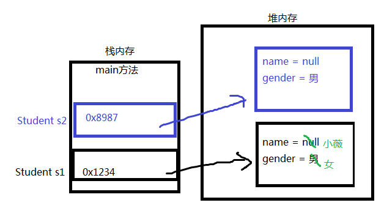
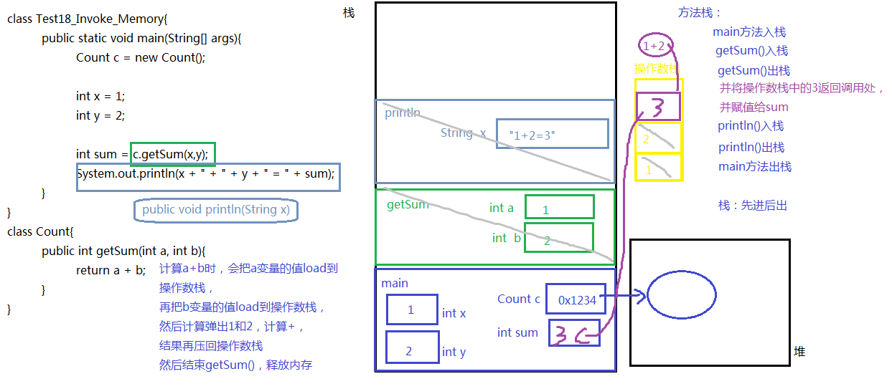
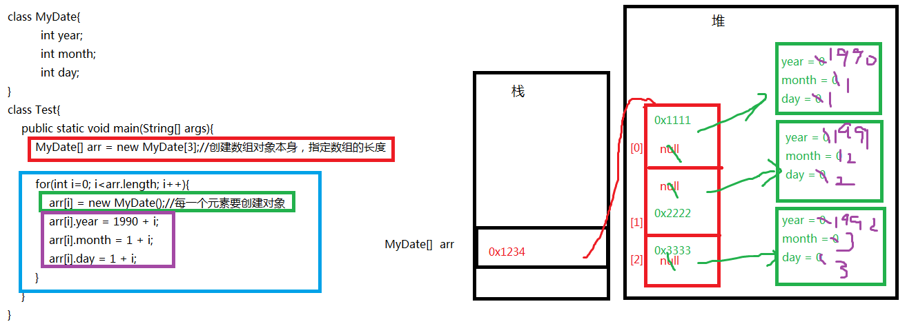

# 第五章 面向对象（上）

## 5.1 面向对象思想概述

**面向对象与面向过程的区别：**

- 面向过程（POP）: Process-Oriented Programming			$\textcolor{red}{C语言、C++(向下兼容c语言)}$
  - 以函数（方法）为最小单位。
  - 数据独立于函数之外。
  - 以过程，步骤为主，考虑怎么做。
  - 程序员是具体执行者。

- 面向对象（OOP）: Object Oriented Programming			$\textcolor{red}{java、python、C++、C\#}$
  - 以类/对象为最小单位，类包括：数据+方法。
  - 以对象（谁）为主，考虑谁来做，谁能做。
  - 程序员是指挥者。

注：面向对象仍然包含面向过程，只不过关注点变了，关注谁来做。

**面向对象的三大基本特征：**封装、继承、多态。

## 5.2 类和对象

* **类**：是一类具有相同特性的事物的抽象描述，是一组相关**属性**和**行为**的集合。可以看成是一类事物的模板，使用事物的属性特征和行为特征来描述该类事物。

现实中，描述一类事物：

​		**属性**：就是该事物的状态信息。

​		**行为**：就是该事物能够做什么。

举例：小猫。

​	属性：名字、体重、年龄、颜色。
​	行为：走、跑、叫。

* **对象**：是一类事物的具体体现。对象是类的一个**实例**，必然具备该类事物的属性和行为。

现实中，一类事物的一个实例：一只小猫 。

举例：一只小猫。

​	属性：tom、5kg、2 years、yellow。
​	行为：溜墙根走、蹦跶的跑、喵喵叫。

**类与对象的关系：**

- 类是对一类事物的描述，是**抽象的**。
- 对象是一类事物的实例，是**具体的**。
- **类是对象的模板，对象是类的实体**。 
- 先有类，再有对象。

## 5.3 类的定义和对象的创建

**事物与类的对比：**

​		现实世界的一类事物：

​			**属性**：事物的状态信息。
​			**行为**：事物能够做什么。

 Java中用class描述事物也是如此：

​			**成员变量**：对应事物的**属性**
​			**成员方法**：对应事物的**行为**

**类的定义格式：**

```java
public class ClassName {
  //成员变量
  //成员方法 
}
```

* **定义类**：就是定义类的成员，包括**成员变量**和**成员方法**。
* **成员变量**：和以前定义变量几乎是一样的。只不过位置发生了改变。**在类中，方法外**。
* **成员方法**：和以前写的main方法格式类似。只不过功能和形式更丰富了。在类中，方法外。

类的定义格式举例：

```java
public class Person {
  	//属性，也是成员变量
  	String name；//姓名
    int age；//年龄
    boolean isMarried;
    
    //函数，也是成员方法
    public void walk(){
        System.out.println("人走路...");
    }
    public String display(){
        return "名字是：" + name + "，年龄是：" + age + "，Married：" + isMarried;
    }
}
```

**对象的创建：**

```java
new 类名()//也称为匿名对象

//给创建的对象命名
//或者说，把创建的对象用一个引用数据类型的变量保存起来
类名 对象名 = new 类名();
```

类似于：

```java
System.out.println("柴老师年龄是：" + 18);//如果确定只在这里一次性使用，那么可以不用变量保存(#^.^#)

//把18用int类型的age变量保存起来，方便后面使用
int age = 18;
System.out.println("柴老师年龄是：" + age);
System.out.println("宋老师比柴老师大10岁，年龄是：" + (age+10));
```

那么，对象名中存储的是什么呢？答：对象地址

```java
class Student{
    
}
public class TestStudent{
    //Java程序的入口
    public static void main(String[] args){
        System.out.println(new Student());//Student@7852e922
        Student stu = new Student();
        System.out.println(stu);//Student@4e25154f
        
        int[] arr = new int[5];
		System.out.println(arr);//[I@70dea4e
    }
}
//Student和TestStudent没有位置要求，谁在上面谁在下面都可以
//但是如果TestStudent类的main中使用了Student类，那么要求编译时，这个Student已经写好了，不写是不行的
//如果两个类都在一个.java源文件中，只能有一个类是public的
```

> ​		注意：学生对象和数组对象类似，直接打印对象名和数组名都是显示“类型@对象的hashCode值"，所以说类、数组都是引用数据类型，引用数据类型的变量中存储的是对象的地址，或者说指向堆中对象的首地址。

## 5.4 成员变量

### 5.4.1 成员变量的分类

- 实例变量：也叫对象属性，属于某个对象的，通过对象来使用

- 类变量：也叫类变量，属于整个类的，不是属于某个实例，后面static部分讲解。


### 5.4.2 实例变量

```java
【修饰符】 class 类名{
    【修饰符】 数据类型  属性名;    //属性有默认值
    【修饰符】 数据类型  属性名 = 值; //属性有初始值
}
```

> 说明：属性的类型可以是Java的任意类型，包括基本数据类型、引用数据类型（类、接口、数组等）

**使用实例变量：**

（1）实例变量在本类的实例方法中，直接使用。

```java
class Circle{
    double radius;
    
    public double getArea(){
        return 3.14 * radius * radius;		//直接使用属性名
    }
}
```

（2）实例变量在其他类的方法中，需要通过“对象名.实例变量"的方式使用

```java
public class TestCircle{
	public static void main(String[] args){
		Circle c = new Circle();
		System.out.println("c这个圆的半径是：" + c.radius);		//对象打点调用
		
		//修改c这个圆的半径
		c.radius = 1.2;
		System.out.println("c这个圆的半径是：" + c.radius);
	}
}
```

**实例变量的特点：**

​		成员变量的默认值：

| 基本类型 | 整数（byte，short，int，long） | 0        |
| -------- | ------------------------------ | -------- |
|          | 浮点数（float，double）        | 0.0      |
|          | 字符（char）                   | '\u0000' |
|          | 布尔（boolean）                | false    |
|          | 数据类型                       | 默认值   |
| 引用类型 | 数组，类，接口                 | null     |

​		实例变量的值是每个对象独立的：

```java
class Circle{
    double radius;
}
public class TestCircle{
	public static void main(String[] args){
		Circle c1 = new Circle();
		Circle c2 = new Circle();
		System.out.println("c1这个圆的半径是：" + c1.radius);//0.0
		System.out.println("c2这个圆的半径是：" + c2.radius);//0.0
		
		//修改c1这个圆的半径的值
		c1.radius = 1.2;
		System.out.println("c1这个圆的半径是：" + c1.radius);//1.2
		System.out.println("c2这个圆的半径是：" + c2.radius);//0.0	
        //c1和c2具有属于自己的属性值。
	}
}
```

**给实例变量赋值：**

（1）在声明属性时显式赋值，那么每一个对象创建之后，这个属性就不是默认值，而是这个初始值了

```java
【修饰符】 class 类名{
    【修饰符】 数据类型  属性名 = 值; //属性有初始值
}
```

代码示例：

```java
class Student{
    String name;
    char gender = '男';//显式赋值
}

class TestStudent{
    public static void main(String[] args){
        Student s1 = new Student();
        System.out.println("姓名：" + s1.name);//null
        System.out.println("性别：" + s1.gender);//男
        
        s1.name = "小薇";//修改属性的默认值
        s1.gender = '女';//修改属性的初始值
        System.out.println("姓名：" + s1.name);//小薇
        System.out.println("性别：" + s1.gender);//女
        
        Student s2 = new Student();
        System.out.println("姓名：" + s2.name);//null
        System.out.println("性别：" + s2.gender);//男
    }
}
```

（2）通过对象为属性赋值

```java
//为对象的属性赋值
对象名.属性名 = 值;
```

### 5.4.3 实例变量内存图

```java
class Student{
    String name;
    char gender = '男';//显式赋值
}
class TestStudent{
    public static void main(String[] args){
        Student s1 = new Student();
        System.out.println("姓名：" + s1.name);//null
        System.out.println("性别：" + s1.gender);//男
        
        s1.name = "小薇";
        s1.gender = '女';
        System.out.println("姓名：" + s1.name);//小薇
        System.out.println("性别：" + s1.gender);//女
        
        Student s2 = new Student();
        System.out.println("姓名：" + s2.name);//null
        System.out.println("性别：" + s2.gender);//男
    }
}
```



### 5.4.4 实例变量和局部变量区别

变量根据定义**位置的不同**，我们给变量起了不同的名字。如下代码所示：

```java
public class Car{
	String color;		//成员变量
    
    public void drive(){
        int speed = 80;			//局部变量
        System.out.println("速度：" + speed);
    }
}
```

- 在类中的位置不同 `重点` 
  - 实例变量：类中，方法外

  - 局部变量：方法中或者方法声明上(形式参数)

- 作用范围不一样 `重点` 
  - 实例变量：类中直接用，其他类通过"对象名.实例变量"使用
  - 局部变量：当前方法的作用域中
- 初始化值的不同 `重点` 
  - 实例变量：有默认值
  - 局部变量：没有默认值。必须先定义，赋值，最后使用
- 在内存中的位置不同 `了解` 
  - 实例变量：堆内存
  - 局部变量：栈内存
- 生命周期不同 `了解` 
  - 实例变量：随着对象的创建或者类的加载而存在，随着对象的消失而消失
    - 换句话说，没有创建对象，就不会在堆中分配它的内存，创建一个，分配一个
  - 局部变量：随着方法的调用而存在，随着方法的调用完毕而消失
    - 换句话说，方法没有被调用，该局部变量不会在栈中分配内存，调用一次，分配一次

### 5.4.5 练习

**练习一：声明矩形类**

需求：声明矩形类，包含长、宽两个实例变量，并创建矩形对象，求面积

```java
public class Field_Demo1 {
	public static void main(String[] args) {
		//创建对象
		Rectangle r = new Rectangle();
		r.length = 1;
		r.width = 2;
		System.out.println("长：" + r.length);
		System.out.println("宽：" + r.width);
		System.out.println("面积：" + r.length*r.width);
	}
}
class Rectangle{
	double length;
	double width;
}
```

**练习二：声明员工类**

需求：声明员工类，包含姓名、性别、薪资三个实例变量，并创建员工对象，打印信息

```java
public class Field_Demo2 {
	public static void main(String[] args) {
		//创建对象
		Employee emp = new Employee();
		emp.name = "柴林燕";
		emp.gender = '女';
		emp.salary = 10000;
		System.out.println("姓名：" + emp.name);
		System.out.println("性别：" + emp.gender);
		System.out.println("薪资：" + emp.salary);
	}
}
class Employee{
	String name;
	char gender;
	double salary;
}
```

**练习三：声明日期类**

需求：声明日期类，包含年、月、日三个实例变量，并创建日期对象，显示信息

```java
public class Field_Demo3 {
	public static void main(String[] args) {
		//创建对象
		MyDate today = new MyDate();
		today.year = 2019;
		today.month = 7;
		today.day = 5;
		System.out.println("今天是" + today.year + "年" + today.month + "月" + today.day);
	}
}
class MyDate{
	int year;
	int month;
	int day;
}
```

**练习四：声明丈夫和妻子类**

需求：

丈夫类：包含姓名和妻子属性

妻子类：包含姓名和丈夫属性

创建一对夫妻对象，并打印信息

```java
public class Field_Demo4 {
	public static void main(String[] args) {
		//创建丈夫对象
		Husband husband = new Husband();
		//创建妻子对象
		Wife wife = new Wife();
		//指定属性
		husband.name = "邓超";
		wife.name = "孙俪";
		husband.wife = wife;
		wife.husband = husband;
		
		System.out.println("丈夫：" + husband.name + "，他妻子是：" + husband.wife.name);
		System.out.println("妻子：" + wife.name + "，他丈夫是：" + wife.husband.name);
	}
}
class Husband{
	String name;
	Wife wife;
}
class Wife{
	String name;
	Husband husband;
}
```

## 5.5 成员方法

### 5.5.1 方法的概念

方法也叫函数，是一个独立功能的定义，是一个类中最基本的功能单元。

把一个功能封装为方法的目的是，可以实现代码重用，从而简少代码量。

**方法的使用原则：**

（1）必须先声明后使用

>  类，变量，方法等都要先声明后使用

（2）不调用不执行，调用一次执行一次。调用一次，在栈中压入一个方法栈。

### 5.5.2 成员方法的分类

成员方法分为两类：

* 实例方法：属于对象的方法，由对象来调用。
* 静态方法：也叫类方法，属于整个类的，不是属于某个实例，由类名来调用，后面static部分讲解。

### 5.5.3 实例方法的格式

1、语法格式

```java
修饰符 返回值类型 方法名(【参数列表：参数类型1 参数名1,参数类型2 参数名, ...... 】){
        方法体；
        【return 返回值;】
}
```

- 修饰符： public 目前固定写法，没有学习其他修饰符
- 返回值类型： 表示方法运行的结果的数据类型，方法执行后将结果返回到调用者
  - 基本数据类型
  - 引用数据类型
  - 无返回值类型：void
- 方法名：给方法起一个名字，见名知意，能准确代表该方法功能的名字
- 参数列表：方法内部需要用到其他方法中的数据，需要通过参数传递的形式将数据传递过来，可以是基本数据类型、引用数据类型、也可以没有参数，什么都不写
- 方法体：特定功能代码
- return：结束方法，并将方法的结果返回去，
  - 如果返回值类型不是void，方法体中必须保证一定有return 返回值;语句，并且要求该返回值结果的类型与声明的返回值类型一致或兼容。
  - 如果返回值类型为void时，return 后面不用跟返回值，甚至也可以没有return语句。
  - return语句后面就不能再写其他代码了，否则会报错：Unreachable code

2、方法声明的位置必须在类中方法外

正确示例：

```java
类{
    方法1(){
        
    }
    方法2(){
        
    }
}
```

错误示例：

```java
类{
    方法1(){
        方法2(){  //错误
        
   		}
    }
}
```

### 5.5.4 实例方法调用

* 方法调用的位置：在另一个方法中调用。

  示例：

  ```java
  类{
      方法1(){
          调用其他方法;
      }
  }
  ```

* 方法调用的分类：

  * 单独调用，格式如下：

    ```java
    对象名.方法名(参数)；
    ```

  * 输出或返回调用，格式如下：

    ```java
    System.out.println(对象名.方法名(参数));//直接输出方法调用后的返回值
    
    或
    
    return 对象名.方法名(参数);//直接返回方法调用后的返回值作为当前方法的返回值
    ```

  * 赋值调用，格式如下：

    ```
    数据类型 变量名 = 对象名.方法名(参数)；
    ```

> 如果实例方法是在本类的另一个实例方法中调用，那么可以省略“对象名.”

```java
class Count {
    /*
    定义计算两个整数和的方法
    返回值类型，计算结果是int
    参数：不确定数据求和，定义int参数.参数又称为形式参数
    */
    public int getSum(int a, int b) {
        return a + b;
    }
    
    /*
    定义计算两个整数差的方法
    返回值类型，计算结果是int
    参数：不确定数据求差，定义int参数.参数又称为形式参数
    */
    public int getSubtract(int a, int b){
        return getSum(a,-b);//直接返回getSum(a,-b)方法调用的结果作为getSubtract(a,b)的结果
    }
}

public class Method_Demo1 {
    public static void main(String[] args) {
        // 创建对象
        Count c = new Count();
        
        // 通过单独调用方式调用方法
        c.getSum(3,4)；
            
       	// 通过输出调用方式调用方法
        System.out.println(c.getSum(3,4));
        
        // 通过赋值调用方式调用方法
        int sum = c.getSum(3,4)；
        System.out.println(sum);
    }
}
```

* 形参：在定义方法时方法名后面括号中的变量名称称为形式参数（简称形参），即形参出现在方法定义中。
* 实参：调用者方法中调用另一个方法时，方法名后面括号中的参数称为实际参数（简称实参），即实参出现在调用者方法中。

总结：

（1）调用时，需要通过方法名来识别调用哪个方法

（2）调用时，需要传“实参”，实参的个数、类型、顺序顺序要与形参列表一一对应

​		如果方法没有形参，就不需要也不能传实参。

（3）调用时，如果方法有返回值，可以接受或处理返回值结果。

​		如果方法的返回值类型是void，不需要也不能接收和处理返回值结果。

### 5.5.5 练习

**练习一：比较两个整数是否相同**

- 分析：定义方法实现功能，需要有两个明确，即`返回值` 和 `参数列表`。
  - **明确返回值**：比较整数，比较的结果只有两种可能，相同或不同，因此结果是布尔类型，比较的结果相同为true。
  - **明确参数列表**：比较的两个整数不确定，所以默认定义两个int类型的参数。

```java
class Count {
    /*
        定义比较两个整数是否相同的方法
        返回值类型，比较的结果布尔类型
        参数：不确定参与比较的两个整数
    */
    public boolean compare(int a, int b) {
        if (a == b) {
            return true;
        } else {
            return false;
        }
    }
}

public class Method_Exer1 {
    public static void main(String[] args) {
        // 创建对象
        Count c = new Count();
        
        //调用方法compare，传递两个整数
        //并接收方法计算后的结果，布尔值
        boolean bool = c.compare(3, 8);
        System.out.println(bool);
    }
}
```

**练习二：计算两个整数的最大值**

* 分析：定义方法实现功能，需要有两个明确，即`返回值` 和 `参数列表`。
  * **明确返回值**：比较整数，比较的结果是它们中的一个，所以是int。
  * **明确参数列表**：比较的两个整数不确定，所以默认定义两个int类型的参数。

```java
class Count{
	public int max(int a,int b){
		return a>b?a:b;
	}
}
public class Method_Exer2{
	public static void main(String[] args) {
		java.util.Scanner input = new java.util.Scanner(System.in);
		System.out.print("请输入一个整数：");
		int x = input.nextInt();
		
		System.out.print("请输入另一个整数：");
		int y = input.nextInt();
		
		Count c = new Count();
		int max = c.max(x, y);
		System.out.println(x + "," + y + "中的最大值是：" + max);
	}
}
```

**练习三：计算1+2+3...+100的和**

- 分析：定义方法实现功能，需要有两个明确，即`返回值`和`参数`。 
  - **明确返回值**：1~100的求和，计算后必然还是整数，返回值类型是int
  - **明确参数**：需求中已知到计算的数据，没有未知的数据，不定义参数

```java
class Count {
	/*
        定义计算1~100的求和方法
        返回值类型，计算结果整数int
        参数：没有不确定数据
    */
    public int getSum() {
        //定义变量保存求和
        int sum = 0;
        //从1开始循环，到100结束
        for (int i = 1; i <= 100; i++) {
            sum = sum + i;
        }
        return sum;
    }
}

public class Method_Exer3 {
    public static void main(String[] args) {
        // 创建对象
        Count c = new Count();
        
        //调用方法getSum
        //并接收方法计算后的结果，整数
        int sum = c.getSum();
        System.out.println(sum);
    }
}
```

**练习四：实现不定次数打印HelloWorld**

- 分析：定义方法实现功能，需要有两个明确，即`返回值`和`参数`。 
  - **明确返回值**：方法中打印出`HelloWorld`即可，没有计算结果，返回值类型`void`。 
  - **明确参数**：打印几次不清楚，参数定义一个整型参数

```java
class PrintUtil {
	/*
          定义打印HelloWorld方法
          返回值类型，计算没有结果 void
          参数：不确定打印几次
    */
    public void printHelloWorld(int n) {
        for (int i = 0; i < n; i++) {
            System.out.println("HelloWorld");
        }
    }
}

public class Method_Exer4 {
    public static void main(String[] args) {
        // 创建对象
        PrintUtil p = new PrintUtil();
        
        //调用方法printHelloWorld，传递整数
        p.printHelloWorld(9);
    }
}
```

**练习五：实现打印不确定（行数、列数、组成的符号）矩形的图形**

* 分析：定义方法实现功能，需要有两个明确，即`返回值`和`参数`。 
  * **明确返回值**：方法中打印出line行column列由sign组成的矩形即可，没有计算结果，返回值类型`void`。 
  * **明确参数**：打印几行，几列，什么符号组成不清楚，参数定义三个参数

```java
public class Method_Exer5 {
	public static void main(String[] args) {
		//创建对象
		PrintUtil pu = new PrintUtil();
		
		//调用printRectangle方法
		pu.printRectangle(5, 10, "&");
	}
}
class PrintUtil{
	public void printRectangle(int line, int column, String sign){
		for (int i = 0; i < line; i++) {
			for (int j = 0; j < column; j++) {
				System.out.print(sign);
			}
			System.out.println();
		}
	}
}
```

**练习六：声明圆类**

* 需求：声明一个圆
  * 包含实例变量radius保存圆对象半径的值
  * 包含实例方法getArea求圆对象的面积
  * 包含实例方法getPerimeter求圆对象的周长
  * 包含实例方法getInfo获取圆对象的详细信息

* 分析：定义方法实现功能，需要有两个明确，即`返回值`和`参数`。 
  * **明确返回值**：
    * getArea()方法需要返回面积值，所以是double类型 
    * getPerimeter()方法需要返回周长值，所以是double类型 
    * getInfo()方法需要返回圆对象的完整信息，所以是String类型
  * **明确参数**：
    * getArea()方法，求面积值通过实例变量radius计算即可，所以不需要再设计参数
    * getPerimeter()方法，求周长通过实例变量radius计算即可，所以不需要再设计参数
    * getInfo()方法，返回圆对象的完整信息，由实例变量radius的值，和通过getArea()方法计算的面积值，通过getPerimeter()方法计算的周长的值组成，所以不需要再设计参数

```java
public class Method_Exer6 {
	public static void main(String[] args) {
		//创建对象
		Circle c = new Circle();
		c.radius = 1.2;
		System.out.println(c.getInfo());
	}
}
class Circle{
	double radius;
	
	public double getArea(){
		return 3.14 * radius * radius;
	}
	
	public double getPerimeter(){
		return 2 * 3.14 * radius;
	}
	
	public String getInfo(){
		return "半径：" + radius + "，面积：" + getArea() + "，周长：" + getPerimeter();
	}
}
```

**练习七：声明客户和账户类、银行类**

* 声明账户类Account
  * 包含：账户和余额两个实例变量
  * 包含save存款方法
  * 包含withdraw取款方法
* 声明客户类Customer
  * 包含：姓名和手机、身份证号、拥有的一个账户，四个实例变量

* 声明银行类BankClerk
  * 包含open方法，给某个客户对象开户，关联Customer和Account两个对象的信息

```java
class Account{
	String id;
	double balance;
	public void save(double money){
		if(money > 0){
			balance += money;
		}else{
			System.out.println("参数有误");
		}
	}
	public void withdraw(double money){
		if(money <0){
			System.out.println("参数有误");
		}else if(money > balance){
			System.out.println("余额不足");
		}else{
			balance -= money;
		}
	}
}
class Customer{
	String name;
	String tel;
	String cid;
	Account account;
}
class BankClerk{
	public void open(Customer c, Account a){
		c.account = a;
	}
}
public class Method_Exer6 {
	public static void main(String[] args) {
		//创建客户对象
		Customer c = new Customer();
		c.name = "柴林燕";
		c.tel = "10086";
		c.cid = "111111111111111111";
		
		//创建银行卡账号对象
		Account a = new Account();
		a.id = "12345678910";
		a.balance = 0;
		
		//银行对象
		BankClerk b = new BankClerk();
		b.open(c, a);
		System.out.println("姓名：" + c.name + "，电话：" + c.tel + "，身份证号：" + c.cid + "，账号：" + c.account.id + "，余额：" + c.account.balance);
		
		//存款
		c.account.save(1000);
		System.out.println("姓名：" + c.name + "，电话：" + c.tel + "，身份证号：" + c.cid + "，账号：" + c.account.id + "，余额：" + c.account.balance);
		
		//取款
		c.account.withdraw(2000);
		//显示信息
		System.out.println("姓名：" + c.name + "，电话：" + c.tel + "，身份证号：" + c.cid + "，账号：" + c.account.id + "，余额：" + c.account.balance);
	}
}
```

### 5.5.6 方法调用内存分析

​		方法不调用不执行，`调用一次执行一次入栈一次`，每次调用会在栈中有一个入栈动作，即给当前方法开辟一块独立的内存区域，用于存储当前方法的局部变量的值，当方法执行结束后，会释放该内存，称为出栈，如果方法有返回值，就会把结果返回调用处，如果没有返回值，就直接结束，回到调用处继续执行下一条指令。

​		栈结构：先进后出，后进先出。

```java
class Test18_Invoke_Memory{
	public static void main(String[] args){
		Count c = new Count();
		
		int x = 1;
		int y = 2;
		
		int sum = c.getSum(x,y);
		System.out.println(x + " + " + y + " = " + sum);
	}
}
class Count{
	public int getSum(int a, int b){
		return a + b;
	}
}
```



# 

### 5.5.7  可变参数

​		在**JDK1.5**之后，如果我们定义一个方法时，此时某个形参的类型可以确定，但是形参的个数不确定，那么我们可以使用可变参数。

格式：

```
修饰符 返回值类型 方法名(【非可变参数部分的形参列表,】参数类型... 形参名){  }
```

要求：

（1）一个方法只能有一个可变参数

（2）可变参数必须是形参列表的最后一个

（3）其实这个书写“等价于”

```
修饰符 返回值类型 方法名(【非可变参数部分的形参列表,】参数类型[] 形参名){  }
```

​		只是后面这种定义，在调用时必须传递数组，而前者更灵活，既可以传递数组，又可以直接传递数组的元素，其实编译成的class文件，将这些元素先封装到一个数组中，在进行传递。这些动作都在编译.class文件时，自动完成了。

**好处：**

​		同样是代表数组，但是在调用这个带有可变参数的方法时，不用创建数组(这就是简单之处)，直接将数组中的元素作为实际参数进行传递，其实编译成的class文件，将这些元素先封装到一个数组中，在进行传递。这些动作都在编译.class文件时，自动完成了。

代码演示：    

```java
public class ChangeArgs {
	public static void main(String[] args) {
		// 创建对象
		Count c = new Count();

		int[] arr = { 1, 4, 62, 431, 2 };
		int sum1 = c.getSum1(arr);
		System.out.println(sum1);

		int sum2 = c.getSum2(arr);
		System.out.println(sum2);
		int sum3 = c.getSum2(1, 4, 62, 431, 2);
		System.out.println(sum3);
	}

}

class Count {

	// 完成数组 所有元素的求和
	// 原始写法
	public int getSum1(int[] arr) {
		int sum = 0;
		for (int i = 0; i < arr.length; i++) {
			sum += arr[i];
		}

		return sum;
	}

	// 可变参数写法
	public int getSum2(int... arr) {
		int sum = 0;
		for (int i = 0; i < arr.length; i++) {
			sum += arr[i];
		}
		return sum;
	}
}
```

**练习一：找最大值**

定义求1-n个整数中的最大值

```java
public class ChangeArgs_Exer1 {
	public static void main(String[] args) {
		Count c = new Count();
		System.out.println(c.max(1));
		System.out.println(c.max(5,3,2,6));
	}
}
class Count{
	public int max(int num, int... others){
		int max = num;
		for (int i = 0; i < others.length; i++) {
			if(max < others[i]){
				max = num;
			}
		}
		return max;
	}
}
```

**练习二：字符串拼接**

定义将n个字符串进行拼接，如果没有传入字符串，那么返回空字符串

```java
public class ChangeArgs_Exer2 {
	public static void main(String[] args) {
		StringUtil su = new StringUtil();
		System.out.println(su.concat());
		System.out.println(su.concat("hello","world"));
	}
}
class StringUtil{
	public String concat(String... args){
		String str = "";
		for (int i = 0; i < args.length; i++) {
			str += args[i];
		}
		return str;
	}
}
```

**练习三：字符串拼接2**

定义将n个字符串进行拼接，每一个字符串之间使用某字符进行分割，如果没有传入字符串，那么返回空字符串

```java
public class ChangeArgs_Exer4 {
	public static void main(String[] args) {
		StringUtil su = new StringUtil();
		System.out.println(su.concat('+'));
		System.out.println(su.concat('+',"hello","world"));
	}
}
class StringUtil{
	public String concat(char seperator, String... args){
		String str = "";
		for (int i = 0; i < args.length; i++) {
			if(i==0){
				str += args[i];
			}else{
				str += seperator + args[i];
			}
		}
		return str;
	}
}
```

### 5.5.8 方法重载

- **方法重载**：指在同一个类中，允许存在一个以上的同名方法，只要它们的`参数列表不同`即可，与修饰符和返回值类型无关。
- 参数列表：数据类型个数不同，数据类型不同，数据类型顺序不同。
- 重载方法调用：JVM通过方法的参数列表，调用不同的方法。

**方法重载练习一：比较两个数据是否相等**

比较两个数据是否相等。参数类型分别为两个`byte`类型，两个`short`类型，两个`int`类型，两个`long`类型，并在`main`方法中进行测试。 

```java
public class Method_Demo6 {
    public static void main(String[] args) {
        //创建
        Count c = new Count();
        
        //定义不同数据类型的变量
        byte a = 10;
        byte b = 20;
        short c = 10;
        short d = 20;
        int e = 10;
        int f = 10;
        long g = 10;
        long h = 20;
        // 调用
        System.out.println(c.compare(a, b));
        System.out.println(c.compare(c, d));
        System.out.println(c.compare(e, f));
        System.out.println(c.compare(g, h));
    }
}

class Count {
        // 两个byte类型的
    public boolean compare(byte a, byte b) {
        System.out.println("byte");
        return a == b;
    }

    // 两个short类型的
    public boolean compare(short a, short b) {
        System.out.println("short");
        return a == b;
    }

    // 两个int类型的
    public boolean compare(int a, int b) {
        System.out.println("int");
        return a == b;
    }

    // 两个long类型的
    public boolean compare(long a, long b) {
        System.out.println("long");
        return a == b;
    }
}
```

**方法重载练习二：求各种最大值**

用重载实现：
定义方法求两个整数的最大值
定义方法求三个整数的最大值
定义方法求两个小数的最大值

```java
//求两个整数的最大值
public int max(int a,int b){
    return a>b?a:b;
}
	
//求三个整数的最大值
public int max(int a, int b, int c){
    return max(max(a,b),c);
}
	
//求两个小数的最大值
public double max(double a, double b){
    return a>b?a:b;
}
```

**方法重载练习三：判断两个方法是否是合理的重载方法**

```java
//判断如下两个方法是否构成重载：是
class StringUtil{
	public String concat(char seperator, String... args){
		String str = "";
		for (int i = 0; i < args.length; i++) {
			if(i==0){
				str += args[i];
			}else{
				str += seperator + args[i];
			}
		}
		return str;
	}
	public String concat(String[] args){
		String str = "";
		for (int i = 0; i < args.length; i++) {
			str += args[i];
		}
		return str;
	}
}
```

```java
//判断如下两个方法是否构成重载：不是
class Count{
	public int getSum(int... nums){
		int sum = 0;
		for (int i = 0; i < nums.length; i++) {
			sum += nums[i];
		}
		return sum;
	}
	public int getSum(int[] nums){
		int sum = 0;
		for (int i = 0; i < nums.length; i++) {
			sum += nums[i];
		}
		return sum;
	}
}
```

```java
class Test06_Overload_Problem2{
	public static void main(String[] args){
		Count c = new Count();
		System.out.println(c.sum(1,2));//(int a, int b)
		System.out.println(c.sum(1,2,3));//(int... args)和(int a, int... args)都兼容，就有问题了
	}
}
//Count类编译没问题，但是调用者有问题
class Count{
	public int sum(int a, int b){
		return a+b;
	}
	public int sum(int... args){
		int sum = 0;
		for(int i=0; i<args.length; i++){
			sum += args[i];
		}
		return sum;
	}
	public int sum(int a, int... args){
		int sum = a;
		for(int i=0; i<args.length; i++){
			sum += args[i];
		}
		return sum;
	}	
}
```

### 5.5.9 方法的参数传递机制

* 形参：在定义方法时方法名后面括号中的变量名称称为形式参数（简称形参），即形参出现在方法定义中。
* 实参：调用者方法中调用另一个方法时，方法名后面括号中的参数称为实际参数（简称实参），即实参出现在调用者方法中。
* 方法的参数传递机制：实参给形参赋值
  * 方法的形参是基本数据类型时，形参值的改变不会影响实参；
  * 方法的形参是引用数据类型时，形参地址值的改变不会影响实参，但是形参地址值里面的数据的改变会影响实参，例如，修改数组元素的值，或修改对象的属性值。
    * 注意：String、Integer等特殊类型除外

示例代码1：

```java
class Test{
    public static void swap(int a, int b){
        int temp = a;
        a = b;
        b = temp;
	}

	public static void main（String[] args){
        int x = 1;
        int y = 2;
        swap(x,y);//调用完之后，x与y的值不变
    }
}

```

示例代码2：

```java
class Test{
    public static void change(MyData my){
        my.num *= 2;
    }
    
    public static void main(String[] args){
        MyData m = new MyData();
        m.num = 1;
        
        change(m);//调用完之后，m对象的num属性值就变为2
    }
}

class MyData{
    int num;
}
```

示例代码3：

```java
public class Test {
	public static void main(String[] args) {
		int[] arr = {2,4,1,5,3};
		
		ArrayUtil util = new ArrayUtil();
		util.sort(arr);		//已进行排序
		
		for (int i = 0; i < arr.length; i++) {
			System.out.println(arr[i]);
		}
	}
}
class ArrayUtil{
	public void sort(int[] arr){
		for (int i = 1; i < arr.length; i++) {
			for (int j = 0; j < arr.length - i; j++) {
				if(arr[j] > arr[j+1]){
					int temp = arr[j];
					arr[j] = arr[j+1];
					arr[j+1] = temp;
				}
			}
		}
	}
}
```

陷阱1：

```java
/*
陷阱1：在方法中，形参 = 新new对象，那么就和实参无关了
*/
class Test{
    public static void change(MyData my){
        my = new MyData();//形参指向了新对象
        my.num *= 2;
    }
    
    public static void main(String[] args){
        MyData m = new MyData();
        m.num = 1;
        
        change(m);//调用完之后，m对象的num属性值仍然为1
    }
}

class MyData{
    int num;
}
```

陷阱2：见字符串和包装类部分

```java
public class Test {
	public static void main(String[] args) {
		StringUtil util = new StringUtil();
		String str = "李焕英";
		util.change(str);
		System.out.println(str);	//李焕英
	}
}
class StringUtil{
	public void change(String str){
		str += "你好";	//String对象不可变，一旦修改就会产生新对象
	}
}
```

### 5.5.10 命令行参数（了解）

​		在cmd中，通过命令行给main方法的形参传递的实参称为命令行参数

```java
public class TestCommandParam{
	//形参：String[] args
	public static void main(String[] args){
		System.out.println(args);
		System.out.println(args.length);
		
		for(int i=0; i<args.length; i++){
			System.out.println("第" + (i+1) + "个参数的值是：" + args[i]);
		}
	}
}
```

运行命令：

```command
java TestCommandParam
```

```command
java TestCommandParam 1 2 3
```

```command
java TestCommandParam hello world
```

### 5.5.11 递归方法

* **递归**：指在当前方法内调用自己的这种现象。
* **递归的分类:**
  * 递归分为两种，直接递归和间接递归。
  * 直接递归称为方法自身调用自己。
  * 间接递归可以A方法调用B方法，B方法调用C方法，C方法调用A方法。
* **注意事项**：
  * 递归一定要有条件限定，保证递归能够停止下来，否则会发生栈内存溢出。
  * 在递归中虽然有限定条件，但是递归次数不能太多。否则也会发生栈内存溢出。

**语法案例演示一：计算1-100之间所有自然数的和**

```java
public class RecursionMethod1{
	public static void main(String[] args) {
		Count c = new Count();
		
		int sum = c.sum(100);
		System.out.println("1-100的和：" + sum);
	}
}
class Count{
	public int sum(int n){
		if(n == 1){
			return 1;
		}else{
			return n + sum(n-1);
		}
	}
}
```

**练习1：求n!**

```java
public class RecursionMethod2{
	public static void main(String[] args) {
		Count c = new Count();
		
		int jieCheng = c.jieCheng(10);
		System.out.println("10的阶乘是：" + jieCheng);
	}
}
class Count{
	public int jieCheng(int n){
		if(n <= 1){
			return 1;
		}else{
			return n * jieCheng(n-1);
		}
	}
}
```

**练习2：计算斐波那契数列（Fibonacci）的第n个值**

规律：一个数等于前两个数之和，

​	f(0) =1，

​	f(1) = 1，

​	f(2) = f(0) + f(1) =2，

​	f(3) = f(1) + f(2) = 3, 

​	f(4) = f(2) + f(3) = 5

​	...

​	f(n) = f(n-2) + f(n-1);

```java
public class RecursionMethod3{
	public static void main(String[] args) {
		Count c = new Count();
		
		System.out.println("f(10)：" + c.f(10));
		System.out.println("f方法被调用的总次数：" + c.total);
	}
}
class Count{
	int total = 0;
	public int f(int n){
		total++;
		if(n <= 1){
			return 1;
		}else{
			return f(n-2) + f(n-1);
		}
	}
}
```


## 5.6  对象数组

​		数组是用来存储一组数据的容器，一组基本数据类型的数据可以用数组装，那么一组对象也可以使用数组来装。

​		即数组的元素可以是基本数据类型，也可以是引用数据类型。当元素是引用数据类型是，我们称为对象数组。

> 注意：对象数组，首先要创建数组对象本身，即确定数组的长度，然后再创建每一个元素对象，如果不创建，数组的元素的默认值就是null，所以很容易出现空指针异常NullPointerException。

**代码演示：**

```java
class MyDate{
	int year;
	int month;
	int day;
}
class Test{
    public static void main(String[] args){
        MyDate[] arr = new MyDate[3];//创建数组对象本身，指定数组的长度
        
        for(int i=0; i<arr.length; i++){
            arr[i] = new MyDate();//每一个元素要创建对象
            arr[i].year = 1990 + i;
            arr[i].month = 1 + i;
            arr[i].day = 1 + i;
        }
    }
}

```

**对象数组的内存图分析：**



### 练习

**练习1:**

（1）定义学生类Student

​	声明姓名和成绩实例变量，

​	getInfo()方法：用于返回学生对象的信息

（2）测试类ObjectArrayTest的main中创建一个可以装3个学生对象的数组，并且按照学生成绩排序，显示学生信息

```java
public class ObjectArrayTest {
	public static void main(String[] args) {
		Student[] arr = new Student[3];
		arr[0] = new Student();
		arr[0].name = "张三";
		arr[0].score = 89;
		
		arr[1] = new Student();
		arr[1].name = "李四";
		arr[1].score = 84;
		
		arr[2] = new Student();
		arr[2].name = "王五";
		arr[2].score = 85;
		
		for (int i = 1; i < arr.length; i++) {
			for (int j = 0; j < arr.length-1; j++) {
				if(arr[j].score > arr[j+1].score){
					Student temp = arr[j];
					arr[j] = arr[j+1];
					arr[j+1] = temp;
				}
			}
		}
		
		for (int i = 0; i < arr.length; i++) {
			System.out.println(arr[i].getInfo());
		}
	}
}
class Student{
	String name;
	int score;
	public String getInfo(){
		return "姓名：" + name + ",成绩：" + score;
	}
}
```

```java
class Test18_ObjectArrayExer2_2{
	public static void main(String[] args){
		//创建一个可以装3个学生对象的数组
		Student[] arr = new Student[3];//只是申明这个数组，可以用来装3个学生，此时里面没有学生对象
		
		//从键盘输入
		java.util.Scanner input = new java.util.Scanner(System.in);
		for(int i=0;i<arr.length; i++){
			System.out.println("请输入第" + (i+1) + "个学生信息：");
			arr[i] = new Student();
			
			System.out.print("姓名：");
			arr[i].name = input.next();
			
			System.out.print("成绩：");
			arr[i].score = input.nextInt();
		}
		
		//先显示一下目前的顺序
		for(int i=0; i<arr.length; i++){
			System.out.println(arr[i].getInfo());
		}
		
		System.out.println("------------------------------------------");
		//冒泡排序
		for(int i=1; i<arr.length; i++){
			for(int j=0; j<arr.length-i; j++){
				//arr[j] > arr[j+1]//错误的
				if(arr[j].score > arr[j+1].score){
					//交换两个元素，这里是两个学生对象，所以temp也得是Student类型
					Student temp = arr[j];
					arr[j] = arr[j+1];
					arr[j+1] = temp;
				}
			}
		}
		//再显示一下目前的顺序
		for(int i=0; i<arr.length; i++){
			System.out.println(arr[i].getInfo());
		}
	}
}
class Student{
	String name;
	int score;//使用int或double都可以
	
	public String getInfo(){
		return "姓名：" + name +"，成绩：" + score;
	}
}
```

**练习2**

（1）定义圆Circle类，包含radius半径属性，getArea()求面积方法，getPerimeter()求周长方法，String getInfo()返回圆对象的详细信息的方法

（2）在测试类中创建长度为5的Circle[]数组，用来装5个圆对象，并给5个圆对象的半径赋值为[1,10)的随机值

```java
class Test16_ObjectArray{
	public static void main(String[] args){
		//要在数组中存储5个圆对象
		//声明一个可以用来存储圆对象的数组
		Circle[] arr = new Circle[5];
		//for(int i=0; i<arr.length; i++){
		//	System.out.println(arr[i]);
		//}
		//System.out.println(arr[0].radius);//NullPointerException
		
		//给元素赋值
		//元素的类型是：Circle，应该给它一个Circle的对象
		//arr[0] = 1.2;//错误的
		//arr[0]相当于它是一个Circle类型的变量，也是对象名
		/*
		arr[0] =  new Circle();
		arr[0].radius = 1.2;
		System.out.println(arr[0].radius);
		*/
		
		//创建5个对象，半径随机赋值为[1,10)的随机值
		//Math.random()==>[0,1)
		//Math.random()*9==>[0,9)
		//Math.random()*9+1==>[1,10)
		for(int i=0; i<arr.length; i++){
			arr[i] = new Circle();//有对象才有半径
			arr[i].radius = Math.random()*9+1;
		}
		
		
		//遍历显示圆对象的信息
		for(int i=0; i<arr.length; i++){
			//arr[i]是一个Circle的对象，就可以调用Circle类中的属性和方法
			System.out.println(arr[i].getInfo());
		}
	}
}
class Circle{
	double radius;
	public double getArea(){
		return 3.14 * radius * radius;
	}
	public double getPerimeter(){
		return 3.14 * 2 * radius;
	}
	public String getInfo(){
		return "半径：" + radius +"，面积：" + getArea() + "，周长：" + getPerimeter();
	}
}
```


