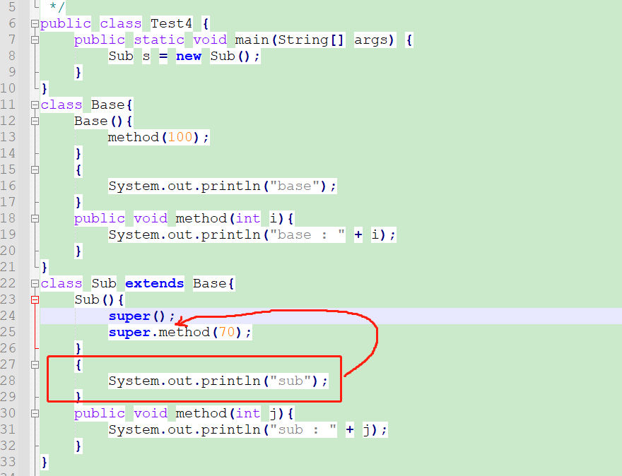

# 第六章 面向对象（中）

## 6.1 封装

### 6.1.1 封装概述

​		面向对象编程语言是对客观世界的模拟，客观世界里成员变量都是隐藏在对象内部的，外界无法直接操作和修改。封装可以被认为是一个保护屏障，防止该类的代码和数据被其他类随意访问。要访问该类的数据，必须通过指定的方式。适当的封装可以让代码更容易理解与维护，也加强了代码的安全性。

​		这个就是我们说的“高内聚，低耦合”的体现之一：

- 高内聚：类的内部数据操作细节自己完成，不允许外部干涉；
- 低耦合：仅对外暴露少量的方法用于使用

​        隐藏对象内部的复杂性，只对外公开简单的接口。便于外界调用，从而提高系统的可扩展性、可维护性。通俗的讲，把该隐藏的隐藏起来，该暴露的暴露出来。这就是封装性的设计思想。

**封装的设计思想的应用：**

（1）类的封装：把属性和方法封装到类的内部，外部通过调用方法完成指定的功能，不需要了解类的内部实现

（2）组件的封装：例如支付宝等支付组件，对外只提供使用接口，我们不需要也无法了解内部的实现

（3）系统的封装：例如我们使用操作系统等，我们只需要知道怎么用，不需要了解内部的实现

### 6.1.2 属性的封装

- 原理：将**属性隐藏**起来，若需要访问某个属性，**提供公共方法**对其访问。


- 目的：
  - 隐藏类的实现细节
  - 让使用者只能通过事先预定的方法来访问数据，从而可以在该方法里面加入控制逻辑，限制对成员变量的不合理访问。
  - 可以进行数据检查，从而有利于保证对象信息的完整性。
  - 便于修改，提高代码的可维护性。

- 实现步骤：

1. 使用 `private` 修饰成员变量

```java
private 数据类型 变量名 ；
```

代码如下：

```java
public class Student {
  private String name;
  private int age;
}
```

2. 提供 `getXxx`方法 / `setXxx` 方法，可以访问成员变量，代码如下：

```java
public class Student {
  private String name;
  private int age;

  public void setName(String n) {
    name = n;
  }

  public String getName() {
    return name;
  }

  public void setAge(int a) {
    age = a;
  }

  public int getAge() {
    return age;
  }
}
```

### 6.1.3 权限修饰符

|                       | 本类内（同文件下） | 本包内（Package） |      本模块内（Module）       |
| :-------------------: | :----------------: | :---------------: | :---------------------------: |
|   public（公有的）    |         √          |         √         |               √               |
|    缺省的（默认）     |         √          |         √         |               ×               |
|   private（私有的）   |         √          |         ×         |               ×               |
| protected（受保护的） |         √          |         √         | 其它包子类√     其它包非子类× |

> 对于类的成员：四种权限修饰符都可以使用
>
> 对于外部的类：只能使用public和缺省两种

**练习**

（1）定义学生类Student

​	声明姓名和成绩实例变量，私有化，提供get/set

​	getInfo()方法：用于返回学生对象的信息

（2）测试类ObjectArrayTest的main中创建一个可以装3个学生对象的数组，并且按照学生成绩排序，显示学生信息

```java
class Test22_Exer{
	public static void main(String[] args){
		//创建一个可以装3个学生对象的数组
		Student[] arr = new Student[3];//只是申明这个数组，可以用来装3个学生，此时里面没有学生对象
		
		//手工赋值
		arr[0] = new Student();
		arr[0].setName("张三");
		arr[0].setScore(78);
		
		arr[1] = new Student();
		arr[1].setName("李四");
		arr[1].setScore(96);
		
		arr[2] = new Student();
		arr[2].setName("王五");
		arr[2].setScore(56);
		
		//先显示一下目前的顺序
		for(int i=0; i<arr.length; i++){
			System.out.println(arr[i].getInfo());
		}
		
		System.out.println("------------------------------------------");
		//冒泡排序
		for(int i=1; i<arr.length; i++){
			for(int j=0; j<arr.length-i; j++){
				//arr[j] > arr[j+1]//错误的
				if(arr[j].getScore() > arr[j+1].getScore()){
					//交换两个元素，这里是两个学生对象，所以temp也得是Student类型
					Student temp = arr[j];
					arr[j] = arr[j+1];
					arr[j+1] = temp;
				}
			}
		}
		//再显示一下目前的顺序
		for(int i=0; i<arr.length; i++){
			System.out.println(arr[i].getInfo());
		}
	}
}
class Student{
	private String name;
	private int score;//使用int或double都可以
	
	//get/set方法，
	public void setName(String n){
		name = n;
	}
	public String getName(){
		return name;
	}
	public void setScore(int s){
		score = s;
	}
	public int getScore(){
		return score;
	}
	
	public String getInfo(){
		return "姓名：" + name +"，成绩：" + score;
	}
}
```


```java
class Test22_Exer_2{
	public static void main(String[] args){
		//创建一个可以装3个学生对象的数组
		Student[] arr = new Student[3];//只是申明这个数组，可以用来装3个学生，此时里面没有学生对象
		
		//从键盘输入
		java.util.Scanner input = new java.util.Scanner(System.in);
		for(int i=0;i<arr.length; i++){
			System.out.println("请输入第" + (i+1) + "个学生信息：");
			arr[i] = new Student();
			
			System.out.print("姓名：");
			String name = input.next();
			arr[i].setName(name);
			
			System.out.print("成绩：");
			arr[i].setScore(input.nextInt());
		}
		
		//先显示一下目前的顺序
		for(int i=0; i<arr.length; i++){
			System.out.println(arr[i].getInfo());
		}
		
		System.out.println("------------------------------------------");
		//冒泡排序
		for(int i=1; i<arr.length; i++){
			for(int j=0; j<arr.length-i; j++){
				//arr[j] > arr[j+1]//错误的
				if(arr[j].getScore() > arr[j+1].getScore()){
					//交换两个元素，这里是两个学生对象，所以temp也得是Student类型
					Student temp = arr[j];
					arr[j] = arr[j+1];
					arr[j+1] = temp;
				}
			}
		}
		//再显示一下目前的顺序
		for(int i=0; i<arr.length; i++){
			System.out.println(arr[i].getInfo());
		}
	}
}
class Student{
	private String name;
	private int score;//使用int或double都可以
	
	//get/set方法，
	public void setName(String n){
		name = n;
	}
	public String getName(){
		return name;
	}
	public void setScore(int s){
		score = s;
	}
	public int getScore(){
		return score;
	}
	
	public String getInfo(){
		return "姓名：" + name +"，成绩：" + score;
	}
}
```


## 6.2 构造器

​		构造器（Constructor)又称为构造方法，那是因为它长的很像方法。但是和方法还有有所区别的。

### 6.2.1 构造器的作用

​		要创建一个类的实例对象，必须调用一个对象的构造器，来完成类的实例初始化过程。实例初始化过程就是为实例变量赋初始值的过程。

​		当一个对象被创建时候，构造方法用来初始化该对象，给对象的成员变量赋初始值。

> 小贴士：无论你与否自定义构造方法，所有的类都有构造方法，因为Java自动提供了一个无参数构造方法，一旦自己定义了构造方法，Java自动提供的默认无参数构造方法就会失效。

### 6.2.2 构造方法的定义

```java
【修饰符】 构造器名(){
    // 实例初始化代码
}
【修饰符】 构造器名(参数列表){
	// 实例初始化代码
}
```

代码如下：

```java
public class Student {
	private String name;
	private int age;
	// 无参构造
  	public Student() {} 
 	// 有参构造
  	public Student(String n,int a) {
		name = n;
    	age = a; 
	}
    //此处其他代码省略
}
```

### 6.2.3 注意事项

1. 构造器名必须与它所在的类名必须相同。
2. 它没有返回值，所以不需要返回值类型，甚至不需要void
3. 如果你不提供构造器，系统会给出无参数构造器，并且该构造器的修饰符默认与类的修饰符相同
4. 如果你提供了构造器，系统将不再提供无参数构造器，除非你自己定义。
5. 构造器是可以重载的，既可以定义参数，也可以不定义参数。
6. 构造器不能被static、final、synchronized、abstract、native修饰

**练习：**

（1）声明一个员工类，

* 包含属性：编号、姓名、薪资、性别，要求属性私有化，提供get/set，
* 提供无参构造器和有参构造器
* 提供getInfo()

（2）在测试类的main中分别用无参构造和有参构造创建员工类对象，调用getInfo

```java
class Test02_Constructor_Exer{
	public static void main(String[] args){
		//分别用无参构造和有参构造创建对象，调用getInfo
		Employee e1 = new Employee();
		System.out.println(e1.getInfo());
		
		Employee e2 = new Employee("1001","张三",110000,'男');
		System.out.println(e2.getInfo());
		
		e2.setSalary(120000);
		System.out.println(e2.getInfo());
		
		System.out.println("e1薪资：" + e1.getSalary());
	}
}
class Employee{
	private String id;
	private String name;
	private double salary;
	private char gender;
	
	//提供无参构造器和有参构造器
	Employee(){
		
	}
	Employee(String i, String n){
		id = i;
		name = n;
	}
	Employee(String i, String n, double s, char g){
		id = i;
		name = n;
		salary = s;
		gender = g;
	}
	
	//提供get/set，
	public void setId(String i){
		id = i;
	}
	public String getId(){
		return id;
	}
	public void setName(String n){
		name = n;
	}
	public String getName(){
		return name;
	}
	public void setSalary(double s){
		salary = s;
	}
	public double getSalary(){
		return salary;
	}
	public void setGender(char g){
		gender = g;
	}
	public char getGender(){
		return gender;
	}
	//提供getInfo()
	public String getInfo(){
		return "编号：" + id + "，姓名：" + name + "，薪资：" + salary + "，性别：" +gender;
	}
}
```


## 6.3 this关键字

**this的含义：**

this代表当前对象的引用（地址值），即对象自己的引用。

* this可以用于构造器中：表示正在创建的那个实例对象，即正在new谁，this就代表谁
* this用于实例方法中：表示调用该方法的对象，即谁在调用，this就代表谁。

**this使用格式：**

1、this.成员变量名

​		当方法的局部变量与当前对象的成员变量重名时，就可以在成员变量前面加this.，如果没有重名问题，就可以省略this.

```java
this.成员变量名；
```

2、this.成员方法

​		调用当前对象自己的成员方法时，都可以加"this."，也可以省略，实际开发中都省略

```java
【变量=】this.成员方法(【实参列表】);
```

3、this()或this(实参列表)

​		当需要调用本类的其他构造器时，就可以使用该形式。

要求：

- 必须在构造器的首行

- 如果一个类中声明了n个构造器，则最多有 n - 1个构造器中使用了"this(【实参列表】)"，否则会发生递归调用死循环


## 6.4 标准JavaBean

​		`JavaBean` 是 Java语言编写类的一种标准规范。符合`JavaBean` 的类，要求类必须是具体的和公共的，并且具有无参数的构造方法，成员变量私有化，并提供用来操作成员变量的`set` 和`get` 方法。

```java
public class ClassName{
  //成员变量
    
  //构造方法
  	//无参构造方法【必须】
  	//有参构造方法【建议】
  	
  //getXxx()
  //setXxx()
  //其他成员方法
}
```

 编写符合`JavaBean` 规范的类，以学生类为例，标准代码如下：

```java
public class Student {
	// 成员变量
	private String name;
	private int age;

	// 构造方法
	public Student() {
	}

	public Student(String name, int age) {
		this.name = name;
		this.age = age;
	}

	// get/set成员方法
	public void setName(String name) {
		this.name = name;
	}

	public String getName() {
		return name;
	}

	public void setAge(int age) {
		this.age = age;
	}

	public int getAge() {
		return age;
	}
    
    //其他成员方法列表
    public String getInfo(){
        return "姓名：" + name + "，年龄：" + age;
    }
}
```

测试类，代码如下：

```java
public class TestStudent {
	public static void main(String[] args) {
		// 无参构造使用
		Student s = new Student();
		s.setName("柳岩");
		s.setAge(18);
		System.out.println(s.getName() + "---" + s.getAge());
        System.out.println(s.getInfo());

		// 带参构造使用
		Student s2 = new Student("赵丽颖", 18);
		System.out.println(s2.getName() + "---" + s2.getAge());
        System.out.println(s2.getInfo());
	}
}
```

## 6.5 包

### 6.5.1 包的作用

1、可以避免类重名

有了包（Package）之后，类的全名称就变为：包.类名

2、分类组织管理众多的类

例如：

* java.lang----包含一些Java语言的核心类，如String、Math、Integer、 System和Thread等，提供常用功能
* java.net----包含执行与网络相关的操作的类和接口。
* java.io ----包含能提供多种输入/输出功能的类。
* java.util----包含一些实用工具类，如集合框架类、日期时间、数组工具类Arrays，文本扫描仪Scanner，随机值产生工具Random。
* java.text----包含了一些java格式化相关的类
* java.sql和javax.sql----包含了java进行JDBC数据库编程的相关类/接口
* java.awt和java.swing----包含了构成抽象窗口工具集（abstract window toolkits）的多个类，这些类被用来构建和管理应用程序的图形用户界面(GUI)。

3、可以控制某些类型或成员的可见范围

如果某个类型或者成员的权限修饰缺省的话，那么就仅限于本包使用


### 6.5.2 声明包的语法格式

```java
package 包名;
```

> 注意：
>
> (1)必须在源文件的代码首行
>
> (2)一个源文件只能有一个声明包的语句

包的命名规范和习惯：
（1）所有单词都小写，每一个单词之间使用.分割
（2）习惯用公司的域名倒置

例如：com.sias.xxx;

> 建议大家取包名时不要使用“java.xx"包

### 6.5.3  如何编译和运行

编译格式：

```
javac -d class文件存放路径 源文件路径名.java
```

例如：

```java
package com.atguigu.demo;

public class TestPackage {
	public static void main(String[] args) {
		System.out.println("hello package");
	}
}
```

编译：

```java
javac -d . TestPackage.java
```

> 其中 . 表示在当前目录生成包目录

运行：

```java
java com.atguigu.demo.TestPackage
```

> 定位到com目录的外面才能正确找到这个类
>
> 使用类的全名称才能正确运行这个类
>
> 了解，之后在idea中就不用了

### 6.5.4 使用其他包的类

前提：被使用的类或成员的权限修饰符是>缺省的

（1）使用类型的全名称

例如：java.util.Scanner input = new java.util.Scanner(System.in);

（2）使用import 语句之后，代码中使用简名称

import语句告诉编译器到哪里去寻找类。

import语句的语法格式：

```java
import 包.类名;
import 包.*;
import static 包.类名.静态成员; //后面补充
```

> 注意：
>
> 使用java.lang包下的类，不需要import语句，就直接可以使用简名称
>
> import语句必须在package下面，class的上面
>
> 当使用两个不同包的同名类时，例如：java.util.Date和java.sql.Date。一个使用全名称，一个使用简名称


示例代码：

```java
package com.atguigu.bean;

public class Student {
	// 成员变量
	private String name;
	private int age;

	// 构造方法
	public Student() {
	}

	public Student(String name, int age) {
		this.name = name;
		this.age = age;
	}

	// 成员方法
	public void setName(String name) {
		this.name = name;
	}

	public String getName() {
		return name;
	}

	public void setAge(int age) {
		this.age = age;
	}

	public int getAge() {
		return age;
	}
}
```

```java
package com.atguigu.test;

import java.util.Scanner;
import java.util.Date;
import com.atguigu.bean.Student;

public class Test{
    public static void main(String[] args){
        Scanner input = new Scanner(System.in);
        Student stu = new Student();
        String str = "hello";
        
        Date now = new Date();
        java.sql.Date d = new java.sql.Date(346724566);        
    }
}
```


## 6.6 static

​		static是一个成员修饰符，可以修饰类的成员：成员变量、成员方法、成员内部类（后面学习）、代码块（后面学习）。被修饰的成员是**属于类**的，而不是单单是属于某个对象的。也就是说，既然属于类，就可以不靠创建对象来调用了。

### 6.6.1 静态方法

​		static修饰的成员方法，称为类方法、静态方法。

语法格式：

```java
【其他修饰符】 static 返回值类型 方法名 (【形参列表】){ 
	// 执行语句 
}
```

（1）在本类中，静态方法可以直接访问静态方法和静态变量。

（2）在其他类中：可以使用“类名.方法"进行调用，也可以使用"对象名.方法"，推荐使用“类名.方法"

（3）在静态方法中，**不能出现**：this，也**不能直接**使用本类的非静态的成员。相反，非静态的实例成员方法可以直接访问静态的类变量或静态方法。

​	this，非静态的成员，这些都是需要创建对象时，才能使用的，而静态方法调用时，可能没有对象。

> 小贴士：静态方法只能访问静态成员。

```java
public class Test{
    public static void main(String[] args){
    	Son s = new Son();
    	s.fun();//有警告，没错误
    	
    	Son.fun();
    }
}

class Son{
	private int a;	
	public static void fun(){
//		method();//错误的
//		System.out.println(a);//错误
//		System.out.println(this.a);//错误

		System.out.println("Son:fun()");
	}
	public void method(){
		System.out.println("Son:method()");
	}
}
```

### 6.6.2 静态变量

​		static修饰的成员变量，称为类变量、静态变量。

（1）该成员变量的值是该类所有对象共享的

（2）类变量的值和类信息一起存在于方法区中。

（3）它的get/set也是static的，

（4）在static方法中如果有局部变量与类变量重名时，使用“类名.成员变量"进行区别

（5）在内存中，静态资源在类加载时就直接存入方法区。

```java
public class Test{
    public static void main(String[] args){
    	Chinese c1 = new Chinese("张三");
    	Chinese c2 = new Chinese("李四");
    	System.out.println("国家名：" + c1.getCountry() + "，姓名：" + c1.getName());
    	System.out.println("国家名：" + c2.getCountry() + "，姓名：" + c2.getName());
    	
    	c1.setCountry("中国");//两个对象共享，一个对象修改，会影响另一个对象
    	System.out.println("国家名：" + c1.getCountry() + "，姓名：" + c1.getName());
    	System.out.println("国家名：" + c2.getCountry() + "，姓名：" + c2.getName());
    	
    	Chinese.setCountry("China");//通过“类名.”访问可读性更好
    	System.out.println("国家名：" + c1.getCountry() + "，姓名：" + c1.getName());
    	System.out.println("国家名：" + c2.getCountry() + "，姓名：" + c2.getName());
    }
}
class Chinese{
	private static String country = "中华人民共和国";
	private String name;

	public Chinese(String name) {
		super();
		this.name = name;
	}

	public static String getCountry() {
		return country;
	}

	public static void setCountry(String country) {
		Chinese.country = country;//类名.静态变量来区别区别同名变量
	}

	public String getName() {
		return name;
	}

	public void setName(String name) {
		this.name = name;
	}
	 
}
```

**练习：**

比如说，基础班新班开班，学员报到。现在想为每一位新来报到的同学编学号（sid），从第一名同学开始，sid为1，以此类推。学号必须是唯一的，连续的，并且与班级的人数相符，这样以便知道，要分配给下一名新同学的学号是多少。这样我们就需要一个变量，与单独的每一个学生对象无关，而是与整个班级同学数量有关。

所以，我们可以这样定义一个静态变量numberOfStudent，代码如下：

```java
public class Student {
  private String name;
  private int age;
  // 学生的id
  private int sid;
  // 类变量，记录学生数量，分配学号
  public static int numberOfStudent = 0;

  public Student(String name, int age){
    this.name = name;
    this.age = age; 
    // 通过 numberOfStudent 给学生分配学号
    this.sid = ++numberOfStudent;
  }

  // 打印属性值
  public void show() {
    System.out.println("Student : name=" + name + ", age=" + age + ", sid=" + sid );
  }
}

public class StuDemo {
  public static void main(String[] args) {
    Student s1 = new Student("张三", 23);
    Student s2 = new Student("李四", 24);
    Student s3 = new Student("王五", 25);
    Student s4 = new Student("赵六", 26);

    s1.show(); // Student : name=张三, age=23, sid=1
    s2.show(); // Student : name=李四, age=24, sid=2
    s3.show(); // Student : name=王五, age=25, sid=3
    s4.show(); // Student : name=赵六, age=26, sid=4
  }
}
```


### 6.6.3 静态导入

​		JDK1.5引入静态导入

```java
package com.atguigu.test;

import static java.lang.Math.*;

public class Test{
    public static void main(String[] args){
    	System.out.println("PI：" + Math.PI);
    	System.out.println("平方根：" + Math.sqrt(4));
    	System.out.println("随机数：" + Math.random());
    	
    	//有静态导入，可以简写如下
    	System.out.println("PI：" + PI);
    	System.out.println("平方根：" + sqrt(4));
    	System.out.println("随机数：" + random());
    }
}
```

### 6.6.4 变量的分类与区别详解

1、变量按照数据类型分：

（1）基本数据类型的变量，里面存储数据值

（2）引用数据类型的变量，里面存储对象的地址值

```java
int a = 10;//栈中的a存储的是数据值

Student stu = new Student();//栈中的stu存储的是对象的地址值
int[] arr = new int[5];//栈中的arr存储的是数组对象的地址值
String str = "hello";//栈中的str存储的是"hello"对象的地址值
```

2、变量按照声明的位置不同：

（1）成员变量

（2）局部变量

```java
class Person{
	private static String country = "中华人民共和国";//成员变量，静态成员变量,类变量，"中华人民共和国"是常量值
	private String name;////成员变量，非静态成员变量，实例变量
	public Person(String name) {//name 局部变量
		this.name = name;//=左边带this.的是成员变量，=右边没有this.的是局部变量
	}
	public Person() {
	}
	public static String getCountry() {
		return country;//成员变量
	}
	public static void setCountry(String country) {//局部变量
		Person.country = country;//=左边带类名.的是成员变量，=右边是局部变量
	}
	public String getName() {
		return name;//成员变量
	}
	public void setName(String name) {//局部变量
		this.name = name;//=左边带this.的是成员变量，=右边是局部变量
	}
}
```

```java
public class Test{
    public static void main(String[] args){//args局部变量
    	String n1 = "张三";//n1局部变量，"张三"是常量值
    	Person p1 = new Person(n1);//p1局部变量
    	
    	String n2 = "李四";//n2局部变量，"李四"是常量值
    	Person p2 = new Person(n2);//p2局部变量
        
        p1.setName("张三丰");//"张三丰"是常量值
    	
    	Person.setCountry("中国");//"中国"是常量值
    }
}
```

3、成员变量与局部变量的区别

（1）**声明的位置不同**

成员变量：类中方法外

局部变量：（1）方法的()中，即形参（2）方法体的{}的局部变量（3）代码块{}中

（2）**存储的位置不同**

成员变量：

​		如果是静态变量（类变量），在方法区中

​		如果是非静态的变量（实例变量），在堆中

 局部变量：栈

（3）**修饰符不同**

成员变量：4种权限修饰符、static等多种修饰符

局部变量：不能有任何修饰符

（4）**作用域不同**

成员变量：

​		如果是静态变量（类变量），在本类中随便用，在其他类中使用“类名.静态变量"

​		如果是非静态的变量（实例变量），在本类中只能在非静态成员中使用，在其他类中使用“对象名.非静态的变量"

局部变量：有作用域，出了作用域就不能使用

（5）**生命周期不同**

成员变量：

​		如果是静态变量（类变量），和类相同，随着类的加载而分配，随着的类的卸载才消亡。

​		如果是非静态的变量（实例变量），和所属的对象相同，每一个对象是独立。对象创建时，才在堆中分配内存，随着对象被垃圾回收而消亡。

局部变量：每次方法调用执行都是新的，而且仅在作用域范围内有效。

### 6.6.5  系统预定义工具类

**1、数组工具类Arrays**

​		java.util.Arrays数组工具类，提供了很多`静态方法`来对数组进行操作，而且如下每一个方法都有各种重载形式，以下只列出int[]类型的，其他类型的数组类推：

* static int binarySearch(int[] a, int key) ：要求数组有序，在数组中查找key是否存在，如果存在返回第一次找到的下标，不存在返回负数

* static int[] copyOf(int[] original, int newLength)  ：根据original原数组复制一个长度为newLength的新数组，并返回新数组

* static int[] copyOfRange(int[] original, int from, int to) ：复制original原数组的[from,to)构成新数组，并返回新数组

* static boolean equals(int[] a, int[] a2) ：比较两个数组的长度、元素是否完全相同

* static void fill(int[] a, int val) ：用val填充整个a数组
* static void fill(int[] a, int fromIndex, int toIndex, int val)：将a数组[fromIndex,toIndex)部分填充为val 
* static void sort(int[] a) ：将a数组按照从小到大进行排序
* static void sort(int[] a, int fromIndex, int toIndex) ：将a数组的[fromIndex, toIndex)部分按照升序排列
* static String toString(int[] a) ：把a数组的元素，拼接为一个字符串，形式为：[元素1，元素2，元素3。。。]

示例代码：

```java
import java.util.Arrays;
import java.util.Random;

public class Test{
    public static void main(String[] args){
    	int[] arr = new int[5];
        // 打印数组,输出地址值
  		System.out.println(arr); // [I@2ac1fdc4
  		// 数组内容转为字符串
    	System.out.println("arr数组初始状态："+ Arrays.toString(arr));
    	
    	Arrays.fill(arr, 3);
    	System.out.println("arr数组现在状态："+ Arrays.toString(arr));
    	
    	Random rand = new Random();
    	for (int i = 0; i < arr.length; i++) {
			arr[i] = rand.nextInt(100);//赋值为100以内的随机整数
		}
    	System.out.println("arr数组现在状态："+ Arrays.toString(arr));
    	
    	int[] arr2 = Arrays.copyOf(arr, 10);
    	System.out.println("新数组：" + Arrays.toString(arr2));
    	
    	System.out.println("两个数组的比较结果：" + Arrays.equals(arr, arr2));
    	
    	Arrays.sort(arr);
    	System.out.println("arr数组现在状态："+ Arrays.toString(arr));
    }
}
```

**2、系统类System的几个方法**

系统类中很多好用的方法，其中两个如下：

* static long currentTimeMillis() ：返回当前系统时间距离1970-1-1 0:0:0的毫秒值

* static void arraycopy(Object src, int srcPos, Object dest, int destPos, int length)： 

  从指定源数组中复制一个数组，复制从指定的位置开始，到目标数组的指定位置结束。常用于数组的插入和删除

* static void exit(int status) ：退出当前系统

* static void gc() ：运行垃圾回收器。

```java
public class Test{
    public static void main(String[] args){
    	long time = System.currentTimeMillis();
    	System.out.println("现在的系统时间距离1970年1月1日凌晨：" + time + "毫秒");
    	
    	System.exit(0);

    	System.out.println("over");//不会执行
    }
}
```

```java
import java.util.Arrays;

public class Test{
    public static void main(String[] args){
    	//在[0]插入10
    	int[] arr = {1,2,3,4,5};
    	//先扩容
    	arr = Arrays.copyOf(arr, arr.length+1);
    	//往后移动元素
    	System.arraycopy(arr, 0, arr, 1, 5);
    	//在[0]插入10
    	arr[0] = 10;
    	System.out.println(Arrays.toString(arr));
    	
    	
    	//删除[0]元素
    	int[] arr2 = {1,2,3,4,5};
    	//往前移动元素
    	System.arraycopy(arr2, 1, arr2, 0, 4);
    	//最后位置恢复为默认值
    	arr2[arr2.length-1] = 0;
    	System.out.println(Arrays.toString(arr2));
    }
}
```

**3、数学类Math**

​		`java.lang.Math` 类包含用于执行基本数学运算的方法，如初等指数、对数、平方根和三角函数。类似这样的工具类，其所有方法均为静态方法，并且不会创建对象，调用起来非常简单。

* `public static double abs(double a) ` ：返回 double 值的绝对值。 

```java
double d1 = Math.abs(-5); //d1的值为5
double d2 = Math.abs(5); //d2的值为5
```

* `public static double ceil(double a)` ：返回大于等于参数的最小的整数。

```java
double d1 = Math.ceil(3.3); //d1的值为 4.0
double d2 = Math.ceil(-3.3); //d2的值为 -3.0
double d3 = Math.ceil(5.1); //d3的值为 6.0
```

* `public static double floor(double a) ` ：返回小于等于参数最大的整数。

```java
double d1 = Math.floor(3.3); //d1的值为3.0
double d2 = Math.floor(-3.3); //d2的值为-4.0
double d3 = Math.floor(5.1); //d3的值为 5.0
```

* `public static long round(double a)` ：返回最接近参数的 long。(相当于四舍五入方法)  

```java
long d1 = Math.round(5.5); //d1的值为6.0
long d2 = Math.round(5.4); //d2的值为5.0
```

* public static double pow(double a,double b)：返回a的b幂次方法
* public static double sqrt(double a)：返回a的平方根
* public static double random()：返回[0,1)的随机值
* public static final double PI：返回圆周率
* public static double max(double x, double y)：返回x,y中的最大值
* public static double min(double x, double y)：返回x,y中的最小值

```java
double result = Math.pow(2,31);
double sqrt = Math.sqrt(256);
double rand = Math.random();
double pi = Math.PI;
```

**练习:** 

请使用`Math` 相关的API，计算在 `-10.8`  到`5.9`  之间，绝对值大于`6`  或者小于`2.1` 的整数有多少个？

```java
public class MathTest {
  public static void main(String[] args) {
    // 定义最小值
    double min = -10.8;
    // 定义最大值
    double max = 5.9;
    // 定义变量计数
    int count = 0;
    // 范围内循环
    for (double i = Math.ceil(min); i <= max; i++) {
      // 获取绝对值并判断
      if (Math.abs(i) > 6 || Math.abs(i) < 2.1) {
        // 计数
        count++;
      }
    }
    System.out.println("个数为: " + count + " 个");
  }
}
```

## 6.7 继承

### 6.7.1 继承的概述

**继承的理解:**

​		**继承**就是子类继承父类的**属性**和**行为**，使得子类对象具有与父类相同的属性、相同的行为。

**继承的好处:**

* 提高**代码的复用性**。

* 提高**代码的扩展性**。

* 类与类之间产生了关系，是学习**多态的前提**。

### 6.7.2 继承的格式

​		通过 `extends` 关键字，可以声明一个子类继承另外一个父类，定义格式如下：

```java
【修饰符】 class 父类 {
	...
}

【修饰符】 class 子类 extends 父类 {
	...
}

```

继承演示，代码如下：

```java
/*
 * 定义动物类Animal，做为父类
 */
class Animal {
    // 定义name属性
	public String name; 
    // 定义age属性
    public int age;
	// 定义动物的吃东西方法
	public void eat() {
		System.out.println(age + "岁的" + name + "在吃东西");
	}
}

/*
 * 定义猫类Cat 继承 动物类Animal
 */
class Cat extends Animal {
	// 定义一个猫抓老鼠的方法catchMouse
	public void catchMouse() {
		System.out.println("抓老鼠");
	}
}

/*
 * 定义测试类
 */
public class ExtendDemo01 {
	public static void main(String[] args) {
        // 创建一个猫类对象
		Cat cat = new Cat()；
      
        // 为该猫类对象的name属性进行赋值
		cat.name = "Tom";
      
      	// 为该猫类对象的age属性进行赋值
		cat.age = 2;
        
        // 调用该猫的catchMouse()方法
		cat.catchMouse();
		
      	// 调用该猫继承来的eat()方法
      	cat.eat();
	}
}

演示结果：
抓老鼠
2岁的Tom在吃东西
```

### 6.7.3 继承的特点一：成员变量

**私有化（private）:**

* 父类中的成员，无论是公有(public)还是私有(private)，均会被子类继承。
* 子类虽会继承父类私有(private)的成员，但子类不能对继承的私有成员直接进行访问，可通过继承的`公有方法`进行访问。

代码如下：

```java
/*
 * 定义动物类Animal，做为父类
 */
class Animal {
    // 定义name属性
	private String name; 
    // 定义age属性
    public int age;
	// 定义动物的吃东西方法
	public void eat() {
		System.out.println(age + "岁的" + name + "在吃东西");
	}
}
/*
 * 定义猫类Cat 继承 动物类Animal
 */
class Cat extends Animal {
	// 定义一个猫抓老鼠的方法catchMouse
	public void catchMouse() {
		System.out.println("抓老鼠");
	}
}

/*
 * 定义测试类
 */
public class ExtendDemo01 {
	public static void main(String[] args) {
        // 创建一个猫类对象
		Cat cat = new Cat()；
      
        // 为该猫类对象的name属性进行赋值
		//t.name = "Tom";// 编译报错
      
      	// 为该猫类对象的age属性进行赋值
		t.age = 2;
        
        // 调用该猫的catchMouse()方法
		t.catchMouse();
		
      	// 调用该猫继承来的eat()方法
      	t.eat();
	}
}
```

**成员变量不重名:**

如果子类父类中出现**不重名**的成员变量，这时的访问是**没有影响的**。代码如下：

```java
class Fu {
	// Fu中的成员变量。
	int num01 = 3;
}

class Zi extends Fu {
	// Zi中的成员变量
	int num02 = 4;
	// Zi中的成员方法
	public void show() {
		// 访问父类中的num，
		System.out.println("num1 = " + num1); 
		// 访问子类中的num2
		System.out.println("num2 = " + num2);
	}
}

class ExtendDemo02 {
	public static void main(String[] args) {
        // 创建子类对象
		Zi z = new Zi(); 
      	// 调用子类中的show方法
		z.show();  
	}
}

演示结果：
num1 = 3
num2 = 4
```

**成员变量重名:**

​		如果子类父类中出现**重名**的成员变量，这时的访问是**有影响的**。代码如下：

```java
class Fu {
	// Fu中的成员变量。
	int num = 3;
}

class Zi extends Fu {
	// Zi中的成员变量
	int num = 4;
	public void show() {
		// 访问的num到底是子类还是父类？
		System.out.println("num = " + num);

	}
}
class ExtendsDemo03 {
	public static void main(String[] args) {
      	// 创建子类对象
		Zi z = new Zi(); 
      	// 调用子类中的show方法
		z.show(); 
	}
}
演示结果：
num = 4
```

​		子父类中出现了同名的成员变量时，在子类中需要访问父类中非私有成员变量时，需要使用`super` 关键字，修饰父类成员变量，类似于之前学过的 `this` 。

使用格式：

```java
super.父类成员变量名
```

子类方法需要修改，代码如下：

```java
class Zi extends Fu {
	// Zi中的成员变量
	int num = 6;
	public void show() {
		//访问父类中的num
		System.out.println("Fu num=" + super.num);
		//访问子类中的num
		System.out.println("Zi num=" + this.num);
	}
}
演示结果：
Fu num = 5
Zi num = 6
```

> 小贴士：Fu 类中的成员变量是非私有的，子类中可以直接访问。若Fu 类中的成员变量私有了，子类是不能直接访问的。通常编码时，我们遵循封装的原则，使用private修饰成员变量，那么如何访问父类的私有成员变量呢？对！可以在父类中提供公共的getXxx方法和setXxx方法。

**练习：代码分析:**

```java
class Father{
	int a = 10;
	int b = 11;
}
class Son extends Father{
	int a = 20;
	
	public void test(){
		//子类与父类的属性同名，子类对象中就有两个a
		System.out.println("父类的a：" + super.a);//10
		System.out.println("子类的a：" + this.a);//20
		System.out.println("子类的a：" + a);//20
		
		//子类与父类的属性不同名，是同一个b
		System.out.println("b = " + b);//11
		System.out.println("b = " + this.b);//11
		System.out.println("b = " + super.b);//11
	}
	
	public void method(int a){
		//子类与父类的属性同名，子类对象中就有两个成员变量a，此时方法中还有一个局部变量a
		System.out.println("父类的a：" + super.a);//10
		System.out.println("子类的a：" + this.a);//20
		System.out.println("局部变量的a：" + a);//30
	}
}
public class TestInherite2 {
	public static void main(String[] args) {
		Son son = new Son();
		System.out.println(son.a);//20
		
		son.test();
		
		son.method(30);
	}
}
```


### 6.7.4 继承的特点二：成员方法

**成员方法不重名:**

​		如果子类父类中出现**不重名**的成员方法，这时的调用是**没有影响的**。对象调用方法时，会先在子类中查找有没有对应的方法，若子类中存在就会执行子类中的方法，若子类中不存在就会执行父类中相应的方法。代码如下：

```java
class Fu{
	public void show(){
		System.out.println("Fu类中的show方法执行");
	}
}
class Zi extends Fu{
	public void show2(){
		System.out.println("Zi类中的show2方法执行");
	}
}
public  class ExtendsDemo04{
	public static void main(String[] args) {
		Zi z = new Zi();
     	//子类中没有show方法，但是可以找到父类方法去执行
		z.show(); 
		z.show2();
	}
}

```

**成员方法重名:——重写(Override)**

​		如果子类父类中出现**重名**的成员方法，这时的访问是一种特殊情况，叫做**方法重写** (Override)。

代码如下：

```java
class Fu {
	public void show() {
		System.out.println("Fu show");
	}
}
class Zi extends Fu {
	//子类重写了父类的show方法
	public void show() {
		System.out.println("Zi show");
	}
}
public class ExtendsDemo05{
	public static void main(String[] args) {
		Zi z = new Zi();
     	// 子类中有show方法，只执行重写后的show方法
		z.show();  // Zi show
	}
}
```

```
在父子类的继承关系当中，创建子类对象，访问成员方法的规则：
    创建的对象是谁，就优先用谁，如果没有则向上找。

注意事项：
无论是成员方法还是成员变量，如果没有都是向上找父类，绝对不会向下找子类的。

重写（Override）
概念：在继承关系当中，方法的名称一样，参数列表也一样。

重写（Override）：方法的名称一样，参数列表【也一样】。覆盖、覆写。
重载（Overload）：方法的名称一样，参数列表【不一样】。

方法的覆盖重写特点：创建的是子类对象，则优先用子类方法。

方法覆盖重写的注意事项：见下面
```

**重写的应用:**

​		子类可以根据需要，定义特定于自己的行为。既沿袭了父类的功能名称，又根据子类的需要重新实现父类方法，从而进行扩展增强。比如新的手机增加来电显示头像的功能，代码如下：

```java
class Phone {
	public void sendMessage(){
		System.out.println("发短信");
	}
	public void call(){
		System.out.println("打电话");
	}
	public void showNum(){
		System.out.println("来电显示号码");
	}
}

//智能手机类
class NewPhone extends Phone {
	
	//重写父类的来电显示号码功能，并增加自己的显示姓名和图片功能
	public void showNum(){
		//调用父类已经存在的功能使用super
		super.showNum();
		//增加自己特有显示姓名和图片功能
		System.out.println("显示来电姓名");
		System.out.println("显示头像");
	}
}

public class ExtendsDemo06 {
	public static void main(String[] args) {
      	// 创建子类对象
      	NewPhone np = new NewPhone()；
        
        // 调用父类继承而来的方法
        np.call();
      
      	// 调用子类重写的方法
      	np.showNum();

	}
}

```

> 小贴士：这里重写时，用到super.父类成员方法，表示调用父类的成员方法。

**注意事项:**

1. 必须保证父子类之间方法的名称相同，参数列表也相同。
   @Override：写在方法前面，用来检测是不是有效的正确覆盖重写。
   这个注解就算不写，只要满足要求，也是正确的方法覆盖重写。

2. 子类方法的返回值类型必须【小于等于】父类方法的返回值类型（小于其实就是是它的子类）。
   小扩展提示：java.lang.Object类是所有类的公共最高父类（祖宗类），java.lang.String就是Object的子类。

   > 注意：如果返回值类型是基本数据类型和void，那么必须是相同

3. 子类方法的权限必须【大于等于】父类方法的权限修饰符。
   小扩展提示：public > protected > 缺省 > private

4. 几种特殊的方法不能被重写

   * 静态方法不能被重写
   * 私有等在子类中不可见的方法不能被重写
   * final方法不能被重写

**练习:**

1、声明父类：Person类
包含属性：姓名，年龄，性别
属性私有化，get/set
包含getInfo()方法：例如：姓名：张三，年龄：23，性别：男

2、声明子类：Student类，继承Person类
新增属性：score成绩
属性私有化，get/set
包含getInfo()方法：例如：姓名：张三，年龄：23，性别：男，成绩：89

3、声明子类：Teacher类，继承Person类
新增属性：salary薪资
属性私有化，get/set
包含getInfo()方法：例如：姓名：张三，年龄：23，性别：男，薪资：10000

```java
public class Person {
	private String name;
	private int age;
	private char gender;
	public Person(String name, int age, char gender) {
		super();
		this.name = name;
		this.age = age;
		this.gender = gender;
	}
	public Person() {
		super();
	}
	public String getName() {
		return name;
	}
	public void setName(String name) {
		this.name = name;
	}
	public int getAge() {
		return age;
	}
	public void setAge(int age) {
		this.age = age;
	}
	public char getGender() {
		return gender;
	}
	public void setGender(char gender) {
		this.gender = gender;
	}
	
	//包含getInfo()方法：例如：姓名：张三，年龄：23，性别：男
	public String getInfo(){
		return "姓名：" + name + "，年龄：" + age +"，性别：" + gender;
	}
}
```

```java
public class Student extends Person {
	private int score;

	public Student() {
	}

	public Student(String name, int age, char gender, int score) {
		setName(name);
		setAge(age);
		setGender(gender);
		this.score = score;
	}

	public int getScore() {
		return score;
	}

	public void setScore(int score) {
		this.score = score;
	}
	//包含getInfo()方法：例如：姓名：张三，年龄：23，性别：男，成绩：89
	public String getInfo(){
		//方式一：
//		return "姓名：" + getName() + "，年龄：" + getAge() + "，成绩：" + score;
		
		//方法二：
		return super.getInfo() + "，成绩：" + score;
	}
	
}
```

```java
public class Teacher extends Person {
	private double salary;

	public Teacher() {
	}

	public Teacher(String name, int age, char gender, double salary) {
		setName(name);
		setAge(age);
		setGender(gender);
		this.salary = salary;
	}

	public double getSalary() {
		return salary;
	}

	public void setSalary(double salary) {
		this.salary = salary;
	}
	
	//包含getInfo()方法：例如：姓名：张三，年龄：23，性别：男，薪资：10000
	public String getInfo(){
		return super.getInfo() + "，薪资：" + salary;
	}
}

```

```java
public class TestPersonExer2 {
	public static void main(String[] args) {
		Person p = new Person("张三", 23, '男');
		System.out.println(p.getInfo());
		
		Student s = new Student("陈琦", 25, '男', 89);
		System.out.println(s.getInfo());
		
		Teacher t = new Teacher("柴林燕", 18, '女', 11111);
		System.out.println(t.getInfo());
	}
}
```

### 6.7.5 继承的特点三：构造器

当类之间产生了关系，其中各类中的构造方法，又产生了哪些影响呢？

首先我们要回忆两个事情，构造方法的定义格式和作用。

1. 构造方法的名字是与类名一致的。所以子类是**无法继承**父类构造方法的。
2. 构造方法的作用是初始化成员变量的。所以子类的初始化过程中，**必须**先执行父类的初始化动作。子类的构造方法中默认有一个`super()` ，表示调用父类的构造方法，父类成员变量初始化后，才可以给子类使用。代码如下：

```java
class Fu {
  private int n;
  Fu(){
    System.out.println("Fu()");
  }
}
class Zi extends Fu {
  Zi(){
    // super（），调用父类构造方法
    super();
    System.out.println("Zi（）");
  } 
}
public class ExtendsDemo07{
  public static void main (String args[]){
    Zi zi = new Zi();
  }
}
输出结果：
Fu（）
Zi（）
```

**如果父类没有无参构造怎么办？**

例如：

```java
public class Person {
	private String name;
	private int age;
	public Person(String name, int age) {
		super();
		this.name = name;
		this.age = age;
	}
	//其他成员方法省略
}
```

```java
public class Student extends Person{
	private int score;
}
```

此时子类代码报错。

解决办法：在子类构造器中，用super(实参列表)，显示调用父类的有参构造解决。

```java
public class Student extends Person{
	private int score;

	public Student(String name, int age) {
		super(name, age);
	}
	public Student(String name, int age, int score) {
		super(name, age);
		this.score = score;
	}
	
	//其他成员方法省略
}
```

**练习：**

1、父类Graphic图形
包含属性：name（图形名），属性私有化，不提供无参构造，只提供有参构造
包含求面积getArea()：返回0.0
求周长getPerimeter()方法：返回0.0
显示信息getInfo()方法：返回图形名称、面积、周长

2、子类Circle圆继承Graphic图形
包含属性：radius
重写求面积getArea()和求周长getPerimeter()方法，显示信息getInfo()加半径信息

3、子类矩形Rectange继承Graphic图形
包含属性：length、width
重写求面积getArea()和求周长getPerimeter()方法，显示信息getInfo()加长宽信息

```java
public class Graphic {
	private String name;

	public Graphic(String name) {
		super();
		this.name = name;
	}

	public String getName() {
		return name;
	}

	public void setName(String name) {
		this.name = name;
	}

	// 包含求面积getArea()和求周长getPerimeter()方法，显示信息getInfo()
	public double getArea() {
		return 0.0;
	}

	public double getPerimeter() {
		return 0.0;
	}

	/*
	 * this对象：调用当前方法的对象，如果是Graphic对象，那么就会执行Graphic的getArea()和getPerimeter()
	 * this对象：调用当前方法的对象，如果是Circle对象，那么就会执行Circle的getArea()和getPerimeter()
	 * this对象：调用当前方法的对象，如果是Rectangle对象，那么就会执行Rectangle的getArea()和getPerimeter()
	 */
	public String getInfo() {
		return "图形：" + name + "，面积：" + getArea() + ",周长：" + getPerimeter();
	}
}
```

```java
public class Circle extends Graphic {
	private double radius;

	public Circle(String name, double radius) {
		super(name);
		this.radius = radius;
	}

	public double getRadius() {
		return radius;
	}

	public void setRadius(double radius) {
		this.radius = radius;
	}

	@Override//表示这个方法是重写的方法
	public double getArea() {
		return Math.PI * radius * radius;
	}

	@Override//表示这个方法是重写的方法
	public double getPerimeter() {
		return Math.PI * radius * 2;
	}

	/*@Override//表示这个方法是重写的方法
	public String getInfo() {
		return super.getInfo() + "，半径：" + radius;
	}*/
	
}

```

```java
public class Rectangle extends Graphic {
	private double length;
	private double width;
	
	public Rectangle(String name, double length, double width) {
		super(name);
		this.length = length;
		this.width = width;
	}

	public double getLength() {
		return length;
	}

	public void setLength(double length) {
		this.length = length;
	}

	public double getWidth() {
		return width;
	}

	public void setWidth(double width) {
		this.width = width;
	}

	@Override
	public double getArea() {
		return length*width;
	}

	@Override
	public double getPerimeter() {
		return 2*(length + width);
	}
	
}

```

```java
public class TestGraphicExer3 {
	public static void main(String[] args) {
		Graphic g = new Graphic("通用图形");
		System.out.println(g.getInfo());
		
		Circle c = new Circle("圆", 1.2);
		System.out.println(c.getInfo());//调用getInfo()方法的对象是c
		
		Rectangle r = new Rectangle("矩形", 3, 5);
		System.out.println(r.getInfo());
	}
}

```


### 6.7.6 继承的特点四：单继承

1. Java只支持单继承，不支持多继承。

```java
//一个类只能有一个父类，不可以有多个父类。
class C extends A{} 	//√
class C extends A，B...	//×
```

2. Java支持多层继承(继承体系)。

```java
class A{}
class B extends A{}
class C extends B{}
```

> 顶层父类是Object类。所有的类默认继承Object，作为父类。

3. 子类和父类是一种相对的概念。
4. 一个父类可以同时拥有多个子类

## 6.8 super

**父类空间优先于子类对象产生：**

​		在每次创建子类对象时，先初始化父类空间，再创建其子类对象本身。目的在于子类对象中包含了其对应的父类空间，便可以包含其父类的成员，如果父类成员非private修饰，则子类可以随意使用父类成员。代码体现在子类的构造方法调用时，一定先调用父类的构造方法。

```java
public class Person {
	private String name;
	private int age;
	//其他代码省略
}
public class Student extends Person{
	private int score;
	//其他成员方法省略
}
public class Test{
    public static void main(String[] args){
    	Student stu = new Student();
    }
}
```


**super和this的含义对比:**

* **super** ：代表父类的**存储空间标识**(可以理解为父亲的引用)。
  * 通过super找成员变量和成员方法时，直接从父类空间（包含父类的父类继承的）找
  * super()或super(实参列表)只能从直接父类找
  * 通过super只能访问父类在子类中可见的（非private，跨包还不能是缺省的）


* **this** ：代表**当前对象的引用**。

  * 通过this找成员变量和成员方法时，先从当前类中找，没有的会往上找父类的。
  * 但是this()或this(实参列表)只会在本类中找

> 注意：super和this都不能出现在静态方法和静态代码块中，因为super和this都是存在与**对象**中的

**super的用法：**

**1、super.成员变量**

在子类对象中访问父类空间的成员变量，即访问从父类继承的在子类中仍然可见的成员变量

（1）子类没有与父类重名的成员变量

```java
public class Test{
    public static void main(String[] args){
    	Son s = new Son();
    	s.test();
    }
}
class Father{
	int a = 10;
}
class Son extends Father{
	public void test(){
		System.out.println(super.a);//10
		System.out.println(this.a);//10
		System.out.println(a);//10
	}
}
```

（2）子类有与父类重名的成员变量

```java
public class Test{
    public static void main(String[] args){
    	Son s = new Son();
    	s.test();
    }
}
class Father{
	int a = 10;
}
class Son extends Father{
	int a = 20;
	public void test(){
		System.out.println(super.a);//10
		System.out.println(this.a);//20
		System.out.println(a);//20
	}
}
```

（3）方法有局部变量与成员变量重名

```java
public class Test{
    public static void main(String[] args){
    	Son s = new Son();
    	s.test(30);
    }
}
class Father{
	int a = 10;
}
class Son extends Father{
	int a = 20;
	public void test(int a){
		System.out.println(super.a);//10
		System.out.println(this.a);//20
		System.out.println(a);//30
	}
}
```

**2、super.成员方法**

在子类对象中访问从父类继承的在子类中仍然可见的成员方法

（1）子类没有重写方法

```java
public class Test{
    public static void main(String[] args){
    	Son s = new Son();
    	s.test();
    }
}
class Father{
	public void method(){
		System.out.println("aa");
	}
}
class Son extends Father{
	public void test(){
		method();//aa
		this.method();//aa
		super.method();//aa
	}
}
```

（2）子类重写父类的方法

```java
public class Test{
    public static void main(String[] args){
    	Son s = new Son();
    	s.test();
    }
}
class Father{
	public void method(){
		System.out.println("aa");
	}
}
class Son extends Father{
	public void method(){
		System.out.println("bb");
	}
	public void test(){
		method();//bb
		this.method();//bb
		super.method();//aa
	}
}
```

**3、super()或super(实参列表)**

```java
this(...)    	--    本类的构造方法
super(...)   	--    父类的构造方法
```

> 子类的每个构造方法中均有默认的super()，调用父类的空参构造。手动调用父类构造会覆盖默认的super()。
>
> super() 和 this() 都必须是在构造方法的第一行，所以不能同时出现。

## 6.9 final

​	final：最终的，不可更改的，它的用法有：

**1、修饰类**

表示这个类不能被继承，没有子类

```java
final class Eunuch{//太监类
	
}
class Son extends Eunuch{//错误
	
}
```

**2、修饰方法**

表示这个方法不能被子类重写

```java
class Father{
	public final void method(){
		System.out.println("father");
	}
}
class Son extends Father{
	public void method(){//错误
		System.out.println("son");
	}
}
```

**3、声明常量**

某个变量如果使用final修饰，那么它的值就不能被修改，即常量

> final可以修饰成员变量（静态的类变量和非静态的实例变量）和局部变量
>
> 如果某个成员变量用final修饰后，没有set方法，并且必须有显式赋值语句，不能使用成员变量默认值
>
> 被final修饰的常量名称，一般都有书写规范，所有字母都**大写**。

```java
public class Test{
    public static void main(String[] args){
    	final int MIN_SCORE = 0;
    	final int MAX_SCORE = 100;
    }
}
class Chinese{
	public static final String COUNTRY = "中华人民共和国";	
	private final String BLOODTYPE = "A";//显示赋值
    private final String CARDID;//如果没有显示赋值，必须保证在
	private String name;
	public Chinese(String cardId, String name) {
		super();
		this.CARDID = cardId;
		this.name = name;
	}
	public Chinese() {
		super();
		CARDID = "000000000000000000";//必须在所有构造器中进行赋值
	}
	public String getName() {
		return name;
	}
	public void setName(String name) {
		this.name = name;
	}
	//final修饰的没有set方法
	public static String getCountry() {
		return COUNTRY;
	}
	public String getCardId() {
		return cardId;
	}
	public String getBloodType() {
		return bloodType;
	}
}
```


## 6.10 类初始化

### 6.10.1 静态代码块

语法格式：

```java
【修饰符】 class 类名{
    static{
        静态代码块语句;
    }
}
```

> 位置：在类中方法外，一个类可以有多个（一般只写一个）

作用：完成类初始化

### 6.10.2 类初始化

​		类被加载内存后，会在方法区创建一个Class对象（后面反射章节详细学习）来存储该类的所有信息。此时会为类的静态变量分配内存，然后为类变量进行初始化。那么，实际上，类初始化的过程时在调用一个<clinit>()方法，而这个方法是编译器自动生成的。编译器会将如下两部分的**所有**代码，**按顺序**合并到类初始化<clinit>()方法体中。

（1）静态类成员变量的显式赋值语句

（2）静态代码块中的语句

整个类初始化只会进行一次，如果子类初始化时，发现父类没有初始化，那么会先初始化父类。

**示例代码1：单个类**

```java
public class Test{
    public static void main(String[] args){
    	Father.test();
    }
}
class Father{
	private static int a = getNumber();
	static{
		System.out.println("Father(1)");
	}
	private static int b = getNumber();
	static{
		System.out.println("Father(2)");
	}
	
	public static int getNumber(){
		System.out.println("getNumber()");
		return 1;
	}
	
	public static void test(){
		System.out.println("Father:test()");
	}
}
```

```java
运行结果：
getNumber()
Father(1)
getNumber()
Father(2)
Father:test()
```

**示例代码2：父子类**

```java
public class Test{
    public static void main(String[] args){
    	Son.test();
        System.out.println("-----------------------------");
        Son.test();
    }
}
class Father{
	private static int a = getNumber();
	static{
		System.out.println("Father(1)");
	}
	private static int b = getNumber();
	static{
		System.out.println("Father(2)");
	}
	
	public static int getNumber(){
		System.out.println("Father:getNumber()");
		return 1;
	}
}
class Son extends Father{
	private static int a = getNumber();
	static{
		System.out.println("Son(1)");
	}
	private static int b = getNumber();
	static{
		System.out.println("Son(2)");
	}
	
	public static int getNumber(){
		System.out.println("Son:getNumber()");
		return 1;
	}
	
	public static void test(){
		System.out.println("Son:test()");
	}	
}
```

```java
运行结果：
Father:getNumber()
Father(1)
Father:getNumber()
Father(2)
Son:getNumber()
Son(1)
Son:getNumber()
Son(2)
Son:test()
-----------------------------
Son:test()
```

结论：

​		每一个类都有一个类初始化方法<clinit>()方法，然后子类初始化时，如果发现父类加载和没有初始化，会先加载和初始化父类，然后再加载和初始化子类。一个类，只会初始化一次。


## 6.11 实例初始化

### 6.11.1 非静态代码块

语法格式：

```java
【修饰符】 class 类名{
    {
        非静态代码块语句;
    }
}
```

> 在类中方法外，一个类中可以出现多个

作用：完成实例初始化

### 6.11.2 实例初始化

​		实际上我们编写的代码在编译时，会自动处理代码，整理出一个<clinit>()的类初始化方法，还会整理出一个或多个的<init>(...)实例初始化方法。一个类有几个实例初始化方法，由这个类有几个构造器决定。

实例初始化方法的方法体，由四部分构成：

（1）super()或super(实参列表)    这里选择哪个，看原来构造器首行是哪句，没写，默认就是super()

（2）非静态实例变量的显示赋值语句

（3）非静态代码块

（4）对应构造器中的代码

特别说明：其中（2）和（3）是按顺序合并的，（1）一定在最前面（4）一定在最后面

执行特点：

* $\textcolor{red}{创建对象时，才会执行}$
* 调用哪个构造器，就是指定它对应的实例初始化方法
* 创建子类对象时，父类对应的实例初始化会被先执行，执行父类哪个实例初始化方法，看用super()还是super(实参列表)

**示例代码1：单个类**

```java
public class Test{
    public static void main(String[] args){
    	Father f1 = new Father();
    	Father f2 = new Father("atguigu");
    }
}
class Father{
	private int a = getNumber();
	private String info;
	{
		System.out.println("Father(1)");
	}
	Father(){
		System.out.println("Father()无参构造");
	}
	Father(String info){
		this.info = info;
		System.out.println("Father(info)有参构造");
	}
	private int b = getNumber();
	{
		System.out.println("Father(2)");
	}
	
	public int getNumber(){
		System.out.println("Father:getNumber()");
		return 1;
	}
}
```

```java
运行结果：
Father:getNumber()
Father(1)
Father:getNumber()
Father(2)
Father()无参构造
Father:getNumber()
Father(1)
Father:getNumber()
Father(2)
Father(info)有参构造
```

**示例代码2：父子类**

```java
public class Test{
    public static void main(String[] args){
    	Son s1 = new Son();
        System.out.println("-----------------------------");
    	Son s2 = new Son("atguigu");
    }
}
class Father{
	private int a = getNumber();
	private String info;
	{
		System.out.println("Father(1)");
	}
	Father(){
		System.out.println("Father()无参构造");
	}
	Father(String info){
		this.info = info;
		System.out.println("Father(info)有参构造");
	}
	private int b = getNumber();
	{
		System.out.println("Father(2)");
	}
	
	public static int getNumber(){
		System.out.println("Father:getNumber()");
		return 1;
	}
}
class Son extends Father{
	private int a = getNumber();
	{
		System.out.println("Son(1)");
	}
	private int b = getNumber();
	{
		System.out.println("Son(2)");
	}
	public Son(){
		System.out.println("Son()：无参构造");
	}
	public Son(String info){
		super(info);
		System.out.println("Son(info)：有参构造");
	}
	public static int getNumber(){
		System.out.println("Son:getNumber()");
		return 1;
	}
}
```

```java
运行结果：
Father:getNumber()
Father(1)
Father:getNumber()
Father(2)
Father()无参构造
Son:getNumber()
Son(1)
Son:getNumber()
Son(2)
Son()：无参构造
-----------------------------
Father:getNumber()
Father(1)
Father:getNumber()
Father(2)
Father(info)有参构造
Son:getNumber()
Son(1)
Son:getNumber()
Son(2)
Son(info)：有参构造
```

**示例代码3：父子类，方法有重写**

```java
public class Test{
    public static void main(String[] args){
    	Son s1 = new Son();
    	System.out.println("-----------------------------");
    	Son s2 = new Son("atguigu");
    }
}
class Father{
	private int a = getNumber();
	private String info;
	{
		System.out.println("Father(1)");
	}
	Father(){
		System.out.println("Father()无参构造");
	}
	Father(String info){
		this.info = info;
		System.out.println("Father(info)有参构造");
	}
	private int b = getNumber();
	{
		System.out.println("Father(2)");
	}
	
	public int getNumber(){
		System.out.println("Father:getNumber()");
		return 1;
	}
}
class Son extends Father{
	private int a = getNumber();
	{
		System.out.println("Son(1)");
	}
	private int b = getNumber();
	{
		System.out.println("Son(2)");
	}
	public Son(){
		System.out.println("Son()：无参构造");
	}
	public Son(String info){
		super(info);
		System.out.println("Son(info)：有参构造");
	}
	public int getNumber(){
		System.out.println("Son:getNumber()");
		return 1;
	}
}
```

```java
运行结果：
Son:getNumber()  //子类重写getNumber()方法，那么创建子类的对象，就是调用子类的getNumber()方法，因为当前对象this是子类的对象。
Father(1)
Son:getNumber()
Father(2)
Father()无参构造
Son:getNumber()
Son(1)
Son:getNumber()
Son(2)
Son()：无参构造
-----------------------------
Son:getNumber()
Father(1)
Son:getNumber()
Father(2)
Father(info)有参构造
Son:getNumber()
Son(1)
Son:getNumber()
Son(2)
Son(info)：有参构造
```

**示例代码4：类初始化与实例初始化**

```java
public class Test{
    public static void main(String[] args){
    	Son s1 = new Son();
    	System.out.println("----------------------------");
    	Son s2 = new Son();
    }
}
class Father{
	static{
		System.out.println("Father:static");
	}
	{
		System.out.println("Father:not_static");
	}
	Father(){
		System.out.println("Father()无参构造");
	}
}
class Son extends Father{
	static{
		System.out.println("Son:static");
	}
	{
		System.out.println("Son:not_static");
	}
	Son(){
		System.out.println("Son()无参构造");
	}
}
```

```java
运行结果：
Father:static
Son:static
Father:not_static
Father()无参构造
Son:not_static
Son()无参构造
----------------------------
Father:not_static
Father()无参构造
Son:not_static
Son()无参构造
```

**结论：**

- 类初始化肯定优先于实例初始化。

- 类初始化只做一次。

- 实例初始化是每次创建对象都要进行。

**构造器和非静态代码块:**

​		从某种程度上来看，非静态代码块是对构造器的补充，非静态代码块总是在构造器执行之前执行。与构造器不同的是，非静态代码块是一段固定执行的代码，它不能接收任何参数。因此非静态代码块对同一个类的所有对象所进行的初始化处理完全相同。基于这个原因，不难发现非静态代码块的基本用法，如果有一段初始化处理代码对所有对象完全相同，且无须接收任何参数，就可以把这段初始化处理代码提取到非静态代码块中。

​		即如果每个构造器中有相同的初始化代码，且这些初始化代码无须接收参数，就可以把它们放在非静态代码块中定义。通过把多个构造器中相同代码提取到非静态代码块中定义，能更好地提高初始代码的复用，提高整个应用的可维护性。

### 易错点：

​		$\textcolor{red}{注意:若存在父类，子类的非静态代码块是在super()之后才开始执行的。}$



## 6.12  就近原则/this/super

（1）当方法中访问变量时，如果没有this.，super.，那么都是遵循就近原则，找最近声明的。

示例代码一：

```java
public class Test{
    public static void main(String[] args){
    	Son s = new Son();
    	System.out.println(s.getNum());//10
    	
    	Daughter d = new Daughter();
    	System.out.println(d.getNum());//20
    }
}
class Father{
	protected int num = 10;
	public int getNum(){
		return num;
	}
}
class Son extends Father{
	private int num = 20;
}
class Daughter extends Father{
	private int num = 20;
	public int getNum(){
		return num;
	}
}
```

（2）找方法时

没有加this.和super.的，默认就是加了this.的。

如果加了this.，先从当前对象的类中找，如果没有自动从父类中查找。

如果加了super.，直接从父类开始找。

```java
public class Test{
    public static void main(String[] args){
    	Son s = new Son();
    	s.test();
    	
    	Daughter d = new Daughter();
    	d.test();
    }
}
class Father{
	protected int num = 10;
	public int getNum(){
		return num;
	}
	
}
class Son extends Father{
	private int num = 20;
	public void test(){
		System.out.println(getNum());//10
		System.out.println(this.getNum());//10
		System.out.println(super.getNum());//10
	}
}
class Daughter extends Father{
	private int num = 20;
	public int getNum(){
		return num;
	}
	public void test(){
		System.out.println(getNum());//20
		System.out.println(this.getNum());//20
		System.out.println(super.getNum());//10
	}
}
```

