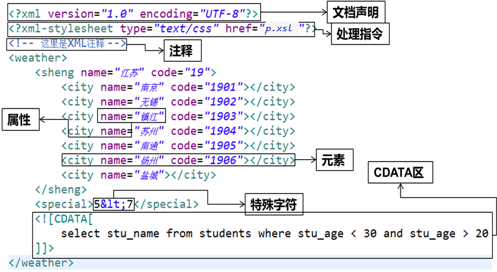
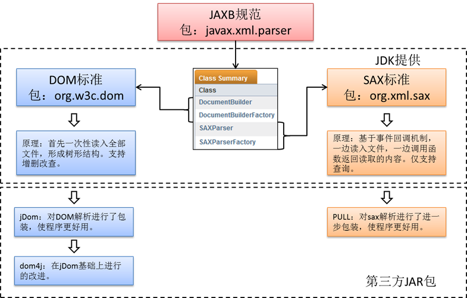

# XML

## 第1章 XML简介

​		不同的平台有他自己的数据格式，但是不同平台之间如果相互想传递数据，那么就应该用同一种数据格式，这样大家都能读懂。就像加入WTO组织的各个国家一样。每个国家都有自己的语言和货币，但是如果大家都用自己的东西就很难沟通和衡量。那么我们就使用统一的方式，使用英语作为交流语言，使用美元作为货币标准。

### 1.1 什么是XML

- XML：e**X**tensible **M**arkup **L**anguage  （可扩展标记语言）。

- 由W3C组织发布，目前推荐遵守的是W3C组织于2000年发布的XML1.0规范。

- XML 是一种标记语言，很类似 HTML。

- XML 的设计宗旨是传输数据，而非显示数据。

- XML的使命，就是以一个统一的格式，组织有关系的数据。为不同平台下的应用程序服务，独立于软件和硬件的信息传输工具。

- XML 仅仅是纯文本。有能力处理纯文本的软件都可以处理 XML。不过，能够读懂 XML 的应用程序可以有针对性地处理 XML 的标签。

  ```xml
  <!--下面是 John 写给 George 的便签，存储为 XML： -->
  
  <note>
  	<to>George</to>
  	<from>John</from>
  	<heading>Reminder</heading>
  	<body>Don't forget the meeting!</body>
  </note>
  ```

### 1.2 XML  vs  HTML

- XML 不是 HTML 的替代。
- XML 和 HTML 为不同的目的而设计：HTML 旨在显示信息，而 XML 旨在传输信息
  - 传统中，XML 被设计为传输和存储数据，其焦点是数据的内容。
  - HTML 被设计用来显示数据，其焦点是数据的外观。
- 关于内部标签：
  - **XML没有任何预定义标签，均为自定义标签**。
  - HTML 文档只使用在 HTML 标准中定义过的标签。
- 树形结构：
  - XML 文档形成一种树形结构，这点上与HTML是相同的。
- 语法要求：
  - XML相较于HTML，语法更加严格。
  - HTML不区分大小写，XML严格区分大小写。

## 第2章 XML用途

### 2.1 配置文件

- JavaWeb中的web.xml，以及后面涉及到的框架都会有很多的配置文件
- C3P0中的c3p0-config.xml
- JDK安装后的目录文件

### 2.2 数据交换格式

- Ajax

- WebService

### 2.3 数据存储

- 保存关系型数据

  举例1：

```xml
<?xml version="1.0" encoding="utf-8"?>
<中国>
	<北京>
		<海淀></海淀>
		<丰台></丰台>
	</北京>
	<湖南>
		<长沙></长沙>
		<岳阳></岳阳>
	</湖南>
	<湖北>
		<武汉></武汉>
		<荆州></荆州>
	</湖北>
</中国>
```

举例2：


> 注：为什么我们要使用xml保存数据呢？比如c3p0的配置文件。因为有些数据是不会经常变化的数据，我们需要固定的保存起来，然而这些数据又是有某些关系的。我们希望也把他们直接的关系用简明易懂的格式保存起来，方便后来查看这些数据的时候一下就能看懂他们直接的关系。


### 2.4 移动端android页面

如下是android某应用的登录界面代码：【activity_login.xml】

```xml
<?xml version="1.0" encoding="utf-8"?>
<LinearLayout xmlns:android="http://schemas.android.com/apk/res/android"
    android:layout_width="match_parent"
    android:layout_height="match_parent"
    android:orientation="vertical">

    <include layout="@layout/common_title"/>

    <RelativeLayout
        android:id="@+id/rl_login"
        android:layout_width="match_parent"
        android:layout_height="44dp"
        android:background="@color/white"
        android:paddingLeft="17dp"
        android:paddingRight="17dp">

        <TextView
            android:id="@+id/tv_login_number"
            android:layout_width="95dp"
            android:layout_height="wrap_content"
            android:layout_centerVertical="true"
            android:text="手机号:"
            android:textColor="#333333"
            android:textSize="14sp"/>

        <EditText
            android:id="@+id/et_login_number"
            android:layout_width="wrap_content"
            android:layout_height="wrap_content"
            android:layout_alignParentRight="true"
            android:layout_centerVertical="true"
            android:layout_toRightOf="@id/tv_login_number"
            android:background="@null"
            android:gravity="center_vertical"
            android:hint="请输入手机号"
            android:inputType="phone"
            android:maxLines="1"
            android:singleLine="true"
            android:textColor="#5c5c5c"
            android:textSize="14sp"/>
    </RelativeLayout>

    <View
        android:layout_width="match_parent"
        android:layout_height="1dp"
        android:background="?android:listDivider"/>

    <RelativeLayout
        android:layout_width="match_parent"
        android:layout_height="44dp"
        android:background="@color/white"
        android:paddingLeft="17dp"
        android:paddingRight="17dp">

        <TextView
            android:id="@+id/tv_login_pwd"
            android:layout_width="95dp"
            android:layout_height="wrap_content"
            android:layout_alignParentLeft="true"
            android:layout_centerVertical="true"
            android:text="密码:"
            android:textColor="#333333"
            android:textSize="14sp"/>

        <EditText
            android:id="@+id/et_login_pwd"
            android:layout_width="wrap_content"
            android:layout_height="wrap_content"
            android:layout_alignParentRight="true"
            android:layout_centerVertical="true"
            android:layout_toRightOf="@id/tv_login_pwd"
            android:hint="请输入密码"
            android:background="@null"
            android:inputType="textPassword"
            android:maxLines="1"
            android:singleLine="true"
            android:textColor="#5c5c5c"
            android:textSize="14sp"/>
    </RelativeLayout>

    <View
        android:layout_width="match_parent"
        android:layout_height="1dp"
        android:background="?android:listDivider"/>

    <Button
        android:id="@+id/btn_login"
        android:layout_width="match_parent"
        android:layout_height="wrap_content"
        android:layout_marginLeft="20dp"
        android:layout_marginRight="20dp"
        android:layout_marginTop="15dp"
        android:background="@drawable/btn_01"
        android:text="登　录"
        android:textColor="#ffffff"
        android:textSize="18sp"/>
</LinearLayout>
```


## 第3章 XML基本语法

### 3.1 XML文档结构

- 举例

  

#### 3.1.1 XML文档声明

- version属性指定XML版本，固定值是**1.0。**
  - 必须在文件的第一行书写文档声明。
  - 最简单的声明语法：\<?xml version="1.0" ?>
- encoding指定的字符集，是**告诉解析器使用什么字符集进行解码**，而编码是由文本编辑器决定的
  - 通常的写法：**\<?xml version="1.0" encoding="utf-8" ?>** 
  - 这样就要求保存文件时，必须用utf-8编码保存。此时要求XML文档的作者确认当前编辑器保存文档的编码方式。
  - eclipse会自动按照解码字符集进行编码保存。记事本需要另存为指定的字符集。
- **xml文档声明如果声明，必须严格遵循语法。当然，也可以不声明。**

#### 3.1.2 CDATA区

- 当XML文档中需要写一些程序代码、SQL语句或其他**不希望XML解析器进行解析的内容**时，就可以写在CDATA区中

- XML解析器会将CDATA区中的内容原封不动的输出

- CDATA区的定义格式：\<![CDATA[…]]>


#### 3.1.3 注 释

​		XML文件中的注释采用：<!--注释-->

#### 3.1.4 处理指令

① 处理指令，简称PI （processing instruction）。处理指令用来指挥解析引擎如何解析XML文档内容。

② 处理指令必须以 \<? 作为开头，以 ?> 作为结尾，XML声明语句就是最常见的一种处理指令。 

例如，在XML文档中可以使用xml-stylesheet指令，通知XML解析引擎，应用xsl文件显示xml文档内容。

```xml
<?xml-stylesheet type="text/css" href="p.xsl"?>
```

③ XSL对于XML来说就相当于CSS对HTML一样，XSL是XML的文件样式。

XSL 指扩展样式表语言（*E*Xtensible *S*tylesheet *L*anguage）。

| 文件 | 样式文件 |
| ---- | -------- |
| XML  | XSL      |
| HTML | CSS      |

#### 3.1.5 元素

- 详情见下

### 3.2 语法规则

① XML声明要么不写，要写就写在第一行，并且前面没有任何其他字符

② 只能有一个根标签，所有的其他标签都必须声明在根标签内部

③ 标签必须正确结束，不能交叉嵌套

⑤ 严格区分大小写

⑥ 开始标签中，可以自定义添加属性。但，如果有属性就必须有值，且必须加引号

⑦ 标签不能以数字开头

⑧ 注释不能嵌套

⑨ XML中可以使用HTML中的转义字符

### 3.3 转义字符

| 特殊字符 | 替代符号 |
| -------- | -------- |
| <        | \&lt;    |
| >        | \&gt;    |
| &        | &amp ;   |
| "        | \&quot;  |
| ‘        | \&aops;  |

XML实体中不允许出现"&","<",">"等特殊字符,否则XML语法检查时将出错,如果编写的XML文件必须包含这些字符,则必须分别写成"&amp;","&lt;","&gt;"再写入文件中。例如，如果在XML文档中使用类似"<" 的字符, 那么解析器将会出现错误，因为解析器会认为这是一个新元素的开始。所以不应该像下面那样书写代码: 

```xml
<age> age < 30 </age>   
<!--这种写法会解析出现错误，因为<,>等等都是关键字符，除过标签以外，不允许占用的。-->
<age> age &lt; 30 </age> 

```

练习：

显示如下一对标签：\<tcode>\</tcode>。标签内的文本内容为：\<script>我喜欢写js代码\<script>

```
<tcode>&lt;script&gt;我喜欢写js代码&lt;script&gt;</tcode>
```


## 第4章 XML解析

- XML解析是指通过解析器读取XML文档，解释语法，并将文档转化成对象
- 对XML的一切操作都是由解析开始的，所以解析非常重要。
- Java 平台同时提供了 DOM（Document Object Model）和 SAX（Simple API for XML）。
  - DOM是 W3C 组织推荐的处理 XML 的一种方式。
  - SAX不是官方标准，但它是 XML 社区实际上的标准，几乎所有的 XML 解析器都支持它。

### 4.1 XML解析技术体系



> DOM解析需要重点掌握，相对简单，且效率高。后台多采用此种方式解析。
>
> SAX解析了解，移动平台使用较多。

### 4.2 DOM和SAX对比

| 对比项   | DOM (Document Object Model)                                  | SAX （Simple API for XML）                                   |
| -------- | ------------------------------------------------------------ | ------------------------------------------------------------ |
| 速度     | 需要一次性加载整个XML文档，然后将文档转换为DOM树，速度较差   | 顺序解析XML文档，无需将整个XML都加载到内存中，速度快         |
| 重复访问 | 将XML转换为DOM树之后，在解析时，DOM树将常驻内存，可以重复访问。 | 顺序解析XML文档，已解析过的数据，如果没有保存，将不能获得，除非重新解析。 |
| 内存要求 | 内存占用较大                                                 | 内存占用率低                                                 |
| 增删改   | 可以对xml文件进行增删改查的操作                              | 只能进行解析（查询操作）                                     |
| 复杂度   | 完全面向对象的解析方式，容易使用                             | 采用事件回调机制，通过事件的回调函数来解析XML文档，略复杂。  |

### 4.3 dom4j

- dom4j是一个简单、灵活的开放源代码的库。

- Dom4j是由早期开发JDOM的人分离出来而后独立开发的。与JDOM不同的是，dom4j使用接口和抽象基类，虽然Dom4j的API相对要复杂一些，但它提供了比JDOM更好的灵活性。

- dom4j是一个非常优秀的Java XML API，具有性能优异、功能强大和极易使用的特点。现在很多软件都采用dom4j，例如Hibernate。

- 使用dom4j开发，需导入dom4j相应的jar包dom4j-1.6.1.jar。所以使用第一步：导包！

- **Dom4j解析关键步骤**

  - 解析并遍历

  ```java
  //1、创建解析器对象
  SAXReader reader = new SAXReader();
  //2、使用解析器将xml文件转换为内存中的document对象
  Document document = reader.read("teachers.xml"); //相对在项目根路径下查找xml文件
  //3、通过文档对象可以获取文档的根标签
  Element rootElement = document.getRootElement();
  //4、根据根标签获取所有的根标签的子标签集合
  List<Element> elements = rootElement.elements();
  //5、遍历集合中的标签，并将所有的数据解析出来
  for (Element element : elements) {
  	//每次遍历就代表一个teacher信息
  	System.out.println("正在遍历的标签名："+element.getName());
  	System.out.println("正在遍历标签的id属性值："+element.attributeValue("id"));
  	//获取teacher的子标签的内容
  	String tname = element.elementText("tname");
  	System.out.println("tname："+tname);
  	String age = element.elementText("tage");
  	System.out.println("tage:"+age);
  	System.out.println("=====================================");
  }
  ```

  其中，xml文件声明如下：【teachers.xml】

  ```xml
   <teachers>
   	<teacher id="1">
   		<tname>佟刚</tname>
   		<tage>49</tage>
   	</teacher>
   	<teacher id="2">
   		<tname>苍老师</tname>
   		<tage>18</tage>
   	</teacher>
   </teachers>
  ```

  - 修改

  ```java
  //添加一个新的student节点
  Element newEle = rootElement.addElement("teacher");
  //创建一个良好的xml格式
  OutputFormat format = OutputFormat.createPrettyPrint();
  //写入文件
  XMLWriter xmlWriter = new XMLWriter(new FileWriter("teachers.xml"),format);
  xmlWriter.write(document);
  xmlWriter.close();
  ```

  - 新建

  ```java
  //1.创建文档
  Document document = DocumentHelper.createDocument();
  //2.添加根元素
  Element root = document.addElement("teachers");
  //3.添加元素节点
  Element tcEle = root.addElement("teacher");
  Element tcEle2 = root.addElement("teacher");
  ```

### 4.4 pull

- Pull解析和Sax解析很相似，都是轻量级的解析，它是一个第三方开源的Java项目，但在Android的内核中已经嵌入了Pull 。

- 只能进行解析（查询）

## 第5章 XPath

### 5.1 简介

- XPath 是在 XML 文档中查找信息的语言，类似于jQuery选择器。

- XPath通过元素和属性进行查找，**简化了Dom4j查找节点的过程**，是W3C组织发布的标准。

- 使用XPath必须在导入dom4j.jar包之外，**再导入jaxen-1.1-beta-6.jar包**

- 具体语法：**见 《XPathTutorial (菜鸟必备)》**


### 5.2 语法

XPath语法示例

| 语法               | 说明                                   |
| ------------------ | -------------------------------------- |
| /AAA               | 选择根元素AAA                          |
| /AAA/CCC           | 选择AAA下的所有CCC子元素               |
| /AAA/DDD/BBB       | 选择AAA的子元素DDD的所有BBB子元素      |
| //BBB              | 选择所有BBB元素                        |
| //DDD/BBB          | 选择所有父元素是DDD的BBB元素           |
| /AAA/CCC/DDD/*     | 选择所有路径依附于/AAA/CCC/DDD的元素   |
| /\*/\*/*/BBB       | 选择所有的有3个祖先元素的BBB元素       |
| //*                | 选择所有元素                           |
| /AAA/BBB[1]        | 选择AAA的第一个BBB子元素               |
| /AAA/BBB[last()]   | 选择AAA的最后一个BBB子元素             |
| //@id              | 选择所有元素的id属性                   |
| //BBB[@id]         | 选择有id属性的BBB元素                  |
| //BBB[@name]       | 选择有name属性的BBB元素                |
| //BBB[@*]          | 选择有任意属性的BBB元素                |
| //BBB[not(@*)]     | 选择没有属性的BBB元素                  |
| //BBB[@id='b1']    | 选择含有属性id且其值为'b1'的BBB元素    |
| //BBB[@name='bbb'] | 选择含有属性name且其值为'bbb'的BBB元素 |

> 其他情况，参见《 XPathTutorial (菜鸟必备)》

### 5.3 使用

① 导包：**jaxen-1.1-beta-6.jar**

② dom4j怎么做就怎么做。只是在查找元素的时候可以使用xpath了

③ 获取所有符合条件的节点

- **document.selectNodes(String xpathExpression) ：返回List集合**
  - 举例：document.selectNodes("/students/student")

- **document.selectSingleNode(String xpathExpression)** ：获取符合条件的单个节点。即一个Node对象。如果符合条件的节点有多个，那么返回第一个。
  - 举例：document.selectSingleNode("/students/student[@id='1']")

### 5.4 代码示例

```java
public void testXpath() throws Exception{
		
	SAXReader reader = new SAXReader();
	Document document = reader.read("src/students.xml");
	//我们使用selectNodes 或 selectSingleNode
	//查询id为2的学生
	Element stuEle = (Element) document.selectSingleNode("/students/student[@id='2']");
	//获取学生的信息
	String idStr = stuEle.attributeValue("id");
	String name = stuEle.elementText("name");
	String ageStr = stuEle.elementText("age");
	String gender = stuEle.elementText("gender");
	String address = stuEle.elementText("address");
	//封装为一个学生对象
	Student stu = new Student(Integer.parseInt(idStr), name, Integer.parseInt(ageStr), gender, address);
	System.out.println(stu);
}

```

其中，xml文件声明在【src/students.xml】中：

```xml
<?xml version="1.0" encoding="UTF-8"?><students>	<student id="1">		<name>孙悟空</name>		<gender>男</gender>		<age>520</age>		<address>花果山</address>	</student>	<student id="2">		<name>猪八戒</name>		<gender>男</gender>		<age>1520</age>		<address>高老庄</address>	</student>	<student id="3">		<name>沙悟净</name>		<gender>男</gender>		<age>1000</age>		<address>流沙河</address>	</student>	<student id="4">		<name>小白龙</name>		<gender>男</gender>		<age>1800</age>		<address>鹰愁涧</address>	</student></students>
```


