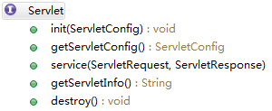
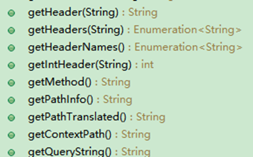
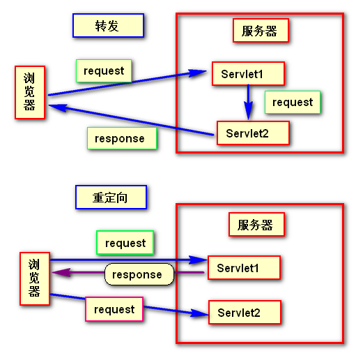

# Servlet组件

## 第1章 我们为什么需要Servlet？

### 1.1 Web应用基本运行模式


### 1.2 Web服务器中Servlet作用举例

​		通过网页驱动服务器端的Java程序。在网页上显示Java程序返回的数据。


## 第2章 什么是Servlet？

**如果把Web应用比作一个餐厅，Servlet就是餐厅中的服务员**——负责接待顾客、上菜、结账。

- 从广义上来讲，Servlet规范是Sun公司制定的一套技术标准，包含与Web应用相关的一系列接口，是Web应用实现方式的宏观解决方案。而具体的Servlet容器负责提供标准的实现。
- 从狭义上来讲，Servlet指的是javax.servlet.Servlet接口及其子接口，也可以指实现了Servlet接口的实现类。
- Servlet（**Server Applet**）作为服务器端的一个组件，它的本意是“服务器端的小程序”。
  - **Servlet的实例对象由Servlet容器负责创建；**
  - **Servlet的方法由容器在特定情况下调用；**
  - **Servlet容器会在Web应用卸载时销毁Servlet对象的实例。**

## 第3章 如何使用Servlet？

### 3.1 操作步骤

- 复习：使用一个接口的传统方式：

  - 创建一个类实现接口
  - new 实现类的对象
  - 调用类的方法等

  

- 使用Servlet接口的方式：

  ① 搭建Web开发环境

  ② 创建动态Web工程

  ③ 创建javax.servlet.Servlet接口的实现类：com.atguigu.servlet.MyFirstServlet

  ④ 在service(ServletRequest, ServletResponse)方法中编写如下代码，输出响应信息：

```java
@Override
	public void service(ServletRequest req, ServletResponse res)
			throws ServletException, IOException {
		//编写输出语句，证明当前方法被调用
		System.out.println("Servlet worked...");
	}

```

​	⑤ 在web.xml配置文件中**注册**MyFirstServlet

```xml
<!-- 声明一个Servlet，配置的是Servlet的类信息 -->
<servlet>
	<!-- 这是Servlet的别名，一个名字对应一个Servlet。相当于变量名 -->
	<servlet-name>MyFirstServlet</servlet-name>
	<!-- Servlet的全类名，服务器会根据全类名找到这个Servlet -->
	<servlet-class>com.atguigu.servlet.MyFirstServlet</servlet-class>
</servlet>

<!-- 建立Servlet的请求映射信息 -->
<servlet-mapping>
	<!-- Servlet的别名，说明这个Servlet将会响应下面url-pattern的请求 -->
	<servlet-name>MyFirstServlet</servlet-name>
	<!-- Servlet响应的请求路径。如果访问这个路径，这个Servlet就会响应 -->
	<url-pattern>/MyFirstServlet</url-pattern>
</servlet-mapping>

```

> 说明：
>
> - <url-pattern>：这个url-pattern可以配置多个，这时表示的就是访问这些url都会触发这个Servlet进行响应，运行浏览器，访问刚才配置的url路径，Servlet的service方法就会被调用。
>
> - <url-pattern>中的文本内容必须以 / 或 *. 开始书写路径。相当于将资源映射到项目根目录下形成虚拟的资源文件。
> - <servlet-mapping>中的<url-pattern>可以声明多个，可以通过任意一个都可以访问。但是开发中一般只会配置一个。

​	⑥ 在WebContent目录下创建index.html

​	⑦ 在index.html中加入超链接 \<a href="MyFirstServlet">To Servlet</a>

​	⑧ 点击超链接测试Servlet

### 3.2 运行分析(执行原理)

- \<a href="MyFirstServlet">To Servlet</a>   中的MyFirstServlet对应的就是<servlet-mapping>中<url-pattern>值。

- 根据映射请求地址<url-pattern>值找到servlet别名。
- 根据别名的全类名找到方法响应请求。

- 如果配置文件一旦修改，需要重启服务器来重新部署web项目。


### 3.3 Servlet作用总结

- 接收请求 【解析请求报文中的数据：请求参数】

- 处理请求 【DAO和数据库交互】

- 完成响应 【设置响应报文】


## 第4章 Servlet生命周期(重要)

### 4.1 Servlet生命周期概述

- 应用程序中的对象不仅在空间上有层次结构的关系，在时间上也会因为处于程序运行过程中的不同阶段而表现出不同状态和不同行为——这就是对象的生命周期。
- 简单的叙述生命周期，就是对象在容器中从开始创建到销毁的过程。

### 4.2 Servlet容器

​		Servlet对象是Servlet容器创建的，生命周期方法都是由容器调用的。这一点和我们之前所编写的代码有很大不同。在今后的学习中我们会看到，越来越多的对象交给容器或框架来创建，越来越多的方法由容器或框架来调用，开发人员要尽可能多的将精力放在业务逻辑的实现上。

### 4.3 Servlet生命周期的主要过程

**① Servlet对象的创建：构造器**

- 默认情况下，**Servlet容器第一次收到HTTP请求时创建对应Servlet对象。**
- 容器之所以能做到这一点是由于我们在注册Servlet时提供了全类名，容器使用反射技术创建了Servlet的对象。

**② Servlet对象初始化：init()**

- Servlet容器**创建Servlet对象之后，会调用init(ServletConfig config)**方法。
- 作用：是在Servlet对象创建后，执行一些初始化操作。例如，读取一些资源文件、配置文件，或建立某种连接（比如：数据库连接）
- init()方法只在创建对象时执行一次，以后再接到请求时，就不执行了
- 在javax.servlet.Servlet接口中，public void init(ServletConfig config)方法要求容器将ServletConfig的实例对象传入，这也是我们获取ServletConfig的实例对象的根本方法。

**③ 处理请求：service()**

- 在javax.servlet.Servlet接口中，定义了**service(ServletRequest req, ServletResponse res)**方法处理HTTP请求。
- 在每次接到请求后都会执行。
- 上一节提到的Servlet的作用，主要在此方法中体现。
- 同时要求容器将ServletRequest对象和ServletResponse对象传入。

**④ Servlet对象销毁：destroy()**

- 服务器重启、服务器停止执行或Web应用卸载时会销毁Servlet对象，会调用public void destroy()方法。
- 此方法用于销毁之前执行一些诸如释放缓存、关闭连接、保存内存数据持久化等操作。

### 4.4 Servlet请求过程

- 第一次请求
  - 调用构造器，创建对象
  - 执行init()方法
  - 执行service()方法
- 后面请求
  - 执行service()方法
- 对象销毁前
  - 执行destroy()方法

## 第5章 Servlet的两个重要接口

官方API中声明如下：


### 5.1 ServletConfig接口


- **ServletConfig接口封装了Servlet配置信息**，这一点从接口的名称上就能够看出来。

- **每一个Servlet都有一个唯一对应的ServletConfig对象**，代表当前Servlet的配置信息。

- 对象由Servlet容器创建，并传入生命周期方法init(ServletConfig config)中。可以直接获取使用。

- 代表当前Web应用的ServletContext对象也封装到了ServletConfig对象中，使ServletConfig对象成为了获取ServletContext对象的一座桥梁。

- ServletConfig对象的主要功能

  - **获取Servlet名称：getServletName()**

  - **获取全局上下文ServletContext对象：getServletContext()**

  - **获取Servlet初始化参数：getInitParameter(String) / getInitParameterNames()。**

    ```java
    String info = config.getInitParameter("url");	//获取value值
    ```

    
  

### 5.2 ServletContext接口


- Web容器在启动时，它会为**每个Web应用程序都创建一个唯一对应的ServletContext对象**，意思是Servlet上下文，**代表当前Web应用。**

- 由于**一个Web应用程序中的所有Servlet都共享同一个ServletContext对象**，所以ServletContext对象也被称为 application 对象（Web应用程序对象）。

- **对象由Servlet容器在项目启动时创建**，通过ServletConfig对象的getServletContext()方法获取。在项目卸载时销毁。

- ServletContext对象的主要功能

  ① 获取项目的上下文路径(带/的项目名):  **getContextPath()**

  ```java
  @Override
  public void init(ServletConfig config) throws ServletException {
  	ServletContext application = config.getServletContext();
  	System.out.println("全局上下文对象："+application);
  	String path = application.getContextPath();
  	System.out.println("全局上下文路径："+path);// /06_Web_Servlet
  }
  ```

  ② 获取虚拟路径所映射的本地真实路径：**getRealPath(String path)**

  - 虚拟路径：浏览器访问Web应用中资源时所使用的路径。

  - 本地路径：资源在文件系统中的实际保存路径。

  - 作用：将用户上传的文件通过流写入到服务器硬盘中。

    ```java
    @Override
    public void init(ServletConfig config) throws ServletException {
    	//1.获取ServletContext对象
    	ServletContext context = config.getServletContext();
    	//2.获取index.html的本地路径
    	//index.html的虚拟路径是“/index.html”,其中“/”表示当前Web应用的根目录，
    	//即WebContent目录
    	String realPath = context.getRealPath("/index.html");
    	//realPath=D:\DevWorkSpace\MyWorkSpace\.metadata\.plugins\
    	//org.eclipse.wst.server.core\tmp0\wtpwebapps\MyServlet\index.html
    	System.out.println("realPath="+realPath);
    }
    
    ```

  ③ 获取WEB应用程序的全局初始化参数（基本不用）

  - 设置Web应用初始化参数的方式是在web.xml的根标签下加入如下代码

    ```xml
    <web-app>
    	<!-- Web应用初始化参数 -->
    	<context-param>
    		<param-name>ParamName</param-name>
    		<param-value>ParamValue</param-value>
    	</context-param>
    </web-app>
    ```

  - 获取Web应用初始化参数

    ```java
    @Override
    public void init(ServletConfig config) throws ServletException {
    	//1.获取ServletContext对象
    	ServletContext application = config.getServletContext();
    	//2.获取Web应用初始化参数
    	String paramValue = application.getInitParameter("ParamName");
    	System.out.println("全局初始化参数paramValue="+paramValue);
    }
    ```

  ④ 作为域对象共享数据

  - 作为最大的域对象在整个项目的不同web资源内共享数据。
    - getAttribute(String):Object
    - getAttributeNames():Enumeration<String>
    - setAttribute(String,Object):void
    - removeAttribute(String):void

  其中，
  
  - setAttribute(key,value)：以后可以在任意位置取出并使用
  - getAttribute(key)：取出设置的value值

## 第6章 Servlet技术体系

### 6.1 Servlet接口



### 6.2 Servlet接口的常用实现类

- 为什么要扩展Servlet接口？
  - 封装不常用方法
- 实现类体系
  - GenericServlet实现Servlet接口
  - HttpServlet继承GenericServlet
- 创建Servlet的最终方式
  - 继承HttpServlet

#### 6.2.1 GenericServlet抽象类

- GenericServlet对Servlet功能进行了封装和完善，重写了init(ServletConfig config)方法，用来获取ServletConfig对象。此时如果GenericServlet的子类（通常是自定义Servlet）又重写了init(ServletConfig config)方法有可能导致ServletConfig对象获取不到，所以子类不应该重写带参数的这个init()方法。
- 如果想要进行初始化操作，可以重写GenericServlet提供的无参的init()方法，这样就不会影响ServletConfig对象的获取。
- 将service(ServletRequest req,ServletResponse res)保留为抽象方法，让使用者仅关心业务实现即可。

#### 6.2.2 HttpServlet抽象类

- 专门用来处理Http请求的Servlet。

- 对GenericServlet进行进一步的封装和扩展，在service(ServletRequest req, ServletResponse res)方法中，将ServletRequest和ServletResponse转换为HttpServletRequest和HttpServletResponse，根据不同HTTP请求类型调用专门的方法进行处理。

- **今后在实际使用中继承HttpServlet抽象类创建自己的Servlet实现类即可。**重写doGet(HttpServletRequest req, HttpServletResponse resp)和doPost(HttpServletRequest req, HttpServletResponse resp)方法实现请求处理，不再需要重写service(ServletRequest req, ServletResponse res)方法了。

- 又因为我们业务中get，post的处理方式又都是一样的，所以我们只需要写一种方法即可，使用另外一种方法调用我们写好的doXXX方法。web.xml配置与之前相同。

  ```java
  //处理浏览器的get请求
  doGet(HttpServletRequest request, HttpServletResponse response){
  	//业务代码
  }
  //处理浏览器的post请求
  doPost(HttpServletRequest request, HttpServletResponse response){
      doGet(request, response);
  }
  ```


## 第7章 其它几个重要的接口

### 7.1 HttpServletRequest接口

- 该接口是ServletRequest接口的子接口，封装了HTTP请求的相关信息。

- 浏览器请求服务器时会封装请求报文交给服务器，服务器接受到请求会将请求报文解析生成request对象。
- 由Servlet容器创建其实现类对象并传入service(HttpServletRequest req, HttpServletResponse res)方法中。

- 以下我们所说的HttpServletRequest对象指的是容器提供的HttpServletRequest实现类对象。

HttpServletRequest对象的主要功能有：

#### 7.1.1 获取请求参数

- 什么是请求参数？

  - 请求参数就是浏览器向服务器提交的数据。

- 浏览器向服务器如何发送数据？

  ① 附在url后面，如：

  [http](http://localhost:8989/MyServlet/MyHttpServlet?userId=20)[://](http://localhost:8989/MyServlet/MyHttpServlet?userId=20)[localhost:8080/MyServlet/MyHttpServlet?userId=20](http://localhost:8080/MyServlet/MyHttpServlet?userId=20)

  ② 通过表单提交

  ```html
  <form action="MyHttpServlet" method="post">	你喜欢的足球队<br /><br />	巴西<input type="checkbox" name="soccerTeam" value="Brazil" />	德国<input type="checkbox" name="soccerTeam" value="German" />	荷兰<input type="checkbox" name="soccerTeam" value="Holland" />	<input type="submit" value="提交" /></form>
  ```

- 使用HttpServletRequest对象获取请求参数

  ```java
  //一个name对应一个值String userId = request.getParameter("userId");
  ```

  ```java
  //一个name对应一组值String[] soccerTeams = request.getParameterValues("soccerTeam");for(int i = 0; i < soccerTeams.length; i++){	System.out.println("team "+i+"="+soccerTeams[i]);}
  ```

#### 7.1.2 获取url地址参数

```java
String path = request.getContextPath();//重要System.out.println("上下文路径："+path);System.out.println("端口号："+request.getServerPort());System.out.println("主机名："+request.getServerName());System.out.println("协议："+request.getScheme());
```

#### 7.1.3 获取请求头信息



```java
String header = request.getHeader("User-Agent");
System.out.println("user-agent:"+header);
String referer = request.getHeader("Referer");
System.out.println("上个页面的地址："+referer);//登录失败，返回登录页面让用户继续登录
```

#### 7.1.4 请求的转发

将请求转发给另外一个URL地址，参见第7章-请求的转发与重定向。

```java
//获取请求转发对象RequestDispatcher dispatcher = request.getRequestDispatcher("success.html");dispatcher.forward(request, response);//发起转发
```

#### 7.1.5 向请求域中保存数据

```java
//将数据保存到request对象的属性域中request.setAttribute("attrName", "attrValueInRequest");//两个Servlet要想共享request对象中的数据，必须是转发的关系request.getRequestDispatcher("/ReceiveServlet").forward(request, response);
```

```java
//从request属性域中获取数据Object attribute = request.getAttribute("attrName");System.out.println("attrValue="+attribute);
```


### 7.2 HttpServletResponse接口

- 该接口是ServletResponse接口的子接口，封装了服务器针对于HTTP响应的相关信息。(暂时只有服务器的配置信息，没有具体的和响应体相关的内容)

- 由Servlet容器创建其实现类对象，并传入service(HttpServletRequest req, HttpServletResponse res)方法中。

- 后面我们所说的HttpServletResponse对象指的是容器提供的HttpServletResponse实现类对象。

HttpServletResponse对象的主要功能有：

#### 7.2.1 使用PrintWriter对象向浏览器输出数据

```java
//通过PrintWriter对象向浏览器端发送响应信息
PrintWriter writer = res.getWriter();
writer.write("Servlet response");
writer.close();
```

- 写出的数据可以是页面、页面片段、字符串等

- 当写出的数据包含中文时，浏览器接收到的响应数据就可能有乱码。为了避免乱码，可以使用Response对象在向浏览器输出数据前设置响应头。

#### 7.2.2 设置响应头

- 响应头就是浏览器解析页面的配置。比如：告诉浏览器使用哪种编码和文件格式解析响应体内容

```java
response.setHeader("Content-Type", "text/html;charset=UTF-8");
```

- 设置好以后，会在浏览器的响应报文中看到设置的响应头中的信息。

#### 7.2.2 重定向请求

- 实现请求重定向，参见第8章-请求的转发与重定向。
- 举例：用户从login.html页面提交登录请求数据给LoginServlet处理。如果账号密码正确，需要让用户跳转到成功页面，通过servlet向响应体中写入成功页面过于复杂，通过重定向将成功页面的地址交给浏览器并设置响应状态码为302，浏览器会自动进行跳转。

```java
//注意路径问题，加上/会失败，会以主机地址为起始，重定向一般需要加上项目名response.sendRedirect(“success.html”);
```


## 第8章 请求的转发与重定向

请求的转发与重定向是web应用页面跳转的主要手段，在Web应用中使用非常广泛。所以我们一定要搞清楚他们的区别。



### 8.1 请求的转发

- 第一个Servlet接收到了浏览器端的请求，进行了一定的处理，然后没有立即对请求进行响应，而是将请求“交给下一个Servlet”继续处理，下一个Servlet处理完成之后对浏览器进行了响应。**在服务器内部将请求“交给”其它组件继续处理就是请求的转发。**对浏览器来说，一共只发了一次请求，服务器内部进行的“转发”浏览器感觉不到，同时浏览器地址栏中的地址不会变成“下一个Servlet”的虚拟路径。
- HttpServletRequest代表HTTP请求，对象由Servlet容器创建。转发的情况下，两个Servlet可以共享同一个Request对象中保存的数据。
- 当需要将后台获取的数据传送到JSP上显示的时候，就可以先将数据存放到Request对象中，再转发到JSP从属性域中获取。此时由于是“转发”，所以它们二者共享Request对象中的数据。
- 转发的情况下，可以访问WEB-INF下的资源。
- **转发以“/”开始表示项目根路径，重定向以”/”开始表示主机地址。**
- 功能：
  - 获取请求参数
  - 获取请求路径即URL地址相关信息
  - 在请求域中保存数据
  - 转发请求
- 代码举例

```java
protected void doGet(HttpServletRequest request,HttpServletResponse response) throws ServletException, IOException {	//1.使用RequestDispatcher对象封装目标资源的虚拟路径	RequestDispatcher dispatcher = request.getRequestDispatcher("/index.html");	//2.调用RequestDispatcher对象的forward()方法“前往”目标资源	//[注意：传入的参数必须是传递给当前Servlet的service方法的	//那两个ServletRequest和ServletResponse对象]	dispatcher.forward(request, response);}
```

### 8.2 请求的重定向

- 第一个Servlet接收到了浏览器端的请求，进行了一定的处理，然后给浏览器一个特殊的响应消息，这个特殊的响应消息会通知浏览器去访问另外一个资源，这个动作是服务器和浏览器自动完成的。**整个过程中浏览器端会发出两次请求**，且在**浏览器地址栏里面能够看到地址的改变**，改变为下一个资源的地址。

- 重定向的情况下，原Servlet和目标资源之间就不能共享请求域数据了。

- HttpServletResponse代表HTTP响应，对象由Servlet容器创建。

- 功能：

  - 向浏览器输出数据
  - 重定向请求

- 重定向的响应报文的头

  ```
  HTTP/1.1 302 FoundLocation: success.html
  ```

- 应用：

  - 用户从login.html页面提交登录请求数据给LoginServlet处理。

    如果账号密码正确，需要让用户跳转到成功页面，通过servlet向响应体中写入成功页面过于复杂，通过重定向将成功页面的地址交给浏览器并设置响应状态码为302，浏览器会自动进行跳转

- 代码举例：

```java
protected void doGet(HttpServletRequest request,HttpServletResponse response) throws ServletException, IOException {	//1.调用HttpServletResponse对象的sendRedirect()方法	//2.传入的参数是目标资源的虚拟路径	response.sendRedirect("index.html");}
```

### 8.3 对比请求的转发与重定向

|                         | 转发                             | 重定向                                              |
| ----------------------- | -------------------------------- | --------------------------------------------------- |
| 浏览器感知              | 在服务器内部完成，浏览器感知不到 | 服务器以302状态码通知浏览器访问新地址，浏览器有感知 |
| 浏览器地址栏            | 不改变                           | 改变                                                |
| 整个过程发送请求次数    | 一次                             | 两次                                                |
| 执行效率                | 效率高                           | 效率低                                              |
| API（或发起者）         | Request对象                      | Response对象                                        |
| 能否共享request对象数据 | 能                               | 否                                                  |
| WEB-INF下的资源         | 能访问                           | 不能访问                                            |
| 目标资源                | 必须是当前web应用中的资源        | 不局限于当前web应用                                 |

> 说明1：默认情况下，浏览器是不能访问服务器web-inf下的资源的，而服务器是可以访问的。
>
> 说明2：浏览器默认的绝对路径：http://localhost:8080/
>
> ​              服务器项目的代码中的绝对路径：http://localhost:8080/项目名/

## 第9章 请求与响应中的字符编码设置

### 9.1 字符编码问题

- 我们web程序在接收请求并处理过程中，如果不注意编码格式及解码格式，很容易导致中文乱码，引起这个问题的原因到底在哪里？如何解决？我们这个小节将会讨论此问题。
- 说到这个问题我们先来说一说字符集。
  - 什么是字符集，就是各种字符的集合，包括汉字，英文，标点符号等等。各国都有不同的文字、符号。这些文字符号的集合就叫字符集。
  - 现有的字符集ASCII、GB2312、BIG5、GB18030、Unicode、UTF-8、ISO-8859-1等
- 这些字符集，集合了很多的字符，然而，字符要以二进制的形式存储在计算机中，我们就需要对其进行编码，将编码后的二进制存入。取出时我们就要对其解码，将二进制解码成我们之前的字符。这个时候我们就需要制定一套编码解码标准。否则就会导致出现混乱，也就是我们的乱码。

### 9.2 编码与解码

- 编码：将字符转换为二进制数

| 汉字 | 编码方式   | 编码       | 二进制                                         |
| ---- | ---------- | ---------- | ---------------------------------------------- |
| ‘中' | **GB2312** | **D6D0**   | **1101 0110-1101 0000**                        |
| ‘中' | **UTF-16** | **4E2D**   | **0100 1110-0010 1101**                        |
| ‘中' | **UTF-8**  | **E4B8AD** | **1110** **0100-** **1011** **1000-1010 1101** |

- 解码：将二进制数转换为字符

1110 0100-1011 1000-1010 1101 → E4B8AD → ’中’

- 乱码：一段文本，使用A字符集编码，使用B字符集解码，就会产生乱码。所以解决乱码问题的根本方法就是统一编码和解码的字符集。

### 9.3 解决请求乱码问题

解决乱码的方法：就是统一字符编码。

#### 9.3.1 GET请求

- GET请求参数是在地址后面的。我们需要修改tomcat的配置文件。需要在server.xml文件修改Connector标签，添加URIEncoding="utf-8"属性。

- 一旦配置好以后，可以解决当前工作空间中所有的GET请求的乱码问题。

#### 9.3.2 POST请求

- post请求提交了中文的请求体，服务器解析出现问题。

- 解决方法：在获取参数值之前，设置请求的解码格式，使其和页面保持一致。

  ```java
  request.setCharacterEncoding("utf-8");
  ```

- POST请求乱码问题的解决，只适用于当前的操作所在的类中。不能类似于GET请求一样统一解决。因为请求体有可能会上传文件。不一定都是中文字符。

### 9.4 解决响应乱码问题

- 向浏览器发送响应的时候，要告诉浏览器，我使用的字符集是哪个，浏览器就会按照这种方式来解码。如何告诉浏览器响应内容的字符编码方案。很简单。

- 解决方法一：

  ```java
  response.setHeader("Content-Type", "text/html;charset=utf-8");
  ```

- 解决方法二

  ```java
  response.setContentType("text/html;charset=utf-8");
  ```

  > 说明：有的人可能会想到使用response.setCharacterEncoding(“utf-8”)，设置reponse对象将UTF-8字符串写入到响应报文的编码为UTF-8。只这样做是不行的，还必须手动在浏览器中设置浏览器的解析用到的字符集。

## 第10章 Web应用路径设置

**问题再现：**

① 创建Web应用Path，目录结构如图所示


② 在a.html中有超链接\<a href="b.html">To b.html</a>

③ 如果先直接访问a.html，再通过超链接转到b.html没有问题。

④ 如果先通过TestServlet转发到a.html，则浏览器地址栏会变成 http://localhost:8989/Path/TestServlet

此时再点击超链接\<a href="b.html">To b.html</a>就会发生问题，找不到b.html。

**如何解决？**

原因是超链接\<a href="b.html">To b.html</a>使用的是相对路径，浏览器进行解析时，只能以当前浏览器地址栏里的路径为基准。例如，当前浏览器地址栏里的内容是：http://localhost:8989/Path/TestServlet

那么经过浏览器解析后b.html的访问地址就成了：http://localhost:8989/Path/TestServletb.html这显然无法访问到b.html。

完整的url构成如下图：


**相对路径和绝对路径**

**相对路径：虚拟路径如果不以“/”开始，就是相对路径**，浏览器会以当前资源所在的虚拟路径为基准对相对路径进行解析，从而生成最终的访问路径。此时如果通过转发进入其他目录，再使用相对路径访问资源就会出错。所以为了防止路径出错，我们经常将相对路径转化为绝对路径的形式进行请求。

**绝对路径：虚拟路径以“/”开始，就是绝对路径。**
**① 在服务器端**：虚拟路径最开始的“/”表示当前Web应用的根目录。只要是服务端解析的绝对路径，都是以web根目录为起始的。由服务器解析的路径包括：<1> web.xml的配置路径、<2>request转发的路径。
**② 在浏览器端**：虚拟路径最开始的“/”表示当前主机地址。
例如：链接地址“/Path/dir/b.html”经过浏览器解析后为：
相当于http://localhost:8989/Path/dir/b.html
由浏览器解析的路径包括：
<1>重定向操作：response.sendRedirect("/xxx")
<2>所有HTML标签：\<a href="/xxx"> 、\<form action="/xxx"> 、link、img、script等
这些最后的访问路径都是 http://localhost:8989/xxx

所以我们可以看出，如果是浏览器解析的路径，我们必须加上项目名称才可以正确的指向资源。[http://localhost:8989](http://localhost:8989/Path/xxx)[/Path](http://localhost:8989/Path/xxx)[/xxx](http://localhost:8989/Path/xxx)

<1>重定向操作：

```java
response.sendRedirect(request.getContextPath()+"/xxx");
```

<2>所有HTML标签：\<a href="/项目名/xxx">；  \<form action=“/项目名/xxx">

- 在浏览器端，除了使用绝对路径之外，我们还可以使用base标签+相对路径的方式来确定资源的访问有效。
- base标签影响当前页面中的所有相对路径，不会影响绝对路径。相当于给相对路径设置了一个基准地址。
- 习惯上在html的<head>标签内，声明：

```html
<!-- 给页面中的相对路径设置基准地址 --><base href="http://localhost:8080/Test_Path/"/>
```

接着html中的路径就可以使用相对路径的方式来访问。比如：

```html
<h4> base+相对路径</h4><!-- <base href="http://localhost:8080/Test_Path/"/> --><a href="1.html">1.html</a><br/><a href="a/3.html">a/3.html</a><br/><!-- servlet映射到了项目根目录下，可以直接访问 --><a href="PathServlet">PathServlet</a><br/>
```


