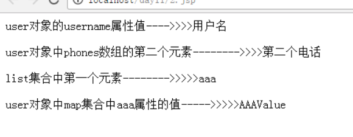
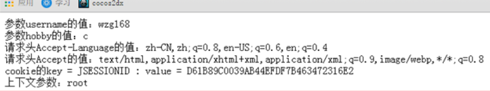

# EL表达式(Expression Language)

***

## 第1章 EL介绍

​		在JSP页面上获取域对象中保存的数据和获取请求参数数据是非常常用的操作。例如：

获取请求域中的数据

```jsp
<%=request.getAttribute("message") == null ? "" : request.getAttribute("message") %>
```

获取请求参数

```jsp
<%=request.getParameter("userName")==null? "": request.getParameter("userName")%>
```

​		

​		同样的操作在EL中：

获取请求域中的数据

```jsp
${requestScope.message }
```

获取请求参数

```jsp
${param.userName }
```

这就是EL表达式，它能够极大的简化JSP页面上数据的显示。他就是被用来优化数据读取操作的。


## 第2章 EL的基本使用

### 2.1 是EL表达式

- EL（Expression Language）是JSP内置的表达式语言，用以**访问**页面的上下文以及**不同作用域中的对象** ，取得对象属性的值，或执行简单的运算或判断操作。EL在得到某个数据时，会**自动进行数据类型的转换**。

- **EL表达式用于代替JSP表达式(<%= %>)**在页面中做输出操作。
- EL表达式出现的目的是为了使JSP写起来更加简单，让jsp的代码更佳简化。

- EL表达式**仅仅用来读取数据，而不能对数据进行修改。**

- 使用EL表达式输出数据时，如果有则输出数据，如果为null则什么也不输出。

- 我们先来看一下EL表达式的一个Hello world 程序，看看它是如何简化jsp代码。


```jsp
<%@ page language="java" contentType="text/html; charset=UTF-8"
    pageEncoding="UTF-8"%>
<!DOCTYPE html PUBLIC "-//W3C//DTD HTML 4.01 Transitional//EN" "http://www.w3.org/TR/html4/loose.dtd">
<html>
<head>
<meta http-equiv="Content-Type" content="text/html; charset=UTF-8">
<title>Insert title here</title>
</head>
<body>
<%
	//首先我们需要在request域对象中设置一个属性
	request.setAttribute("hello", "这是内容");
%>

<%-- 获取请求域中的属性hello输出 --%>
jsp的输出：<%=request.getAttribute("hello") == null ? "" : request.getAttribute("hello")%><br/><br/>

<%-- 输出在域中查找输出hello的值 --%>
EL表达式的输出：${hello}<br/><br/>
</body>
</html>

```

从上面的程序，我们不难看出：我们要输出域中的属性，方便多了。

所以EL表达式使得jsp页面的代码变得更加简洁。主要用于替换 jsp中表达式脚本。

**EL表达式的最主要功能就是从域对象中获取数据，并且输出**

### 2.2 EL表达式基本语法

- 使用EL表达式获取数据的语法：(EL表达式总是放在{}中，而且前边有一个$作为前缀。)

```jsp
 “${标识符}”
```

- 第一点：当EL表达式输出的key不存在的时候，输出的是空串””

- 第二点：EL表达式在域对象中搜索属性的顺序是pageContext，request，session，application

- 获取域中的对象可以直接使用对象名，这时按照从小到大的顺序依次向上查找。如获取域中名字为user的对象
  -  ${user}

- 获取对象的属性值可以直接通过“对象.属性名”
  -  ${user.name}
  -  ${user.age}

- 注意：这里的属性名是**get和set方法对应的属性值**，并不是对象中的变量名。
  - 比如：如果获取name属性值，那么该对象中必定要存在一个getName()方法。

- 获取对象的属性也可以通过“对象[“属性名”]”
  -  ${user[“name”]}
  -  ${user[“age”]}

- 获取Map中属性时可以直接通过属性的key
  -  ${map.key}
  -  ${map[key]}

- **在指定域中获取属性**
  - 在EL表达式中如果我们直接使用属性名如：${user}，它将会在四个域中**由小到大**依次查找。顺序：pageScope、requestScope、sessionScope、applicationScope。
  - 也可以指定从哪个域中获取：
    - ${pageScope .user}：当前页面
    - ${requestScope.user}：当前请求
    - ${sessionScope.user}：当前会话
    - ${applicationScope.user}：当前应用


## 第3章 EL表达式运算符

语法：${ 运算表达式 } ， EL 表达式支持如下运算符：

### 3.1 算术运算符

| **算数运算符** | **说**    **明** |         **范**    **例**          | **结果** |
| :------------: | :--------------: | :-------------------------------: | :------: |
|       +        |       加法       |           ${ 12 + 18 }            |    30    |
|       -        |       减法       |            ${ 18 - 8 }            |    10    |
|       *        |       乘法       |           ${ 12 * 12 }            |   144    |
|    / 或div     |       除法       | ${ 144 / 12 } 或 ${ 144 div 12 }  |    12    |
|    % 或mod     |       取模       | \${ 144 % 10 } 或 ${ 144 mod 10 } |    4     |

### 3.2 关系运算符

| **关系运算符** | **说**    **明** |          **范**    **例**           | **结果** |
| :------------: | :--------------: | :---------------------------------: | :------: |
|   ==   或 eq   |       等于       | ${  5 == 5    } 或 ${  5 eq 5    }  |   true   |
|   !=   或 ne   |      不等于      |  ${  5 !=5    } 或 ${  5 ne 5    }  |  false   |
|   <   或 lt    |       小于       |  ${  3 < 5    } 或 ${  3 lt 5    }  |   true   |
|   >   或 gt    |       大于       | ${  2 > 10    } 或 ${  2 gt 10    } |  false   |
|   <=   或 le   |     小于等于     |   ${   5 <= 12 } 或 ${ 5 le 12 }    |   true   |
|   >=   或 ge   |     大于等于     |    ${   3 >= 5 }  或 ${ 3 ge 5 }    |  false   |


### 3.3 逻辑运算符

| **逻辑运算符** | **说**    **明** |                      **范**    **例**                      | **结果** |
| :------------: | :--------------: | :--------------------------------------------------------: | :------: |
|  &&   或 and   |      与运算      |  \${   12 == 12 && 12 < 11 } 或 ${ 12 == 12 and 12 < 11 }  |  false   |
|  \|\|   或 or  |      或运算      | ${   12 == 12 \|\| 12 < 11 } 或 ${ 12 == 12   or 12 < 11 } |   true   |
|    ! 或 not    |     取反运算     |                ${   !true } 或 ${not true }                |  false   |


### 3.4 empty运算符 (常用)

- empty运算是判断一个对象或者集合是否为空。返回boolean值。

  - 对象为null时，返回**true**
  - 如果是空的字符串，返回**true**
  - 如果是空的Object数组(Object数组.length == 0)，返回**true**
  - 空的集合，返回**true**
  - 空的map，返回**true**

- empty运算符测试代码：

  ```jsp
  <%@page import="java.util.Map"%>
  <%@page import="java.util.List"%>
  <%@page import="java.util.HashMap"%>
  <%@page import="java.util.ArrayList"%>
  <%@ page language="java" contentType="text/html; charset=UTF-8"
      pageEncoding="UTF-8"%>
  <!DOCTYPE html PUBLIC "-//W3C//DTD HTML 4.01 Transitional//EN" "http://www.w3.org/TR/html4/loose.dtd">
  <html>
  <head>
  <meta http-equiv="Content-Type" content="text/html; charset=UTF-8">
  <title>Insert title here</title>
  </head>
  <body>
  <%
  	// 对象为null时，返回true
  	request.setAttribute("nullObject", null);
  	//如果是空的字符串，返回true
  	request.setAttribute("emptyStr", "");
  	//如果是空的数组，返回true
  	request.setAttribute("emptyArr", new Object[]{});
  	//空的集合，返回true
  	List list = new ArrayList();
  	request.setAttribute("emptyList", list);
  	//空的map，返回true
  	Map map = new HashMap();
  	request.setAttribute("emptyMap", map);
  %>
  <h1>EL empty 运算</h1>
  对象为null，empty为真 ---->>>>${ empty nullObject }<br/>
  空的字符串，empty为真------>>>>${ empty emptyStr }<br/>
  空的数组，empty为真------>>>>${ empty emptyArr }<br/>
  空的list集合，empty为真---->>>>${ empty emptyList }<br/>
  空的map集合，empty为真----->>>>${ empty emptyMap }<br/>
  </body>
  </html>
  
  ```

  

### 3.5 三元运算符

我们可以在EL 表达式中方便的使用三元运算输出。

- 语法：

```
${ 表达式1 ? 表达式2 : 表达式3 }
```

- 示例：

```
${ 12 == 12 ? "12 等于 12" : "12 ！= 12" }
```

 

我们可以很方便的在EL 表达式中使用三元运算符进行运算。

### 3.6 “.”和[]运算符

- “.” 运算符，可以取JavaBean对象的属性值，也可以取map中某个key的值。

- [] 中括号，可以获取顺序集合中指定索引的元素，也可以获取特殊key的值。

- 当我们在map对象中存放一些特殊的key的时候，比如说，key字符串中含有 “.” 、“+” 、“-” 、“*” 、“/” 、 “%” 等 这些运算符的时候，会让el解析器产生歧义的时候。我们可以使用[‘key’]中括号加引号包含key的形式取值。

- []中括号，不仅可以获取有序集合（数组和List集合）中的给定索引的元素，还可以获取key中含有特殊意义字符的key对应的值。比如key中含有 “.” ，  “+”   , “_”    ,  “*”  ,   “/”  等的运算字符。

- **示例：**

```jsp
<body>	
    <%		
    //设置		
    Map map = new HashMap();		
    map.put("a-b-c","a-b-c-Value");		
    map.put("a.b.c", "a.b.c.Value");		
    map.put("aaa","aaa-Value");		
    request.setAttribute("map", map);	
    %>	
    <%-- 下面我们可以通过中括号方式获取对应key的值  --%>	
    ${ map['a.b.c'] }<br/>	
    ${ map['a-b-c'] }<br/>	
    ${ map.aaa }<br/>
</body>
```

**输出为：**

a.b.c.Value

a-b-c-Value

aaa-Value

## 第4章 EL中11个隐含对象

EL中包含11个隐含对象，这些对象可以在EL表达式中直接使用。

|     **隐含对象**     | **类型**                         | **说明**                                |
| :------------------: | :------------------------------- | :-------------------------------------- |
|   **pageContext**    | javax.servlet.jsp.PageContext    | 就是JSP页面中的pageContext对象          |
|    **pageScope**     | java.util.Map<String,Object>     | Page范围属性名和属性值                  |
|   **requestScope**   | java.util.Map<String,Object>     | Request范围属性名和属性值               |
|   **sessionScope**   | java.util.Map<String,Object>     | Session范围属性名和属性值               |
| **applicationScope** | java.util.Map<String,Object>     | Web应用范围属性名和属性值               |
|      **param**       | **java.util.Map<String,String>** | **对应一个请求参数**                    |
|     paramValues      | java.util.Map<String,String[]>   | 对应一组请求参数                        |
|      **header**      | java.util.Map<String,String>     | 请求头                                  |
|     headerValues     | java.util.Map<String,String[]>   | 请求头返回字符数组                      |
|      **cookie**      | java.util.Map<String, Cookie>    | 获取某个cookie对象                      |
|      initParam       | java.util.Map<String, String>    | 获取web.xml中\<context-param>初始化参数 |

- 请求域
  - 请求域主要用于获取域对象中的属性，四个对象分别对应四个请求域。
    - pageScope
    - requestScope
    - sessionScope
    - applicationScope

- 请求参数
  - 参数对象主要用于获取get或post请求中的参数。
    - param：获取指定的请求参数， 如：${param.username},与jsp中request.getParameter()作用一致。
    - paramValues：获取请求参数数组，如：${paramValues.hobby}会返回一个string类型的数组


## 第5章 EL获取域对象中的数据

| 称呼          | el对象           | <=== 对应 ===> | jsp对象     |            |
| ------------- | ---------------- | -------------- | ----------- | ---------- |
| page域        | pageScope        | <=== 对应 ===> | pageContext | 域中的属性 |
| request域     | requestScope     | <=== 对应 ===> | request     | 域中的属性 |
| session域     | sessionScope     | <=== 对应 ===> | session     | 域中的属性 |
| application域 | applicationScope | <=== 对应 ===> | application | 域中的属性 |


### 5.1 从四个域对象中获取各自的属性

​		需求：分别往四个域对象中存储数据，然后使用pageScope，requestScope，sessionScope，applicationScope中取出数据

```jsp
<%@ page language="java" contentType="text/html; charset=UTF-8"    pageEncoding="UTF-8"%>
<!DOCTYPE html PUBLIC "-//W3C//DTD HTML 4.01 Transitional//EN" "http://www.w3.org/TR/html4/loose.dtd">
<html>
    <head>
        <meta http-equiv="Content-Type" content="text/html; charset=UTF-8">
        <title>Insert title here</title>
    </head>
    <body>
        <% 		
        // 在四个域中存放数据，进行获取	
        pageContext.setAttribute("key", "pageContext-value");	
        request.setAttribute("key", "request-Value");	
        session.setAttribute("key", "session-value");	
        application.setAttribute("key", "application-value");
        %>
        
        <%-- 从不同的域中获取数据 --%>
        page域中key的值：${ pageScope.key }<br/>
        request域中key的值：${ requestScope.key }<br/>
        session域中key的值：${ sessionScope.key }<br/>
        application域中key的值：${ applicationScope.key }<br/>
    </body>
</html>
```


### 5.2 EL表达式获取域数据的顺序

​		EL 表达式语句在执行时，会用标识符为关键字分别从page、request、session、application四个域中查找对应key的对象。找到则返回相应数据。找不到则返回空串。（注意，不是null，而是空字符串）

```jsp
<%@ page language="java" contentType="text/html; charset=UTF-8"    pageEncoding="UTF-8"%>
<!DOCTYPE html PUBLIC "-//W3C//DTD HTML 4.01 Transitional//EN" "http://www.w3.org/TR/html4/loose.dtd">
<html>
    <head>
        <meta http-equiv="Content-Type" content="text/html; charset=UTF-8">
        <title>Insert title here</title>
    </head>
    <body>
        <%	
        //我们在四个域对象中设置同一个属性	
        pageContext.setAttribute("hello", "page这是内容");	
        request.setAttribute("hello", "request这是内容");	
        session.setAttribute("hello", "session这是内容");	
        application.setAttribute("hello", "application这是内容");
        %>
        <%--从page，request，session，application四个作用域中顺序查找对应的key的值输出，没有找到就输出空串--%>
        ${hello}<br/>
    </body>
</html>
```

**测试步骤：**

1. 写好页面代码，直接访问页面，输出pageContext中的内容。

2. 注掉pageContext.setAttribute 代码。刷新页面，输出request域范围的hello属性值。

3. 注掉 request.setAttribute  代码。刷新页面，输出Session域范围的hello属性值。

4. 注掉 session.setAttribute 代码，并且关闭浏览器后重新打开浏览器访问页面。输出 application（ServletContext）域范围的属性值

5. 注掉application.setAttribute代码，关闭服务器。然后再启动服务器。再打开浏览器，再访问页面。application中也没有数据了

### 5.3 获取javaBean普通属性、数组属性、List集合属性，map属性中的数据

**例如：** 

${  user.username  }           // 获取user对象中。username属性值 

${  list[下标]  }                       // 访问有序集合（或数组）中给定索引的元素

${  map.key  }                       // 访问map集合中指定key的属性值

${  map[“key”] }          // 访问特殊字符串的key的属性值

**注意：[] 中括号除了可以访问带有顺序的集合和数组的元素之外。还可以访问特殊的key值**

**需求：**创建一个User类对象，添加字符串属性，数组属性，List集合属性。map属性。然后创建一个对象实例添加到request域对象中测试获取。 

一定要记住一点，EL表达式获取数据的时候，是通过对应的get方法获取的BeanUtils 是通过set方法设置值

① **先定义一个JavaBean对象------User类**

```java
package com.atguigu.servlet;

import java.util.Arrays;
import java.util.List;
import java.util.Map;

public class User {	
    
    private String username;	
    private String[] phones;	
    private Map<String, Object> map;	
    private List<String> strList;	
    
    public User(String username, String[] phones, Map<String, Object> map, List<String> strList) {	
        super();		
        this.username = username;		
        this.phones = phones;		
        this.map = map;		
        this.strList = strList;	
    }	
    
    public User() {		
        super();	
    }	
    
    public String getUsername() {
        return username;	
    }	
    public void setUsername(String username) {	
        this.username = username;	
    }	
    public String[] getPhones() {	
        return phones;	
    }	
    public void setPhones(String[] phones) {
        this.phones = phones;
    }
    public Map<String, Object> getMap() {
        return map;
    }	
    public void setMap(Map<String, Object> map) {
        this.map = map;
    }	
    public List<String> getStrList() {	
        return strList;
    }	
    public void setStrList(List<String> strList) {	
        this.strList = strList;
    }	
    @Override	
    public String toString() {	
        return "User [username=" + username + ", phones=" + Arrays.toString(phones) + ", map="				+ map + ", strList=" + strList + "]";	
    }
}
```

② 在jsp页面中添加一些对象到四个域对象中，使用el表达式访问测试。

```jsp
<%@page import="java.util.ArrayList"%>
<%@page import="java.util.List"%>
<%@page import="java.util.HashMap"%>
<%@page import="com.atguigu.servlet.User"%>
<%@ page language="java" contentType="text/html; charset=UTF-8"    pageEncoding="UTF-8"%>
<!DOCTYPE html PUBLIC "-//W3C//DTD HTML 4.01 Transitional//EN" "http://www.w3.org/TR/html4/loose.dtd">
<html>
    <head>
        <meta http-equiv="Content-Type" content="text/html; charset=UTF-8">
        <title>Insert title here</title>
    </head>
    <body>
        <%	
        // 创建一个map对象，并添加数据	
        HashMap<String,Object> map = new HashMap<String,Object>();	
        map.put("aaa", "AAAValue");	
        map.put("bbb", "bbbValue"); 	
        map.put("ccc", "cccValue");	
        map.put("ddd", "dddValue");		
        // 创建一个list集合对象	
        List<String> strList = new ArrayList<String>();	
        strList.add("aaa");	
        strList.add("bbb");	
        strList.add("ccc");		
        // 创建一个User对象	
        User user = new User("用户名",new String[]{"第一个电话","第二个电话","第三个电话"},map,strList);		
        // 把用户对象添加到请求request的属性中	
        request.setAttribute("user", user);
        %>
        
        <%--访问 对象的username 属性--%>
        user对象的username属性值---->>>>${ user.username }<br/><br/>
        <%--访问user对象中数组的第二个元素--%>
        user对象中phones数组的第二个元素-------->>>>${ user.phones[1] }<br/><br/>
        <%--访问 list集合 中第一个元素--%>
        list集合中第一个元素-------->>>>>${ user.strList[0] }<br/><br/>
        <%--访问 user对象中map集合的aaa的属性值 --%>
        user对象中map集合中aaa属性的值----->>>>>${ user.map.aaa }<br/><br/>
    </body>
</html>
```

页面输出如下：



### 5.4 pageContext访问Jsp中内置对象

- 通过pageContext对象我们可以直接获取jsp中的一些内置对象，比如：request对象，session对象，Servletconfig对象，ServletContext对象，然后获取一些我们需要的信息。

- **常用的功能获取**
  - 协议
  - 服务器ip
  - 服务器端口
  - **获取工程路径**
  - 获取请求方法
  - 获取客户端ip地址
  - 获取会话的id编号

- pageContext使用示例代码

```jsp
<%@ page language="java" contentType="text/html; charset=UTF-8"    pageEncoding="UTF-8"%>
<!DOCTYPE html PUBLIC "-//W3C//DTD HTML 4.01 Transitional//EN" "http://www.w3.org/TR/html4/loose.dtd">
<html>
    <head>
        <meta http-equiv="pragma" content="no-cache" />
        <meta http-equiv="cache-control" content="no-cache" />
        <meta http-equiv="Expires" content="0" />
        <meta http-equiv="Content-Type" content="text/html; charset=UTF-8">
        <title>Insert title here</title>
    </head>
    <body>
        协议：${ pageContext.request.scheme }<br/>
        服务器ip：${ pageContext.request.serverName }<br/>
        服务器端口：${ pageContext.request.serverPort }<br/>
        获取工程路径：${ pageContext.request.contextPath }<br/>
        获取请求方法：${ pageContext.request.method }<br/>
        获取客户端ip地址：${ pageContext.request.remoteHost }<br/>
        获取会话的id编号：${ pageContext.session.id }<br/>
    </body>
</html>
```

- **pageContext对象最常用的功能就是获取上下文路径（也就是工程路径名）**

- 工程名(上下文路径):${ pageContext.request.contextPath }

- **但是在实际项目中为了缩短代码量，会把request对象放在pageContext域对象中。然后再使用**。比如说

```jsp
<% 
// 先把request对象放到pageContext域对象中
pageContext.setAttribute(“req”,request);
%>
```

然后EL表达式代码改为

```jsp
工程名(上下文路径):${ req.contextPath }
```

### 5.5 EL表达式其他隐含对象的使用

web.xml文件中的配置内容：

```
	<context-param>		
	<param-name>username</param-name>		
	<param-value>root</param-value>
    </context-param>
```

使用的示例代码：

```jsp
<%@ page language="java" contentType="text/html; charset=UTF-8"    pageEncoding="UTF-8"%>
<!DOCTYPE html PUBLIC "-//W3C//DTD HTML 4.01 Transitional//EN" "http://www.w3.org/TR/html4/loose.dtd">
<html>
    <head>
        <meta http-equiv="Content-Type" content="text/html; charset=UTF-8">
        <title>Insert title here</title>
    </head>
    <body>
        参数username的值：${ param.username }<br/>
        参数hobby的值：${ paramValues.hobby[0] }<br/>
        请求头Accept-Language的值：${ header["Accept-Language"] }<br/>
        请求头Accept的值：${ headerValues["Accept"][0] }<br/>
        cookie的key = ${ cookie.JSESSIONID.name } : value = ${ cookie.JSESSIONID.value } <br/>
        上下文参数：${ initParam.username }<br/>
    </body>
</html>
```

访问的显示结果：



